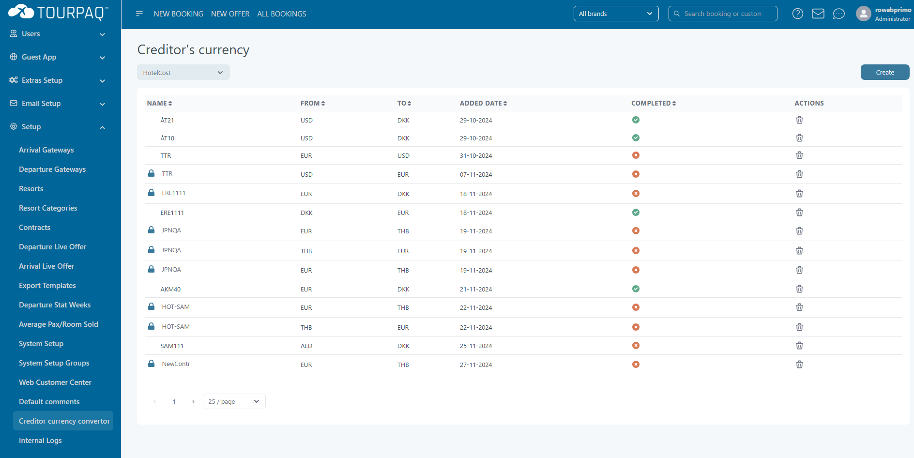
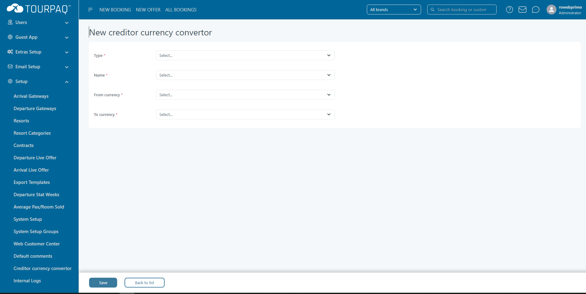
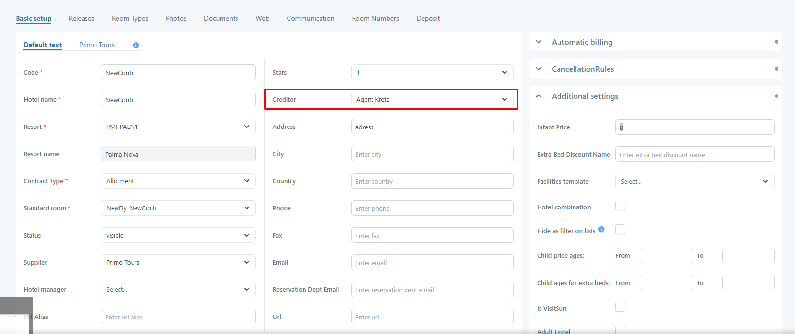
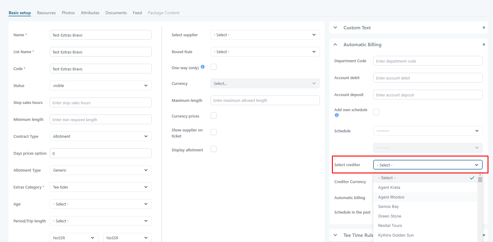
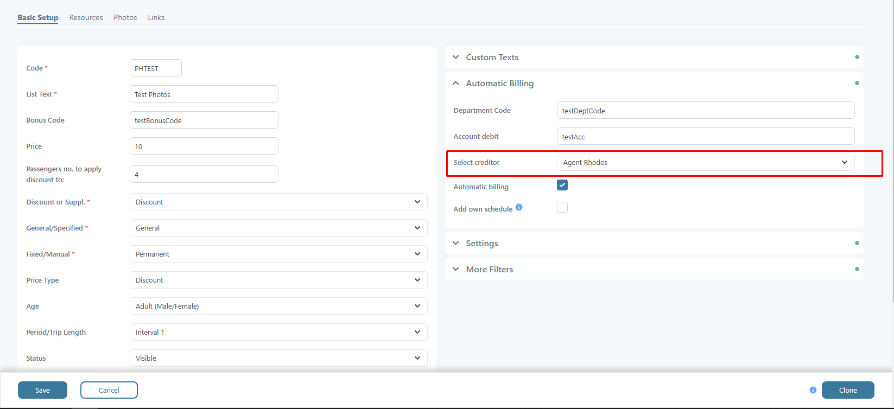

# Creditor Currency Converter

## Creditor Currency Converter

### Overview

**Creditor Currency Converter** controls price recalculation after a creditor change changes the supplier currency.

It uses creditor currencies and the [System Setup – Currency](system-setup/system-setup-currency.md) exchange-rate configuration. It applies to hotel, extra, and discount supplement costs.

### Purpose

Use this page to:

* Review conversion entries created after relevant creditor changes.
* Confirm the source and target currencies.
* Enable price recalculation for approved conversions.

### Requirements

Before activating a conversion entry:

* The original and replacement [creditors](../creditor.md) must use the intended currencies.
* The required exchange rates must exist in [System Setup – Currency](system-setup/system-setup-currency.md).
* The creditor change must apply to a hotel, extra, or discount supplement cost.

### Navigation

In Tourpaq Office, open **Setup → Creditor Currency Converter**.

### Interface overview

The page lists conversion entries created after qualifying creditor changes. Review the cost type, item, currencies, and recalculation setting before enabling an entry.

<figure><figcaption></figcaption></figure>

### System behavior

When a creditor changes for a **Hotel**, **Extra**, or **Discount supplement**, Tourpaq compares the currencies.

If the new creditor uses another currency, Tourpaq creates a conversion entry. The entry does not affect pricing until it is enabled.

<figure><figcaption></figcaption></figure>

#### Hotel currency converter trigger 

Tourpaq creates an entry when a hotel creditor changes to a creditor with another currency.

<figure><figcaption></figcaption></figure>

#### Extras currency converter trigger 

Tourpaq creates an entry when an extra creditor changes to a creditor with another currency.

<figure><figcaption></figcaption></figure>

#### Discount supplements currency converter trigger 

Tourpaq creates an entry when a discount supplement creditor changes to a creditor with another currency.

<figure><figcaption></figcaption></figure>

### Field descriptions

| **Field**                                          | **Description**                                                                                                                           |
| -------------------------------------------------- | ----------------------------------------------------------------------------------------------------------------------------------------- |
| **Type**                                           | Identifies the cost type. Values are **Hotel Cost**, **Product Cost**, or **Discount Supplement Cost**.                                   |
| **Name**                                           | Identifies the cost item that Tourpaq converts.                                                                                           |
| **From Currency**                                  | Shows the original creditor currency.                                                                                                     |
| **To Currency**                                    | Shows the currency of the replacement creditor.                                                                                           |
| **Trigger Price Recalculation on Creditor Change** | Enables price recalculation when this creditor change requires conversion. Enable only after validating the currencies and exchange rate. |

### Configure a conversion entry



#### Open the converter

In Tourpaq Office, open **Setup → Creditor Currency Converter**.



#### Select the entry

Select the entry created by the creditor change.



#### Validate From Currency

Confirm **From Currency** matches the original creditor currency.



#### Validate To Currency

Confirm **To Currency** matches the replacement creditor currency.



#### Enable recalculation

Enable **Trigger Price Recalculation on Creditor Change**.




Maintain exchange rates separately.

See [System Setup – Currency](system-setup/system-setup-currency.md).


### Examples

#### Hotel creditor change

A hotel creditor changes from **EUR** to **DKK**.

Tourpaq creates an entry with **From Currency** set to **EUR** and **To Currency** set to **DKK**. Enable **Trigger Price Recalculation on Creditor Change** after validating the rate.

#### Extra creditor change

An extra creditor changes from **SEK** to **EUR**.

Tourpaq creates a conversion entry for **SEK** to **EUR** for that extra cost.

#### Discount supplement creditor change

A discount supplement creditor changes from **USD** to **EUR**.

Tourpaq creates a conversion entry for **USD** to **EUR**.

<figure><figcaption></figcaption></figure>

### Validation

Before enabling an entry:

* Confirm the change applies to the intended cost item.
* Confirm **From Currency** and **To Currency** match the two creditors.
* Confirm the exchange rate in **System Setup – Currency**.

### Related pages

* [Creditor](../creditor.md)
* [System Setup – Currency](system-setup/system-setup-currency.md)
* [System Setup](system-setup/)
