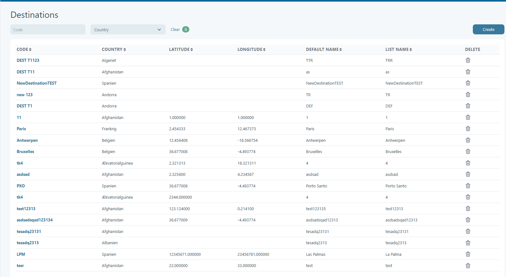
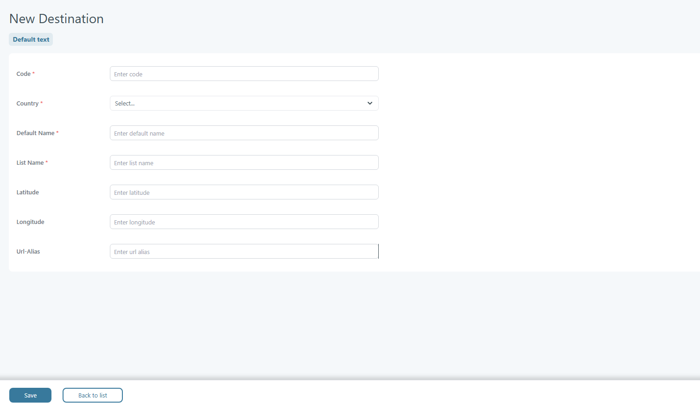

# Destination

**Overview / Purpose**

The **Destinations** feature, located under **Setup → Destination**, allows users to create and manage destinations in Tourpaq. Destinations define geographical locations and can be linked to other system elements such as resorts and extras. This ensures bookings and resources are properly associated with the correct travel location.

<figure><figcaption></figcaption></figure>

### Destination Create 

<figure><figcaption></figcaption></figure>

### **How It Works**

When creating a destination, users enter core information such as **code, country, and name**, along with optional details like coordinates and agency-specific settings. Once created, destinations can be used in other parts of the system:

* Resorts can be tied to destinations to define their location.
* Extras can be linked to destinations to ensure services are available only in relevant areas.

### **Key Features / Functions**

#### **Destination Creation (Setup → Destination)**

* **Required Fields:**
  * **Code** – A unique identifier for the destination.
  * **Country** – The country where the destination is located.
  * **Default Name** – The standard name of the destination.
  * **List Name** – The display name shown in lists.
* **Geographic Coordinates:**
  * **Latitude**
  * **Longitude**
  * **Country** (used again for location precision)
* **Additional Fields:**
  * **URL Alias** – Optional alias used for links.
  * **Agency-Specific Details** – Custom settings per agency.
* **Customizable Fields:**
  * **Default Name**
  * **List Name**

<figure><figcaption></figcaption></figure>

### Destination usage 

Location: **Setup/Resorts**

A resort can have a destination associated with it.

<figure><figcaption></figcaption></figure>

**Extras setup/Extras** An extra resource can be associated with a destinaiton.

<figure><figcaption></figcaption></figure>

### **Notes / Best Practices**

* Always use a **unique code** when creating destinations to avoid conflicts.
* Latitude and longitude values help define the exact location—this is especially useful for mapping and geo-based filtering.
* Use **agency-specific details** when different agencies require unique naming or display settings.
* Keep **Default Name** consistent for system-wide recognition, but adjust **List Name** for better readability in customer-facing views.
