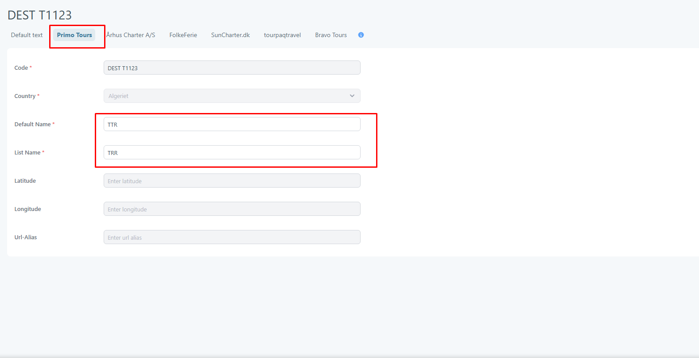
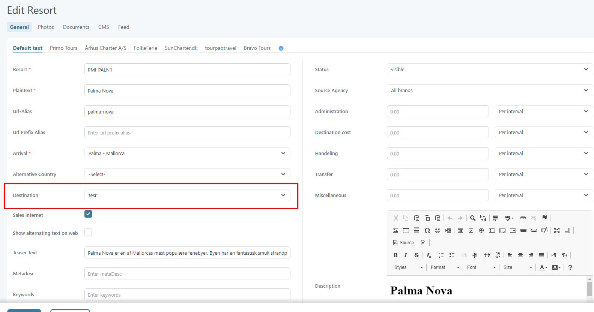
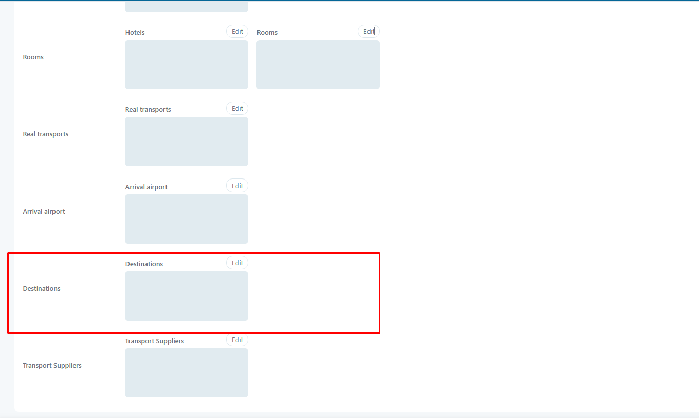

# Destination

This page can be found on **Setup/Destination**. This feature allows users to customize destinations and define agency-specific details.

<figure><figcaption></figcaption></figure>

### Destination Create 

<figure><figcaption></figcaption></figure>

Required Fields:

* Code - Uniquie
* Country
* Default Name
* List Name

To determine geographic coordinates, the destination also includes:

* Latitude
* Country
* Longitude

Additional fields:

* Url-Alias

### Agency specific details 

Customizable fields:

* Default Name
* List Name

<figure><figcaption></figcaption></figure>

### Destination usage 

Location: **Setup/Resorts**

A resort can have a destination associated with it.

<figure><figcaption></figcaption></figure>

**Extras setup/Extras** An extra resource can be associated with a destinaiton.

<figure><figcaption></figcaption></figure>
