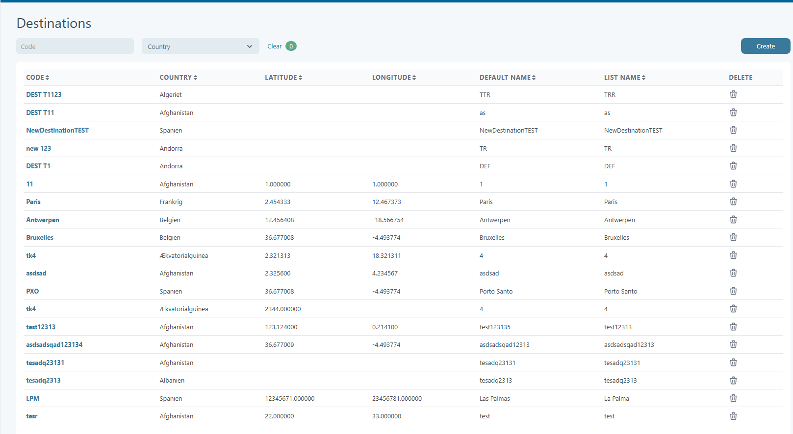
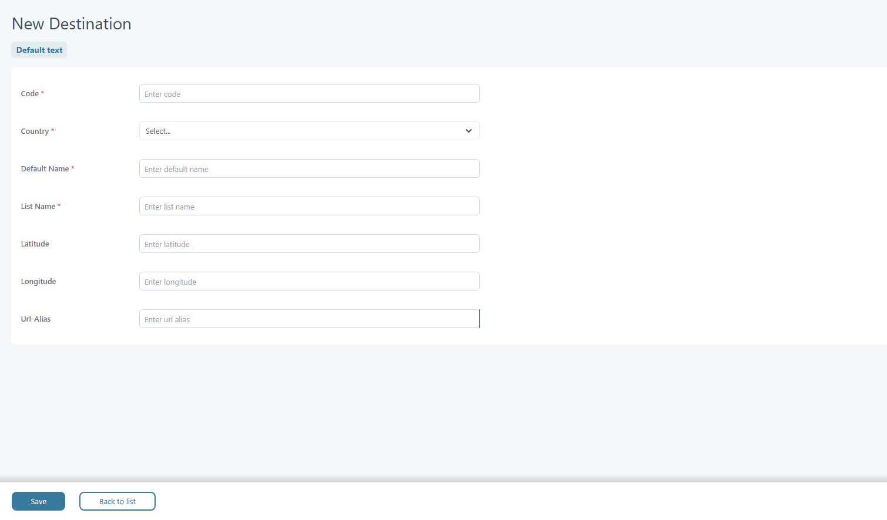

# Destination

### Overview

The **Destination** page (under **Setup → Destination**) lets you create and maintain destinations in Tourpaq.

Destinations are shared master data. They are used to group **resorts** and control where **extras** can be sold.

<figure><figcaption></figcaption></figure>

### How destinations are used

* **Resorts** can be linked to a destination to define their area.
* **Extras** can be linked to a destination so they are only available where relevant.

This keeps bookings, reporting, and availability logic aligned with the correct location.

### Create a destination 

<figure><figcaption></figcaption></figure>



**Fill in the core fields**

At minimum, fill in:

* **Code** (unique)
* **Country**
* **Default name**
* **List name**



**(Optional) Add geographic and web fields**

Use these when you need mapping, SEO, or integration support:

* **Latitude / Longitude**
* **URL alias**
* **Agency-specific details**



**Customizable Fields:**

* **Default Name**
* **List Name**

<figure><figcaption></figcaption></figure>



**Save**

Click **Save** to create the destination.



### Fields (destination)

* **Code**
  * Unique identifier for the destination.
  * Keep it short and stable. Other data can reference it.
* **Country**
  * Country for the destination.
* **Default name**
  * Standard name used across the system.
* **List name**
  * Name shown in lists and selectors.
  * Use a readable label for daily work.
* **Latitude / Longitude** (optional)
  * Coordinates used for map features and geo filtering.
* **URL alias** (optional)
  * Alias used for web links, depending on your setup.
* **Agency-specific details** (optional)
  * Use when agencies need different naming or behavior.

### Destination usage 

#### Resorts

A resort can reference a destination.

<figure><figcaption></figcaption></figure>

#### Extras

An extra resource can be associated with a destination.

<figure><figcaption></figcaption></figure>

### Notes and best practices

* Use a **unique code** to avoid conflicts.
* Keep **Default name** consistent. Use **List name** for readability.
* Add **latitude/longitude** if you rely on maps or geo filtering.
* Use **agency-specific details** only when you truly need per-agency differences.

### Passenger Information

#### Overview

The **Passenger Information** section, found under **Setup → Destination**, allows administrators to define informational messages for a specific destination.\
These entries control what information is associated with that destination and can be used to provide guests with destination-specific notes such as arrival guidelines, service information, or important updates.

Passenger Information is managed per destination and can include conditions based on **stay period** and **booking period**.

#### Purpose

The purpose of the **Passenger Information** section is to:

* Manage destination-level informational content that can later be used in various parts of the system or shared with guests.
* Define and control which information applies to passengers depending on their **travel dates** or **booking dates**.
* Set up acknowledgment requirements for specific messages that guests or guides need to confirm.

#### Instructions

<figure><figcaption></figcaption></figure>

**Accessing Passenger Information**

1. Go to **Setup → Destination**.
2. Select the required **destination** (for example, _CHQ_).
3. Open the **Passenger Information** tab.

The list displays all entries configured for the selected destination.

| **Column**                 | **Description**                                                                  |
| -------------------------- | -------------------------------------------------------------------------------- |
| **Stay From / Stay To**    | The travel period during which the information applies.                          |
| **Booking Date From / To** | Optional booking date limits that define when the message is relevant.           |
| **Information**            | The title or content reference of the passenger information.                     |
| **Acknowledge**            | Indicates if the message must be acknowledged by the guest (checked = required). |
| **Delete**                 | Removes the selected entry.                                                      |

**Creating Passenger Information**

1. Click **Create**.
2. Complete the following fields:
   * **Stay From / Stay To** – defines the period of stay when this message is valid.
   * **Booking Date From / To** – limits the message visibility to bookings made in a specific timeframe.
   * **Information** – enter or select the information to be displayed.
   * **Acknowledge** – enable if passengers must confirm they have read the information.
3. Click **Save** to store the configuration.

#### Example

In the provided example:

* The destination **CHQ** has one passenger information entry titled **Dest Errata Def**.
* It applies to stays from **28-10-2025** to **28-10-2026** and booking dates from **01-02-2026** to **28-02-2026**.


**Passenger Information allows overlapping periods**

For example, **Dest errata Def** can apply for an entire season (28.10.25–28.10.26). **Destination passenger information overlap period** can apply for a shorter period (01.02.26–28.02.26). The periods can overlap. The system allows both entries and displays them on the ticket.


* The entry is marked as _Acknowledged_, meaning passengers must confirm it.

<figure><figcaption></figcaption></figure>

<figure><figcaption></figcaption></figure>

### Related pages

* [Resorts](resorts.md)
* [Extras](../extras-setup/extras-general-page/extras.md)
