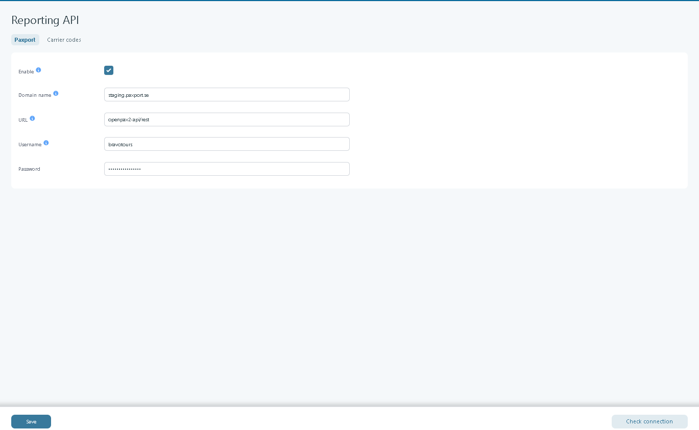
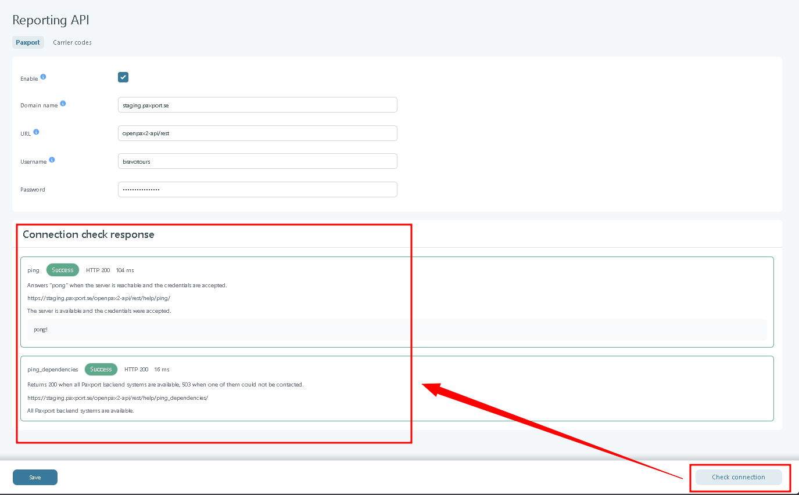
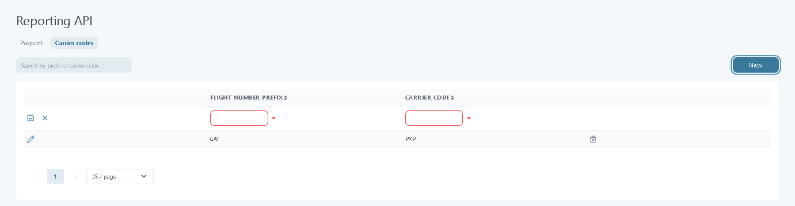
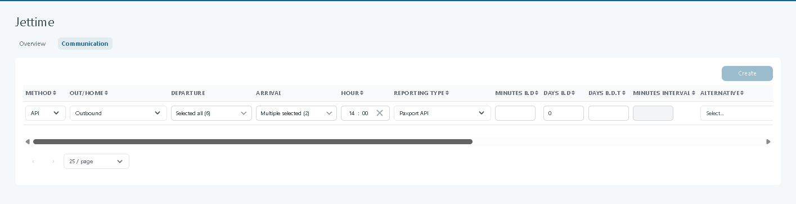
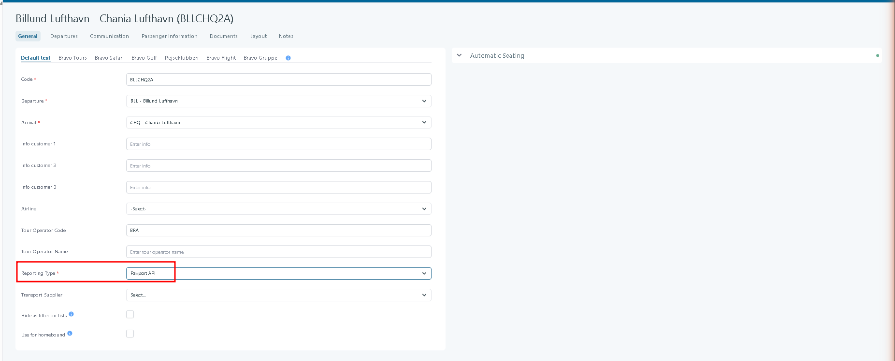

---
tags:
  - '15.5'
---

# Reporting API

### Overview

The Paxport API integration lets Tourpaq report flight bookings to Paxport automatically, in real time, using Paxport's REST-based API ("OpenPax") instead of file-based (FTP) or email reporting.

This affects users who configure **Transport Suppliers** and **Transport Reporting** for airlines/carriers that report through Paxport, and anyone who monitors transport reporting errors through the **Transport Warnings** notifications.

> Paxport can still also be reported to using the existing file-based method (**Reporting Type: Paxport**). The **Paxport API** reporting type is a separate, independent option — it does not replace settings from the file-based Paxport configuration.

#### What the Paxport API solution reports

At a high level, once a Transport Supplier is configured for it, the Paxport API solution keeps Paxport up to date automatically for three kinds of booking events on that supplier's flights:

* **New bookings** — when a booking including such a flight is made, it is reported to Paxport as a new booking.
* **Updated bookings** — when a previously reported booking changes (for example passenger or flight details), the change is reported to Paxport as an update.
* **Cancelled bookings** — when the booking, or the relevant flight on it, is cancelled, the cancellation is reported to Paxport.

Each of these is sent automatically, following the timing configured on the supplier's Communication rule (see **Configuration** below) — there is no manual step to trigger a report. The exact data sent for each event follows Paxport's own OpenPax REST API specification; the field-level payload structure is outside the scope of this page.

### Transport Reporting methods

Transport Reporting is how Tourpaq sends booking information for flights to the systems used by carriers, ticketing partners, and other reporting providers. For each Transport Supplier, one or more **Communication** rules define when and how that reporting happens, and every rule uses one of three methods:

| Method   | How it delivers the report                                                                                                                                                                                                                |
| -------- | ----------------------------------------------------------------------------------------------------------------------------------------------------------------------------------------------------------------------------------------- |
| **FTP**  | Tourpaq generates a report file and delivers it to an FTP server (selected via **FTP System** on the rule). Used by most existing reporting types (e.g. AirSeven, DAT, Air Berlin, Bus Feed, and the file-based **Paxport** type).        |
| **Mail** | Tourpaq sends the report as an email, to the address and subject configured on the rule.                                                                                                                                                  |
| **API**  | Tourpaq calls the reporting provider's own REST API directly, in real time, instead of producing a file or an email. **API** is the method introduced by this feature; today it is only available for the **Paxport API** reporting type. |

The methods can be selected on a given Communication rule depends on its **Reporting Type** — a reporting type must specifically support a method for that option to be selectable. Existing reporting types continue to use **FTP** and/or **Mail** as before; **Paxport API** is the first reporting type built to use **API** only.

### Configuration

Configuration of the Paxport API happens in two places: the global connection settings under **Setup**, and the per-airline reporting settings on each **Transport Supplier**.

#### Setup > Reporting API > Paxport

The **Reporting API** page is available under the **Setup** menu. It contains two tabs: **Paxport** and **Carrier codes**.

<figure><figcaption></figcaption></figure>

| Setting         | Description                                                                                                                                                                                                                                                                      |
| --------------- | -------------------------------------------------------------------------------------------------------------------------------------------------------------------------------------------------------------------------------------------------------------------------------- |
| **Enable**      | Checkbox. Tooltip: "When checked, the Paxport API is enabled and can be selected as a Transport Reporting method." When unchecked, **Paxport API** cannot be selected as a Reporting Type on a Transport Supplier.                                                               |
| **Domain name** | The Paxport host to connect to, for example `api.paxport.se` for production or `test.paxport.se`/`staging.paxport.se` for test. Tooltip: "The Paxport host, for example api.paxport.se for production or test.paxport.se for test. https:// is assumed when no scheme is given." |
| **URL**         | The base path of the OpenPax REST API on that host; all API resources are called relative to it. Tooltip: "The base path of the OpenPax REST API on that host. The resources are called relative to it, for example `{domain}/{url}/help/ping/`."                                |
| **Username**    | The account username supplied by Paxport. Sent to Paxport as HTTP Basic authentication together with the password.                                                                                                                                                               |
| **Password**    | The account password supplied by Paxport. Sent together with the username as HTTP Basic authentication (tooltip shown on Username applies to both).                                                                                                                              |

Below the fields is a **Save** button (saves the configuration) and a **Check connection** button.

**Check connection** calls two Paxport endpoints and displays the results directly on the page, under a **Connection check response** heading, so the user can diagnose problems such as a wrong URL, a wrong password, or connectivity issues without leaving Tourpaq:

| Check                  | Purpose                                                                                                                                                          | Displayed result                                                                                                                                       |
| ---------------------- | ---------------------------------------------------------------------------------------------------------------------------------------------------------------- | ------------------------------------------------------------------------------------------------------------------------------------------------------ |
| **ping**               | Confirms the server is reachable and the entered credentials are accepted. Answers `pong` when successful.                                                       | Result badge (**Success**/failure), HTTP status code, response time, the endpoint URL called, a plain-language status line, and the raw response body. |
| **ping\_dependencies** | Confirms that Paxport's own backend systems are available. Returns HTTP 200 when all of them are available, or HTTP 503 when one of them could not be contacted. | Same format as above (badge, HTTP status, response time, endpoint URL, plain-language status line).                                                    |

<figure><figcaption></figcaption></figure>

#### Setup > Reporting API > Carrier codes

This tab maintains the mapping between a flight number's airline prefix and its IATA carrier code, so Tourpaq can identify the correct carrier when reporting a flight to Paxport.

<figure><figcaption></figcaption></figure>

| Element        | Description                                                                                                                                                                 |
| -------------- | --------------------------------------------------------------------------------------------------------------------------------------------------------------------------- |
| Search box     | Filters the list by prefix or carrier code ("Search by prefix or carrier code").                                                                                            |
| **New** button | Adds a new, editable row with two required fields: **Flight number prefix** and **Carrier code**. A save icon and a cancel icon appear on the row while it is being edited. |
| List table     | Columns: **Flight number prefix** and **Carrier code**, both sortable. Each row has an edit (pencil) icon and a delete (trash) icon.                                        |
| Pagination     | Page selector and a page-size selector (e.g. 25/page) at the bottom of the list.                                                                                            |

#### Transport Supplier

**Reporting Type** on a Transport Supplier's **Overview** tab includes **Paxport API** as one of the available reporting types (alongside the existing types such as Paxport, AirSeven, Radixx, DAT, Amadeus, and others).

<figure><figcaption></figcaption></figure>

On the Transport Supplier's **Communication** tab, each communication rule starts with a **Method** column, offering the three methods described under **Transport Reporting methods** above (**FTP** / **Mail** / **API**). Which of these can be selected depends on the rule's **Reporting Type** — see **Rules and conditions** below for exactly when **API** is enabled or disabled.

The remaining columns on the Communication tab define when and how the rule fires. The ones introduced or changed by this feature are described above; the other columns already existed for FTP/Mail-based reporting and are listed here for completeness:

| Column                                                              | Description                                                                                                                                                                                                                                             |
| ------------------------------------------------------------------- | ------------------------------------------------------------------------------------------------------------------------------------------------------------------------------------------------------------------------------------------------------- |
| **Out/Home**                                                        | Direction the rule applies to: **Outbound** or **Homebound**.                                                                                                                                                                                           |
| **Departure** / **Arrival**                                         | The departure and/or arrival points the rule is restricted to (multi-select, e.g. "Selected all" or "Multiple selected"; left empty to apply to all).                                                                                                   |
| **Hour**                                                            | Time of day the report is sent.                                                                                                                                                                                                                         |
| **Reporting Type**                                                  | The Transport Reporting type this rule applies to (e.g. Paxport API).                                                                                                                                                                                   |
| **Minutes B.D**, **Days B.D**, **Days B.D.T**, **Minutes interval** | Not specified in detail by this feature — existing scheduling fields controlling how long before departure, and at what interval, the report is triggered.                                                                                              |
| **Alternative**                                                     | Alternative reporting type                                                                                                                                                                                                                              |
| **Email** / **Subject**                                             | Enter the recipient's email address and define the subject line of the email.                                                                                                                                                                           |
| **FTP System**                                                      | The FTP system to use — not applicable when Method is API. If using FTP, select the appropriate FTP configuration/system. (is defined in System Setup FTP menu).                                                                                        |
| **Use F.no**, **Stop Sale**, **ADL**                                | 
Checkbox: Use flight number if enabled.

Checkbox: Mark if this triggers a Stop Sale action. Checkbox: Enable ADL flag if needed. ADL reporting must is done whenever there are changes to a flight after the initial reporting is sent.
 |
| **Resend**                                                          | Work only with ADL checkbox marked and offer the posibility to resend any ADl report for a specific date.                                                                                                                                               |
| **Comm.**                                                           | Communication link: gives access to the latest payload sent to, and the latest response received from, the Paxport API for this rule, to help diagnose communication issues.                                                                            |

#### Transport

Besides being configured on the **Transport Supplier, Paxport API** reporting can also be set directly on an individual transport, in two places: its **Communication tab** and its **Overview tab.**

**On the transport's own Communication ta**b **(General sub-tab), each row defines a communication rule the same way as on the** Transport Supplier's Communication ta&#x62;**:** Reporting Type **can be set to** Paxport AP&#x49;**, alongside the other scheduling and delivery columns described above.**

**It can also be set directly on the transport: open its** Overview ta&#x62;**, expand** Setting&#x73;**, and set** Reporting typ&#x65;**.**

<figure><figcaption>
The Settings section under a transport's Overview tab, with Tour Operator Name and Reporting Type set to Paxport API.
</figcaption></figure>


The **Tour Operator Name** field is available next to **Tour Operator Code** in **Settings**. Both of them must be completed when **Paxport API** is selected as the reporting type, as the value is required (not mandatory) for **Paxport API** reporting.


The same **Reporting Type** and **Tour Operator Name** settings are also available in the general settings of a **Real Transport**, so reporting can be configured per departure.

<figure><figcaption></figcaption></figure>

### How it works

1. An administrator enables the integration and enters the connection details under **Setup > Reporting API > Paxport** (Enable, Domain name, URL, Username, Password), then saves.
2. The administrator uses **Check connection** to verify the setup. Tourpaq calls Paxport's `ping` endpoint to confirm the server is reachable and the credentials are valid, and the `ping_dependencies` endpoint to confirm Paxport's own backend systems are available. Both results are shown on the page.
3. Once enabled, **Paxport API** becomes selectable as the **Reporting Type** on a Transport Supplier.
4. On that Transport Supplier's **Communication** tab, a communication rule is created with **Method = API** and the relevant **Reporting Type**, direction, route, timing, and notification settings.
5. From that point on, the booking events described under **What the Paxport API solution reports** (new, updated, and cancelled bookings) are reported to Paxport through the API automatically, according to the rule's timing.
6. Flight numbers are resolved to a carrier via the **Carrier codes** mapping (prefix → carrier code) so the correct airline is reported to Paxport.
7. Every request/response exchanged with Paxport is logged; this traffic is retained in Elastic for 4 weeks. Any errors or warnings encountered while reporting are also raised in the **Transport Warnings** notification list, and the latest payload/response for a given communication rule can be inspected via its **Comm.** link.

### Rules and conditions

| Condition                                                             | System behavior                                                                                                        |
| --------------------------------------------------------------------- | ---------------------------------------------------------------------------------------------------------------------- |
| **Enable** is unchecked on the Paxport tab                            | **Paxport API** cannot be selected as a Reporting Type / Method anywhere.                                              |
| **Enable** is checked and credentials are valid                       | **Paxport API** is available for selection as a Reporting Type on Transport Suppliers.                                 |
| A Communication rule's Reporting Type is **Paxport API**              | Only **API** can be chosen as the Method for that rule; **FTP** and **Mail** are disabled.                             |
| A Communication rule's Reporting Type does not support the API method | **API** is disabled as a Method for that rule.                                                                         |
| Domain name has no scheme prefix                                      | `https://` is assumed.                                                                                                 |
| **ping** succeeds (HTTP 200)                                          | The server is reachable and the entered credentials were accepted.                                                     |
| **ping\_dependencies** returns HTTP 200                               | All of Paxport's backend systems are available.                                                                        |
| **ping\_dependencies** returns HTTP 503                               | At least one of Paxport's backend systems could not be contacted, even though the credentials themselves may be valid. |
| Reporting Type **Paxport** (file-based) vs. **Paxport API**           | The two are independent: SSR codes and other configuration are not shared or inherited between them.                   |
| Reporting Type **Radixx** (existing API-based reporting)              | Not migrated to this new structure — kept as-is; out of scope for this feature.                                        |
| Passport data / API-style passenger documents                         | Not supported by this integration — adding this data to bookings is explicitly out of scope.                           |

### Manifestation in Tourpaq

* **Setup**: **Reporting API** menu item, with **Paxport** and **Carrier codes** tabs.
* **Transport > Transport Suppliers**: new **Paxport API** option in the **Reporting Type** field; new **Method** column (with the **API** option) on the **Communication** tab, including the **Comm.** payload/response link.
* **Notifications**: reporting errors and warnings appear in the **Transport Warnings** notification list.

### Example

**Given:**

* **Setup > Reporting API > Paxport**: Enable is checked, Domain name `staging.paxport.se`, URL `openpax2-api/rest`, Username `bravotours`, Password set.
* Transport Supplier "Airseven (Paxport API)" has Reporting Type set to **Paxport API**, and a Communication rule with Method **API**, Out/Home **Outbound**, Hour `09:00`, Minutes B.D `60`.

**When:**

* The administrator clicks **Check connection**.

**Then:**

* **ping** returns **Success**, HTTP 200 in 144 ms, calling `https://staging.paxport.se/openpax2-api/rest/help/ping/`, with the response body `pong!` — confirming the server is available and the credentials were accepted.
* **ping\_dependencies** returns **Success**, HTTP 200 in 12 ms, calling `https://staging.paxport.se/openpax2-api/rest/help/ping_dependencies/` — confirming all Paxport backend systems are available.

### Edge cases

| Scenario                                                                                           | Expected behavior                                                                                                                                        |
| -------------------------------------------------------------------------------------------------- | -------------------------------------------------------------------------------------------------------------------------------------------------------- |
| Wrong URL, wrong password, or a connection issue                                                   | **Check connection** reports the failure (result badge, HTTP status, and response) so the user can identify the cause.                                   |
| Paxport is reachable and credentials are correct, but one of Paxport's own backend systems is down | **ping** succeeds while **ping\_dependencies** returns HTTP 503, indicating the problem is on Paxport's side rather than with the Tourpaq configuration. |
| A Transport Supplier still uses the file-based **Paxport** reporting type                          | It continues to work as before; switching to **Paxport API** requires configuring the new reporting type and its own SSR codes independently.            |
| A supplier uses the **Radixx** reporting type                                                      | Not affected by this feature; Radixx configuration is not moved to the new structure.                                                                    |

### Expected result

Once **Setup > Reporting API > Paxport** is enabled with valid credentials (confirmed via **Check connection**) and a Transport Supplier is set to Reporting Type **Paxport API** with a Communication rule using Method **API**, Tourpaq reports new, updated, and cancelled bookings for that supplier's flights to Paxport automatically through the REST API.

Flight numbers are resolved to carriers via the Carrier codes mapping, all traffic is logged for 4 weeks, and any errors surface in the Transport Warnings notification list and on the rule's Comm. link.

### Related pages

* [communication-configuration-transport-supplier.md](../transport-suppliers/communication-configuration-transport-supplier.md "mention") — Configure reporting rules and delivery settings for each Transport Supplier.
