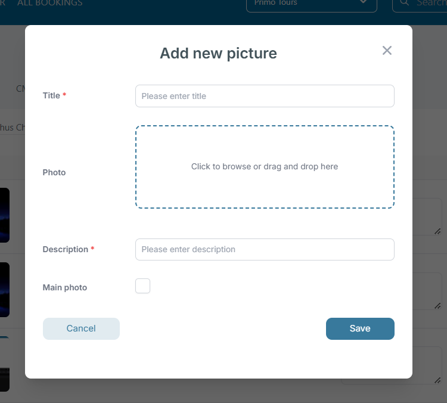
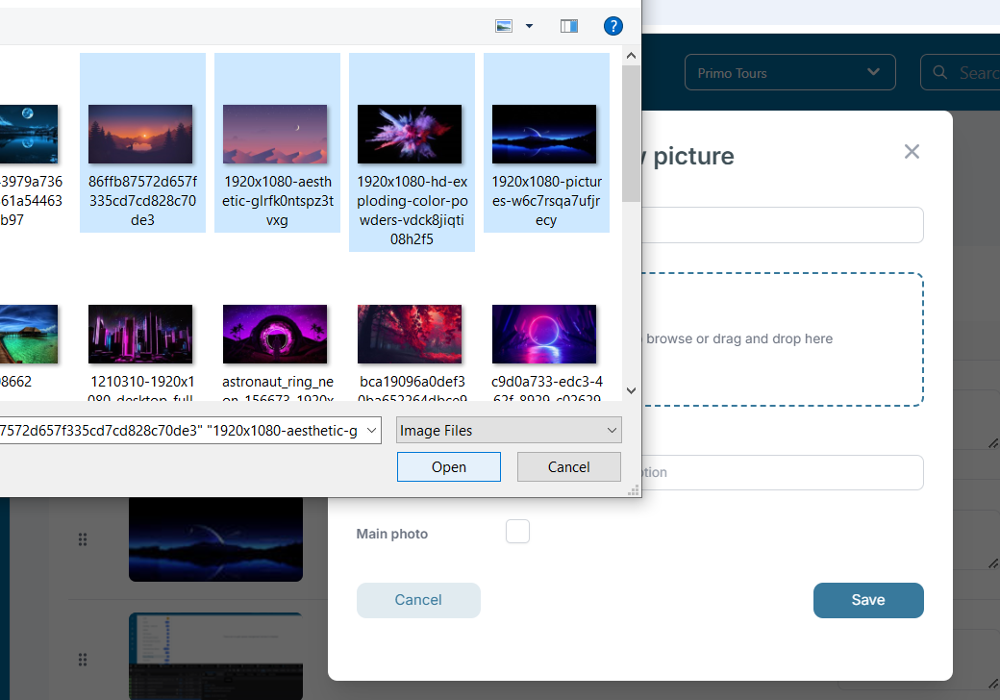
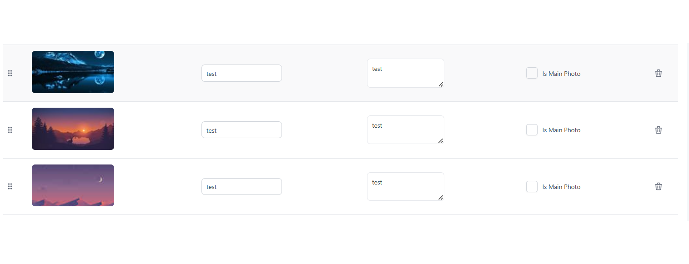

# Resorts

### Overview

The **Resorts** interface provides a structured way to manage resorts associated with different arrival gateways. This system allows users to search, filter, and manage resort data efficiently.

<figure><figcaption></figcaption></figure>

### Features

* **Search Functionality:** A search bar allows users to quickly find specific resorts.
* **Filtering Options:** Users can filter by selecting a specific resort from the dropdown.
* **Show Hidden:** A toggle option enables the display of hidden resorts.
* **Create New Entry:** A "Create" button allows users to add new resorts.
* **Delete Functionality:** Each entry includes a trash bin icon for easy removal.

### Column Breakdown

1. **Resort ID:** A unique identifier for each resort.
2. **Plaintext:** The common name of the resort.
3. **Code:** A unique code representing the resort.
4. **Country:** The country where the resort is located.
5. **Arrival:** The associated arrival gateway for the resort.
6. **Actions:** A delete icon to remove an entry.

### User Actions

#### Searching for a Resort

1. Use the search bar at the top to enter a resort name or keyword.
2. The table dynamically updates to show matching results.

#### Filtering Resorts

1. Select a specific resort from the **Select Resort** dropdown.
2. The list updates to display only relevant entries.
3. The **Show Hidden** toggle can be used to reveal hidden resorts.

#### Creating a New Entry

1. Click on the **Create** button.
2. Enter the required details (Resort ID, name, code, country, arrival gateway, etc.).
3. Save the entry to add it to the list.

#### Deleting an Entry

1. Locate the resort to remove.
2. Click the trash bin icon under the "Actions" column.
3. Confirm deletion if prompted.

### Notes

* Resort IDs help maintain unique identification across multiple locations. To edit an already created resort, just click on the ID of the resort, a new page will be open and you can start to edit the resort details.

&#x20;

<figure><figcaption></figcaption></figure>

* The arrival gateway column ensures proper mapping between resorts and transportation hubs.
* Hidden resorts can be managed using the **Show Hidden** toggle.

This interface provides an intuitive way to manage resorts and their corresponding arrival gateways efficiently.

### Resort - Photos tab 

Insert multiple photos in one step and sort them by drag and drop.

Fields:

* Title
* Photo
* Description
* Main photo

<figure><figcaption></figcaption></figure>

You can choose multiple images to be saved:

<figure><figcaption></figcaption></figure>

In case of uploading more than one image, the title and the description field will be saved for each photo with the same values. After save, these fields can be edited from inside the list.

<figure><figcaption></figcaption></figure>

To order the list of photos, press and keep click on the specific row and move cursor up/down to the position desired. Release and then press save to store the ordered list.
