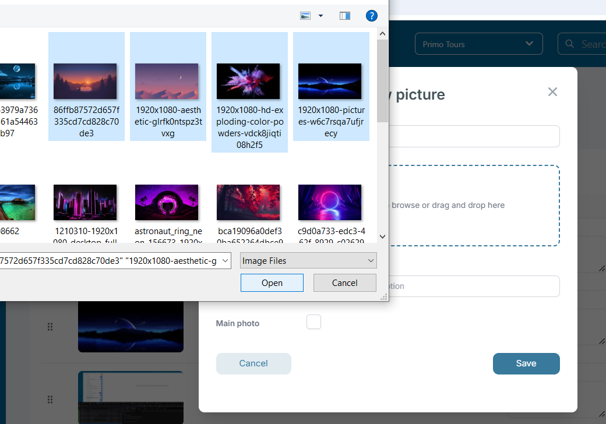
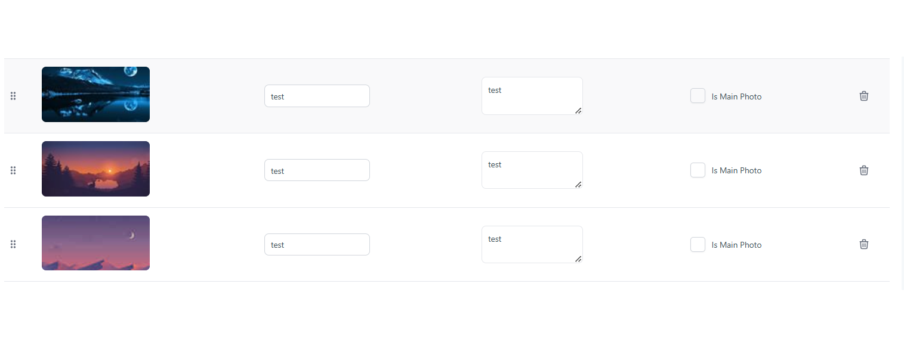

# Resorts

### Overview

The **Resorts** page supports creating and maintaining resorts used in bookings, hotels, price lists, and reporting.

Each resort is typically linked to an **arrival gateway** and can also be grouped under a **destination**.

<figure><figcaption></figcaption></figure>

### What you can do

* **Search** resorts by keyword.
* **Filter** by resort, destination, or arrival.
* **Show hidden** resorts.
* **Create** new resorts.
* **Delete** resorts (if they are not in use).

### Column explanation

* **Code**
  * A short unique identifier for the resort (for example `_BCN_`, `_TFS_`).
  * Often based on airport or city codes, but it can be custom.
* **Name**
  * The full name of the resort (for example, _Barcelona_, _Costa Adeje_, _Malaga_).
  * Shown to users and customers.
* **Country**
  * The country in which the resort is located (for example, _Spanien_, _Romania_, _Thailand_).
  * Used for geographic grouping and reporting.
* **Destination**
  * Groups the resort into a broader travel destination category (for example, _Valencia_, _Chania Dest_).
  * Useful for packaging and filtering by larger areas.
* **Arrival**
  * The arrival airport or point of entry associated with the resort (for example, _Barcelona_, _Varna_, _Bangkok_).
  * Used to link the resort to transport routes.
* **Delete (Trash Bin icon)**
  * Allows the removal of a resort from the system.
  * Deletion should be done carefully, as removing a resort can affect linked price lists, hotels, and packages.


Deleting a resort can affect data that references it.\
If deletion is blocked, the resort is likely in use.


### Common tasks



**Search for a resort**

1. Type a keyword in the search field.
2. Review the filtered list.



**Filter resorts**

1. Select a specific resort from the **Resort/ Destination/ Arrival** dropdown.
2. Enable **Show hidden** if needed.
3. Review the filtered list.



**Create a resort**

1. Click **Create**.
2. Fill in the required fields (resort code, name, country, arrival).
3. Save.



**Delete a resort**

1. Locate the resort to remove.
2. Click the trash bin icon under **Actions**.
3. Confirm if prompted.



### Edit a resort

<figure><figcaption></figcaption></figure>

### Fields (edit resort)

#### Left section

* **Resort**\*
  * Unique code for the resort (for example, _CALETA-FUE_).
  * Acts as the system identifier and must be unique.
* **Name**\*
  * The full name of the resort (for example, _Caleta De Fuste_).
  * This is the label displayed to users.
* **URL alias**
  * Defines the URL alias for the resort.
  * Used for SEO-friendly links.
* **URL prefix alias**
  * Optional prefix for the resort URL.
  * Helps structure URLs under a broader category, such as a destination prefix.
* **Arrival**\*
  * The airport or point of arrival associated with the resort (for example, _Fuerteventura Airport_).
* **Alternative Country**
  * Optional field if the resort belongs to a different country grouping than the default.
* **Destination**
  * Destination grouping that the resort belongs to (for example, _Fuerte DEST_).
  * Used for travel package creation and filtering.
* **Sales Internet**
  * Checkbox to enable the resort for online sales.
* **Show alternating text on web**
  * Displays alternate marketing text on the website if enabled.
* **Latitude / Longitude**
  * Geographical coordinates of the resort.
  * Useful for maps and geo-location features.
* **Hide as filter on lists**
  * If checked, the resort will not appear as a filter option in search/listing views.
* **Show in VAB as Country**
  * In **View All Bookings** statistics, treat the resort as a “country” grouping option.

***

#### Right section

* **Status**
  * Visibility status of the resort (for example, _visible_).
  * Controls whether the resort is visible or hidden.
* **Source Agency**
  * Defines which agency or brand the resort belongs to (for example, _All brands_).
* **Teaser Text**
  * Short promotional text shown in website teasers.
* **Metadesc**
  * Meta description used for search engines (SEO).
* **Keywords**
  * SEO keywords related to the resort.
* **Title**
  * Title used for web/SEO purposes.
* **Description**
  * Rich-text editor field where a full description of the resort can be added.
  * Supports formatting, links, and images.

### Resort: Photos tab 

Upload multiple photos and sort them by drag-and-drop.

Fields:

* **Title**: Picture name.
* **Photo**: Click to add one or more photos.
* **Description**: Short description.
* **Main photo**: If enabled, the selected photo becomes the resort’s main photo.

<figure><figcaption></figcaption></figure>

Select multiple images to save:

<figure><figcaption></figcaption></figure>

If you upload multiple images at once, **Title** and **Description** are saved with the same values for each image. You can edit them later in the list.

<figure><figcaption></figcaption></figure>

To reorder photos, click and hold a row, drag it to the right position, then click **Save**.

### Resort: Documents tab

The **Documents** tab lets you store resort-specific files, such as guides, descriptions, or legal documents.

#### Instructions

**Accessing the tab**

1. Open the **Resort** you wish to edit.
2. Select the **Documents** tab from the top menu bar (next to _General_, _Photos_, _CMS_, etc.).

**Adding a new document**

1. Click the **Add document** button on the right side of the page.
2.  Enter a document name and upload the file (**PDF only**).

    
<figure><figcaption></figcaption></figure>

3. Save your changes.

**Deleting a document**

* Press the **trash bin icon** next to a document name to remove it.

### Passenger Information

#### Overview

The **Passenger Information** section, found under **Setup → Resorts**, allows administrators to define informational messages for a specific resort.\
These entries control what information is associated with that resort and can be used to provide guests with resort-specific notes such as arrival guidelines, service information, or important updates.

Passenger Information is managed per resort and can include conditions based on **stay period** and **booking period**.

#### Purpose

The purpose of the **Passenger Information** section is to:

* Manage resort-level informational content that can later be used in various parts of the system or shared with guests.
* Define and control which information applies to passengers depending on their **travel dates** or **booking dates**.
* Set up acknowledgment requirements for specific messages that guests or guides need to confirm.

#### Instructions

<figure><figcaption></figcaption></figure>

**Accessing Passenger Information**

1. Go to **Setup → Resorts**.
2. Select the required resort (for example, _CHQ_).
3. Open the **Passenger Information** tab.

The list displays all entries configured for the selected resort.

| **Column**                 | **Description**                                                                  |
| -------------------------- | -------------------------------------------------------------------------------- |
| **Stay From / Stay To**    | The travel period during which the information applies.                          |
| **Booking Date From / To** | Optional booking date limits that define when the message is relevant.           |
| **Information**            | The title or content reference of the passenger information.                     |
| **Acknowledge**            | Indicates if the message must be acknowledged by the guest (checked = required). |
| **Delete**                 | Removes the selected entry.                                                      |

**Creating Passenger Information**

1. Click **Create**.
2. Complete the following fields:
   * **Stay From / Stay To** – defines the period of stay when this message is valid.
   * **Booking Date From / To** – limits the message visibility to bookings made in a specific timeframe.
   * **Information** – enter or select the information to be displayed.
   * **Acknowledge** – enable if passengers must confirm they have read the information.
3. Click **Save** to store the configuration.

#### Example

In the provided example:

* The resort **CHQ** has one passenger information entry titled **Resort Errata Def**.
* It applies to stays from **28-10-2025** to **28-10-2026** and booking dates from **01-02-2026** to **28-02-2026**.
* The entry is marked as _Acknowledged_, meaning passengers are required to confirm it.


**Passenger Information allows overlapping periods**

For example, **Resort Errata Def** can apply for an entire season (28.10.25–28.10.26). **Resort overlap periods** can apply for a shorter period (01.02.26–28.02.26). The periods can overlap. The system allows both entries and displays them on the ticket.


<figure><figcaption></figcaption></figure>

<figure><figcaption></figcaption></figure>

### Related pages

* [Destination](destination.md)
* [Arrival Gateways](arrival-gateways/)
