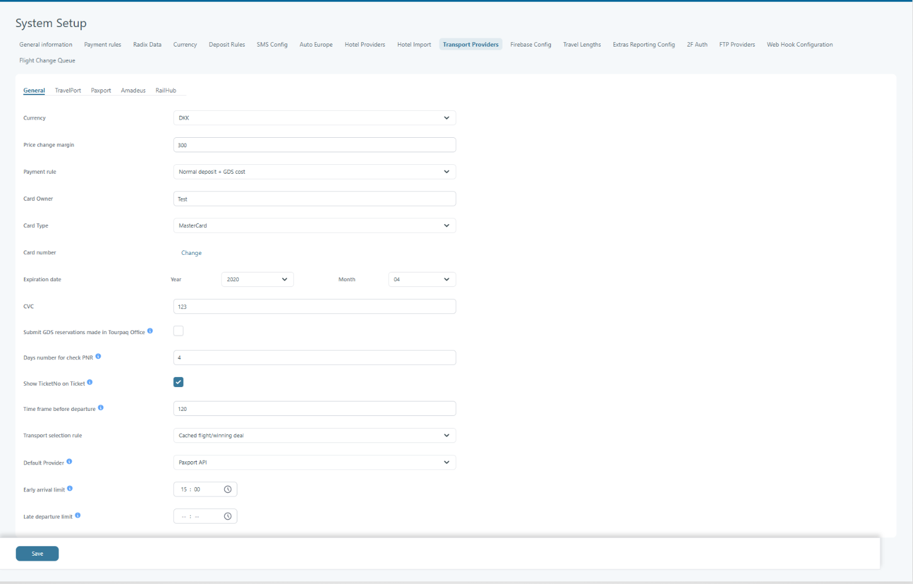

# System Setup – Transport Providers

### Overview

Transport Providers configures integrations to external transport systems (flights, rail, etc.).

These settings control how Tourpaq searches, books, tickets, and pays when using provider APIs.

Go to **Setup → System Setup → Transport Providers**.


This page contains payment and API credentials.

Treat values as secrets and restrict access.


### Purpose

Use these settings to standardize transport behavior across providers:

* Default currency and payment behavior.
* Card and payment credentials used for automated processes.
* Rules for selecting and updating transport data.
* Timing and restrictions for reservation management.

### Tabs

The **Transport Providers** section includes several tabs, such as:

* **General**: Core configuration and default rules.
* **TravelPort**, **Paxport**, **Amadeus**, **RailHub**: Provider-specific authentication and connection settings.

### General tab

<figure><figcaption></figcaption></figure>

| **Field**                                           | **Description**                                                                                                                                                                                        |
| --------------------------------------------------- | ------------------------------------------------------------------------------------------------------------------------------------------------------------------------------------------------------ |
| **Currency**                                        | Defines the currency used for transport transactions. Example: _EUR_.                                                                                                                                  |
| **Price change margin**                             | The percentage margin applied when a price change occurs (e.g., 50%).                                                                                                                                  |
| **Payment rule**                                    | Sets the rule for payment processing (e.g., _Normal deposit + GDS cost_). Determines how deposits and GDS-related fees are applied.                                                                    |
| **Card Owner**                                      | Name of the cardholder used for automated payments or API-based transactions.                                                                                                                          |
| **Card Type**                                       | Type of payment card used (e.g., _VISA_, _MasterCard_).                                                                                                                                                |
| **Card Number**                                     | Stores the payment card number used for automated processes. Clicking **Change** allows updating card details.                                                                                         |
| **Expiration Date (Year / Month)**                  | Defines the card’s expiration date. Both _Year_ and _Month_ are required.                                                                                                                              |
| **CVC**                                             | The card security code used for transaction validation.                                                                                                                                                |
| **Submit GDS reservation made in Tourpaq Office**   | 
If checked, GDS reservations made in Tourpaq Office will automatically be submitted.

The bookings made from web booking are always submitted.
                                             |
| 
 (Note: This uses the SubmitGDS service).
 |                                                                                                                                                                                                        |
| **Days number for check PNR**                       | Indicates how many days before departure the system should check PNR (Passenger Name Record) information.                                                                                              |
| **Show TicketNo on Ticket**                         | Displays the GDS ticket number on printed tickets.                                                                                                                                                     |
| **Time frame before departure**                     | Minutes before departure when a flight can be removed from a booking (when booking date equals departure date).                                                                                        |
| **Transport selection rule**                        | Determines the logic for selecting transport offers, e.g., _Cached flight/winning deal_.                                                                                                               |
| **Default Provider**                                | Defines which transport provider is used by default (e.g., _Paxport API_).                                                                                                                             |
| **Early arrival limit**                             | If the arrival time for departure is before the limit, then the guest needs the hotel on the day before the arrival date, adding one extra day (+DAYS) to the stay. This applies only to new bookings. |
| **Late departure limit**                            | If the return departure time is after the limit, the guest needs one extra hotel night (LAND DAYS). This adds one extra day to the stay. Applies only to new bookings.                                 |


If you store card details here, follow your internal compliance rules.

Avoid sharing screenshots containing full card numbers or CVC.


### Provider tabs

There are four transport providers that can be configured in this menu:

* [TravelPort](../../../integration/transport-providers/travelport.md)
* [Paxport](../../../integration/transport-providers/paxport.md)
* [Amadeus](../../../integration/transport-providers/amadeus.md)
* [Railhub](../../../integration/transport-providers/railhub.md)

### Troubleshooting

* **No search results:** Verify provider is enabled, credentials are correct, and you are using the right environment (test vs production).
* **Authentication failed:** Re-check usernames, passwords/tokens, and office/branch/PCC codes.
* **Ticket number not shown:** Ensure **Show TicketNo on Ticket** is enabled and the provider returns a ticket number.
* **Unexpected price changes:** Review **Price change margin** and payment rules.
* **PNR checks not happening:** Verify **Days number for check PNR** and that your workflow uses PNR checking.

### FAQ

<strong>Do these settings apply to all brands and agencies?</strong>

In most setups, System Setup values are company-wide.

If you need per-brand settings, confirm what your environment supports.

<strong>Should I use test or production targets?</strong>

Use **test** for validation and onboarding.

Use **production** only when credentials and workflows are ready.

<strong>Why are there both “General” and provider tabs?</strong>

General controls shared behavior (currency, payment rules, ticket display, etc.).

Provider tabs store connection details and provider-specific rules.

<strong>Is it safe to store card details here?</strong>

Follow your internal compliance requirements.

Avoid sharing screenshots or exports containing sensitive card data.

