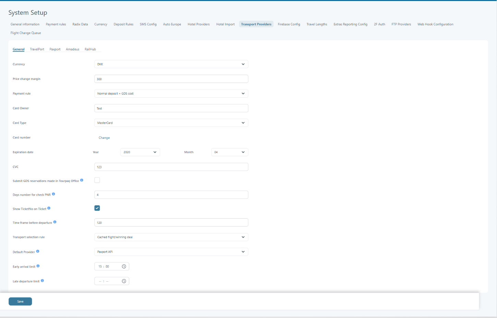

# System Setup – Transport Providers

### Overview

**Transport Providers** configures shared transport behavior and provider connections in Tourpaq.

These settings support transport search, booking, ticketing, payment, and PNR processing.

Provider-specific tabs store credentials and connection parameters for each external provider.

### Purpose

Use **Transport Providers** to standardize shared transport settings across provider integrations.

The **General** tab controls defaults, payment settings, booking limits, and provider selection.

Provider tabs define each provider's authentication and connection settings.

### Requirements

Before configuring **Transport Providers**, confirm the following:

1. Administrator access to **Setup → System Setup** is available.
2. The provider has supplied valid credentials and required connection details.
3. The company payment policy defines the card and payment-rule configuration.
4. A test environment is available when the provider supports one.


This page contains payment and API credentials.

Treat values as secrets and restrict access.

When storing card details, follow internal compliance rules.

Avoid sharing screenshots containing full card numbers or CVC.


### Navigation

In Tourpaq Office, open **Setup → System Setup → Transport Providers**.

### Interface overview

The page contains one shared **General** tab and provider-specific tabs.

Use **General** for currency, payment, GDS, booking, and provider-selection settings.

Use provider tabs for authentication and provider-specific connection parameters.

<figure><figcaption>
Transport Providers General tab.
</figcaption></figure>

### General tab fields

| Field                                             | Description                                                                                  | Requirement and related behavior                                                                                |
| ------------------------------------------------- | -------------------------------------------------------------------------------------------- | --------------------------------------------------------------------------------------------------------------- |
| **Currency**                                      | Defines the currency used for transport transactions. For example, _EUR_.                    | Required status is not indicated.                                                                               |
| **Price change margin**                           | Defines the percentage margin applied when a price changes. For example, `50%`.              | Review this value when transport prices differ unexpectedly.                                                    |
| **Payment rule**                                  | Sets the payment-processing rule. For example, _Normal deposit + GDS cost_.                  | Determines how deposits and GDS-related fees are applied.                                                       |
| **Card Owner**                                    | Defines the cardholder name for automated payments or API transactions.                      | Used with the other card fields. Follow internal compliance rules.                                              |
| **Card Type**                                     | Defines the payment card type. For example, _VISA_ or _MasterCard_.                          | Used with the other card fields.                                                                                |
| **Card Number**                                   | Stores the payment card number for automated processes.                                      | **Change** updates card details. Restrict access to this value.                                                 |
| **Expiration Date (Year / Month)**                | Defines the card expiration date.                                                            | Both **Year** and **Month** are required.                                                                       |
| **CVC**                                           | Stores the card security code used for transaction validation.                               | Restrict access to this value.                                                                                  |
| **Submit GDS reservation made in Tourpaq Office** | Automatically submits GDS reservations made in Tourpaq Office when selected.                 | Reservations made through Web Booking are always submitted. This setting uses the SubmitGDS service.            |
| **Days number for check PNR**                     | Specifies the number of days before departure when Tourpaq checks PNR information.           | PNR means Passenger Name Record.                                                                                |
| **Show TicketNo on Ticket**                       | Displays the GDS ticket number on printed tickets.                                           | Requires the provider to return a ticket number.                                                                |
| **Time frame before departure**                   | Specifies the minutes before departure when a flight can be removed from a booking.          | Applies when the booking date equals the departure date.                                                        |
| **Transport selection rule**                      | Defines the logic for selecting transport offers. For example, _Cached flight/winning deal_. | Affects which offer Tourpaq selects.                                                                            |
| **Default Provider**                              | Defines the transport provider used by default. For example, _Paxport API_.                  | Select a provider configured on its own tab.                                                                    |
| **Early arrival limit**                           | Defines the arrival-time limit for adding a hotel day before arrival.                        | If the arrival time is before the limit, Tourpaq adds one hotel day (+DAYS). Applies only to new bookings.      |
| **Late departure limit**                          | Defines the return-departure limit for adding a hotel night.                                 | If the departure time is after the limit, Tourpaq adds one hotel day (LAND DAYS). Applies only to new bookings. |

### Configuration steps

1. In **Setup → System Setup → Transport Providers**, open **General**.
2. Set **Currency**, **Price change margin**, and **Payment rule**.
3. Configure the card fields when automated payment requires a card.
4. Set GDS and PNR options for the company workflow.
5. Set **Time frame before departure**, **Early arrival limit**, and **Late departure limit**.
6. Select the configured **Default Provider**.
7. Open the provider tab and enter provider-specific connection settings.
8. Save the configuration.
9. Validate search, booking, and ticketing in the provider test environment.

### System behavior

#### Shared defaults

Tourpaq uses the **General** tab for shared transport behavior.

The selected **Default Provider** defines the provider used by default.

#### GDS reservations and tickets

Selecting **Submit GDS reservation made in Tourpaq Office** submits Office GDS reservations automatically.

Web Booking reservations are always submitted.

Selecting **Show TicketNo on Ticket** displays the returned GDS ticket number on printed tickets.

#### Hotel-day adjustments

Tourpaq evaluates **Early arrival limit** and **Late departure limit** for new bookings.

An early arrival adds one hotel day before arrival.

A late return departure adds one hotel day after the stay.

### Examples

#### Display ticket numbers

Select **Show TicketNo on Ticket**.

Tourpaq displays the provider's GDS ticket number on printed tickets.

#### Check PNRs before departure

Set **Days number for check PNR** to `3`.

Tourpaq checks PNR information three days before departure.

#### Add a hotel day for an early arrival

Set an **Early arrival limit** that matches the company arrival policy.

Tourpaq adds one hotel day when the arrival occurs before that limit.

### Provider-specific configuration

Configure the provider selected in **Default Provider**:

* [TravelPort](../../../integration/transport-providers/travelport.md): GDS credentials, ticketing, queue, fare, and email settings.
* [Paxport](../../../integration/transport-providers/paxport.md): API URL, syndicator credentials, target, and API version.
* [Amadeus](../../../integration/transport-providers/amadeus.md): Amadeus connection settings.
* [RailHub](../../../integration/transport-providers/railhub.md): Rail-provider connection settings.

### Troubleshooting

* **No search results:** Verify that the provider is enabled, credentials are correct, and the selected environment is correct.
* **Authentication failed:** Recheck usernames, passwords, tokens, and office, branch, or PCC codes.
* **Ticket number is not shown:** Confirm **Show TicketNo on Ticket** is selected and the provider returns a ticket number.
* **Unexpected price changes:** Review **Price change margin** and **Payment rule**.
* **PNR checks do not occur:** Verify **Days number for check PNR** and confirm the workflow uses PNR checking.

### Related pages

* [Transport Providers](../../../integration/transport-providers/): Transport provider concepts and integration scope.
* [TravelPort](../../../integration/transport-providers/travelport.md): TravelPort GDS configuration.
* [Paxport](../../../integration/transport-providers/paxport.md): Paxport API configuration.
