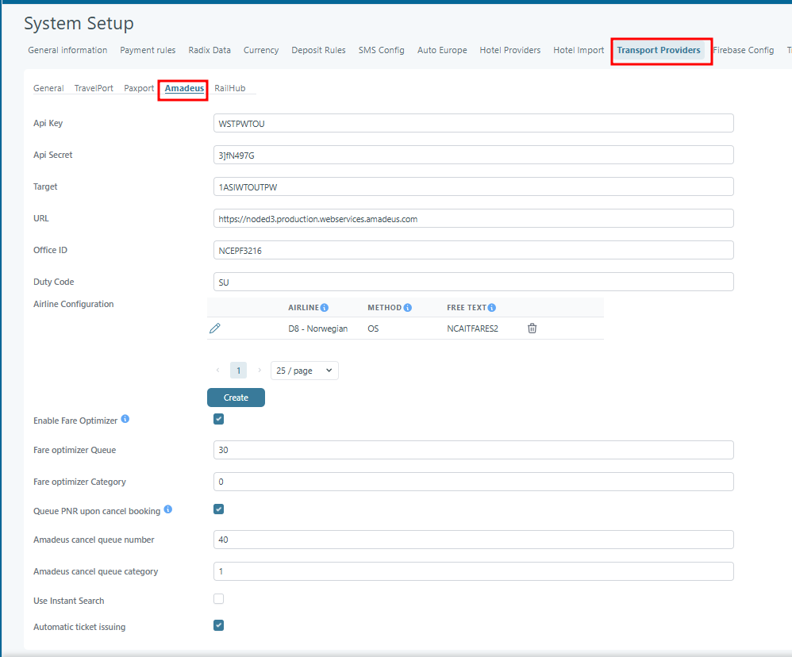

# Amadeus

## Overview

The **Amadeus Transport Provider Configuration** page is used to connect Tourpaq with the Amadeus reservation system.\
This integration enables the platform to:

* Search and book flights through Amadeus
* Issue tickets automatically
* Queue cancellations and booking updates
* Apply airline-specific configurations
* Support web booking and booking flow integrations
* Enable automated airline communication and reporting

This setup is located under:

`System Setup → Transport Providers → Amadeus`

## Purpose of the Feature

The purpose of the Amadeus configuration is to establish a secure communication channel between Tourpaq and the Amadeus GDS (Global Distribution System).

Once configured, the system can:

* Retrieve live flight availability
* Create and manage PNRs
* Issue airline tickets
* Send cancellation requests
* Manage queues
* Handle airline-specific OSI/SSR messaging
* Optimize fare processing

Without this configuration, flight booking functionality connected to Amadeus will not operate.

## Configuration Fields

### General Configuration

<figure><figcaption></figcaption></figure>

<table><thead><tr><th width="259" align="center">Field</th><th width="490.25">Description</th></tr></thead><tbody><tr><td align="center"><strong>API Key</strong></td><td>Authentication key provided by Amadeus Web Services. Used to identify the integration client.</td></tr><tr><td align="center"><strong>API Secret</strong></td><td>Secret token paired with the API key for secure authentication. Must remain confidential.</td></tr><tr><td align="center"><strong>Target</strong></td><td>Identifier for the Amadeus environment (test or production). Determines which Amadeus system the platform communicates with.</td></tr><tr><td align="center"><strong>URL</strong></td><td>The endpoint address for the Amadeus API services. Defines where requests are sent (e.g., test or live environment).</td></tr><tr><td align="center"><strong>Office ID</strong></td><td>Amadeus office identifier (Pseudo City Code / PCC). Determines ownership of bookings and ticketing access.</td></tr><tr><td align="center"><strong>Duty Code</strong></td><td>Code defining the agent’s permission level within Amadeus. Often matches the Office ID.</td></tr></tbody></table>

***

## Airline Configuration Section

The **Airline Configuration** table allows airline-specific behavior customization.

| Column          | Description                                                                                                     |
| --------------- | --------------------------------------------------------------------------------------------------------------- |
| **Airline**     | Airline code and airline name. Select the airline that has a dedicated ticket-issuing deadline extension method |
| **Method**      | Communication method used. Select the method used to extend the ticket-issuing deadline.                        |
| **Free Text**   | Specify the free text associated with the method. The free text depends on the actual company agreement.        |
| **Delete Icon** | Removes the airline configuration                                                                               |

#### Available Actions

| Action            | Description                     |
| ----------------- | ------------------------------- |
| **Edit Icon**     | Modify existing airline setup   |
| **Create Button** | Add a new airline configuration |
| **Delete Icon**   | Remove configuration            |

***

### Airline Configuration Example

| Airline          | Method | Free Text     |
| ---------------- | ------ | ------------- |
| `D8 - Norwegian` | `OS`   | `NCAITFARES2` |

#### Example Usage

When a booking is made with Norwegian Airlines, the system automatically sends the configured OS/free-text message to Amadeus during booking processing.

This ensures:

* Correct airline communication
* Special operational handling
* Automated queue management

***

## Fare Optimizer Settings

### Enable Fare Optimizer

If checked, the PNR is placed in a queue when the reservation is made. This allows the Amadeus Fare Optimizer to process it.
\
The queue is identified by a number and a category. Both values come from Amadeus.

The following options are only shown if "Enable Fare Optimizer" is selected:

* Fare optimizer Queue (positive number)
* Fare optimizer category (positive number)

***

### Fare Optimizer Queue

Defines the Amadeus queue number used for fare optimization processing.

#### Example

`30`

***

### Fare Optimizer Category

Defines the queue category used together with the optimizer queue.

#### Example

`0`

***

## Queue PNR upon Cancel Booking

When enabled, the PNR is placed in a queue when the booking is canceled. This enables manual processing in Amadeus. The queue is identified by a number and a category. Both values came from Amadeus.

***

### Amadeus Cancel Queue Number

Defines which queue receives cancellation requests.

#### Example

`40`

***

### Amadeus Cancel Queue Category

Defines the queue category used for cancellations.

#### Example

`1`

***

## Use Instant Search

Enables the Amadeus Instant Search method for faster flight availability responses. When disabled, standard search is used instead.

***

## Automatic Ticket Issuing

When enabled, tickets are automatically issued after successful booking confirmation.Enables automated issuing of e-tickets for GDS bookings handled through Amadeus.

***

## Typical Configuration Process

### Step-by-Step Setup

1. Open:\
   `System Setup → Transport Providers → Amadeus`
2. Enter:
   * API Key
   * API Secret
   * Target
   * URL
   * Office ID
   * Duty Code
3. Configure airline-specific rules
4. Enable required options:
   * Fare optimizer
   * Queue cancellations
   * Automatic ticket issuing
5. Save configuration

### **Usage notes**

* All fields must be valid for the system to perform Amadeus flight searches or booking actions.
* Credentials differ between **test** and **production** environments. Verify values before switching.
* Any change in API Key or Secret requires saving the configuration and re-authenticating.
