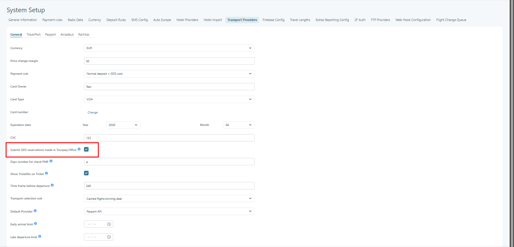

# Instant GDS Submit

### Purpose

The Instant GDS Submit feature automatically submits eligible GDS reservations as soon as all required conditions have been met. This removes the need for users to manually submit reservations through the GDS tab and helps secure airline inventory and pricing without delay.

By submitting reservations immediately, the system helps ensure that reservations are created in the GDS at the earliest possible moment.

***

### Configuration

The feature configuration setting: **System Setup -> Transport Providers -> General ->** **Submit GDS reservations made in Tourpaq Office**

<figure><figcaption></figcaption></figure>

#### Enabled

When this setting is enabled, the system automatically submits GDS reservations as soon as all required submission conditions are met (the GDS reservation is submitted once the first payment is made for the booking).

#### Disabled

When this setting is disabled, the system does not automatically submit reservations.

#### Example

A user enables **Submit GDS reservations made in Tourpaq Office**.

A booking contains a GDS flight and the customer made the first payment for the booking. Once all submission conditions are fulfilled, the reservation is automatically submitted to the GDS.

***

### How the Feature Works in the Booking Flow

During the booking flow, the system continuously evaluates whether a booking is eligible for GDS submission.

When all required conditions have been met, including payment-related requirements such as the first payment and the booking deposit, the reservation is submitted immediately.

No manual action is required from the user.

#### Booking Flow Example

1. A user creates a booking containing GDS flights.
2. The booking remains pending until all submission requirements are satisfied.
3. The customer makes the first payment of the booking.
4. The booking becomes eligible for GDS submission.
5. The system immediately submits the reservation to the GDS.
6. The booking is updated with the resulting GDS reservation details.

***

### User Impact

Users no longer need to remember to manually submit reservations through the GDS tab when the booking becomes eligible.

The system automatically performs the submission once the required conditions have been met.
