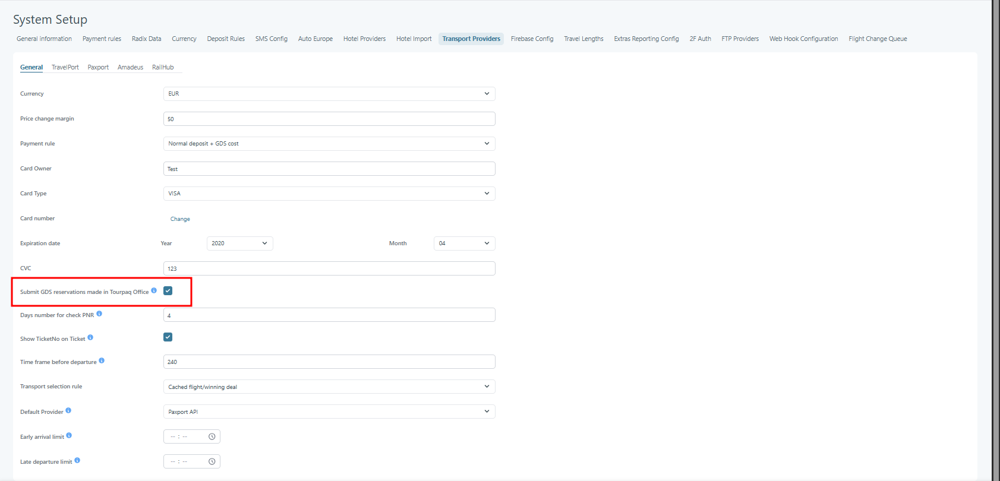

# Instant GDS Submit

### Overview

Instant GDS Submit automatically submits eligible GDS reservations from Tourpaq Office.

The setting complements the manual workflow in [Submit a GDS Booking](../../../gds-queue-place/submit-a-gds-booking/).

### Purpose

Instant GDS Submit removes manual submission from the booking **GDS** tab.

Tourpaq submits the reservation when all configured conditions are satisfied.

### Requirements

Before enabling Instant GDS Submit, complete these requirements:

* Configure the relevant GDS provider. See [GDS Bookings](../../../gds-queue-place/gds-bookings.md).
* Ensure the booking contains GDS flights.
* Ensure the booking meets all submission conditions, including first payment and booking deposit.

### Navigation

In Tourpaq Office, open **System Setup → Transport Providers → General**.

Configure **Submit GDS reservations made in Tourpaq Office**.

### Interface overview

<figure><figcaption>
Use this checkbox to enable automatic GDS reservation submission.
</figcaption></figure>

#### Submit GDS reservations made in Tourpaq Office

This optional checkbox controls automatic GDS submission for Tourpaq Office bookings.

Select the checkbox to submit eligible GDS reservations automatically.

Clear the checkbox to retain manual submission through the booking **GDS** tab.

This setting applies to the GDS workflow described in [GDS Bookings](../../../gds-queue-place/gds-bookings.md).

### Configuration steps

Configure Instant GDS Submit as follows:

1. In **System Setup**, open **Transport Providers**.
2. Open the **General** tab.
3. Select **Submit GDS reservations made in Tourpaq Office**.
4. Save the transport provider configuration.

### System behavior

Tourpaq evaluates GDS bookings during the booking flow.

When a booking meets every submission condition, Tourpaq submits its reservation immediately.

The conditions include the booking's first payment and booking deposit.

Tourpaq records the resulting GDS reservation details in the booking.

When the checkbox is clear, Tourpaq does not submit reservations automatically.

Manual submission remains available from the booking **GDS** tab. See [Submit a GDS Booking](../../../gds-queue-place/submit-a-gds-booking/).

### Booking flow example

This example shows an eligible GDS reservation:

1. Create a booking containing GDS flights.
2. Register the booking's first payment.
3. Complete the booking deposit requirement.
4. Tourpaq verifies the submission conditions.
5. Tourpaq submits the reservation to the GDS.
6. Tourpaq stores the returned GDS reservation details.

### Examples

#### Automatic submission enabled

A booking contains GDS flights and satisfies every payment condition.

Tourpaq submits the reservation without a manual **GDS**-tab action.

#### Automatic submission disabled

A booking contains GDS flights, but the checkbox remains clear.

Staff submit the reservation through the booking **GDS** tab when appropriate.

### Related pages

* [GDS Bookings](../../../gds-queue-place/gds-bookings.md) explains GDS reservation processing.
* [Submit a GDS Booking](../../../gds-queue-place/submit-a-gds-booking/) describes manual GDS submission.
* [System Setup – Transport Providers](./) describes transport provider configuration.
