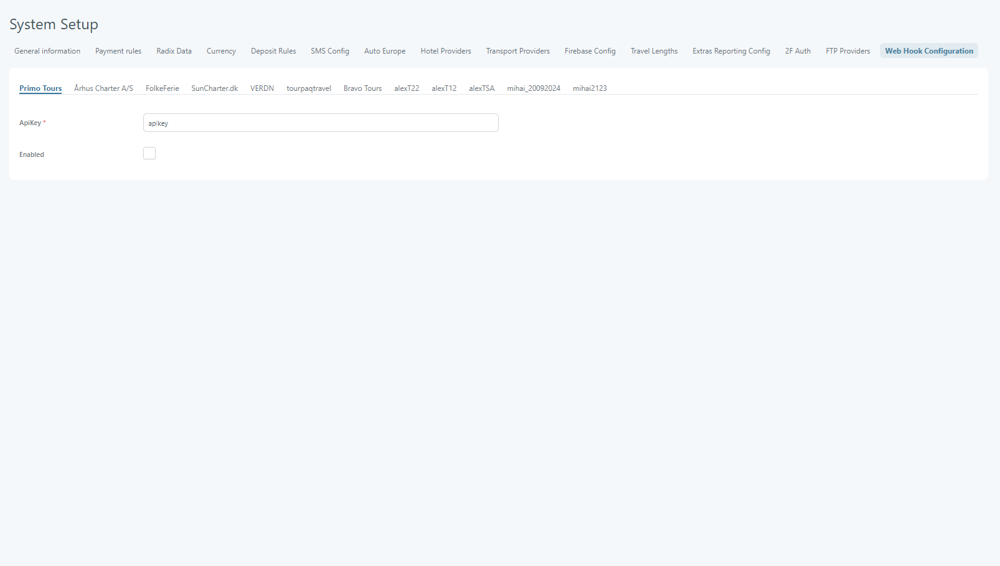
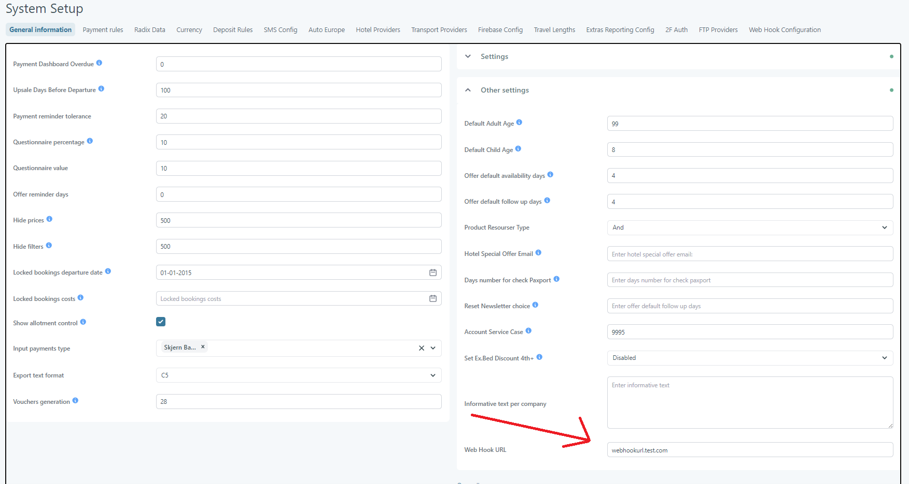

# System Setup – Web Hook Configuration

### Overview

**Web Hook** sends hotel-update notifications to an external URL. The configuration applies separately to each brand.

Web Hook uses **Web Hook URL** from [General Information Settings](system-setup-general-information-settings.md).

### Purpose

Use **Web Hook** to keep an external system informed about hotel changes. The external system receives a notification after supported hotel updates.

### Requirements

Before enabling webhooks, confirm these requirements:

* Administrator access to **System Setup**.
* A target endpoint for **Web Hook URL**.
* An **API key** for each enabled brand.
* Access to the target system for validation.

### Navigation

In Tourpaq Office, open **Setup → System Setup → Web Hook**.

### Interface overview

The **Web Hook** tab stores configuration for each brand. **API key** is required before a brand configuration can be saved.

<figure><figcaption>
Web Hook API key configuration by brand.
</figcaption></figure>

**Web Hook URL** provides the destination used by every enabled webhook.

<figure><figcaption>
Web Hook URL configuration in General Information Settings.
</figcaption></figure>

### Field descriptions

| Field            | Description                                                                                                                                                                        |
| ---------------- | ---------------------------------------------------------------------------------------------------------------------------------------------------------------------------------- |
| **API key**      | Required for each brand configuration. Stores the API key for that brand's webhook configuration. A configuration cannot be saved without this value.                              |
| **Web Hook URL** | Required before an enabled webhook can reach an external system. Defines the destination URL for webhook notifications. This setting applies through General Information Settings. |

### Configuration steps

To configure webhooks for a brand:

1. In **General Information Settings**, open **Other Settings**.
2. In **Web Hook URL**, enter the target endpoint.
3. In **System Setup**, open **Web Hook**.
4. In **Web Hook**, select the required brand.
5. In **API key**, enter the brand API key.
6. Enable webhooks for the brand.
7. Save the configuration.
8. Update a test hotel description, photo, or facility.
9. Confirm that the target system receives the webhook.

### System behavior

After a brand is enabled, Tourpaq sends webhooks to **Web Hook URL**. Each brand uses its own **API key**.

Supported hotel events include updates to descriptions, photos, and facilities.

### Examples

#### Hotel content integration

A brand uses an external hotel-content platform. Set the platform endpoint in **Web Hook URL**. Then configure the brand **API key** and enable its webhook.

When a hotel description changes, Tourpaq sends a notification to the platform.

#### Multiple brands

Two brands require webhook notifications. Configure an **API key** for each brand. Enable webhooks only for brands requiring notifications.

### Related pages

Use these related guides:

* [System Setup](./) describes company-wide configuration.
* [General Information Settings](system-setup-general-information-settings.md) contains **Web Hook URL**.
* [Hotel API webhook](https://docsv2.tourpaq.com/docs/hotel-api/webhook) documents the webhook API.
