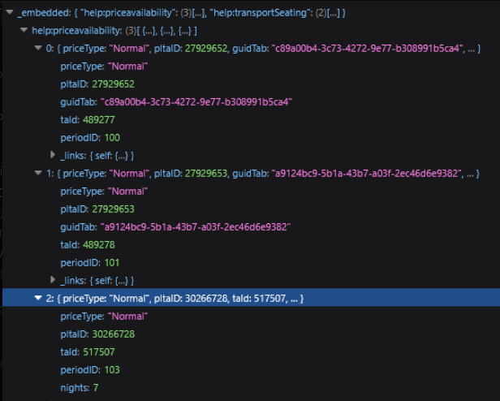
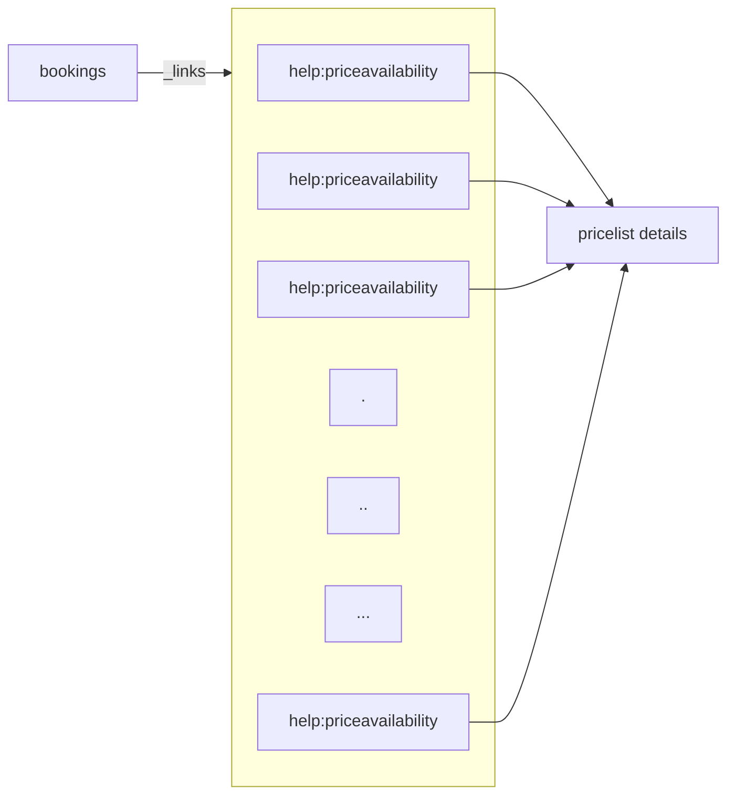

# Check-out flow/customer center for A la carte

### Overview

An **A la carte** booking combines more than one hotel stay and/or one-way transport in a single booking, instead of a single fixed package. This page explains how the check-out flow in Customer Center, and the equivalent Web Booking flow, identify an A la carte booking, and how passengers, products, and supplements are matched back to the correct hotel or transport inside it.

### Purpose

* Recognise why an A la carte booking returns more than one item where a normal booking returns one.
* Match a passenger, product, or supplement to the correct hotel or transport inside an A la carte booking.
* Build or debug an integration against Customer Center or Web Booking for A la carte bookings.

### Preconditions

* The booking is confirmed and reachable through the office API, see the [.](./ "mention") page.
* The booking's `agencyID` and `hash` are known for Customer Center, or its offer details are known for Web Booking, needed to call the API.
* A PLTA ID identifies one trip component, one hotel stay or one transport, within a booking—see [.](./ "mention") in the Tourpaq Web Booking - Technical documentation page.

In the case of DoBooking flow, it is necessary to aquiere a "package GUID"with which you will start the booking flow.(this replaces the traditional parameters from \<LINK TO WB PARAMS.)

### How-to



#### Customer Center

* Call the office API `api/office/bookings/0?agencyID=&hash=`.&#x20;
* Then read the `help:priceavailability` array in the response's `_embedded objects`.&#x20;
* In a normal booking, this array contains only 1 item (the charter, or the one way hotel). In an ALC hotel (comprised of multiple hotels, and/or transports) this array contains multiple items.

<figure><figcaption></figcaption></figure>



#### **Room Availability:**

* Looking at the \_links object, it has the same "help:priceavailability" array, this time it's a list of paths. These need to be called using GET, to get all the details about the hotels.
* In short terms, for a normal booking you would be making one call and memorizing it's result, in the a la carte scenario you need to make multiple cals and memorize the results.



#### **Passengers**

* In the passengers call, you will have your pax multiplied. Each entry has a different "roomDetails" node. For example, if a pax stays in 2 rooms/hotels, they will appear twice, each with said room/hotel. BUT THEY ARE ESSENTIALLY THE SAME PAX. (identified by the unique pax hash)
* You can identify what pax is from what room by the pltaID in the roomDetails.
* Supplements are untouched since those are pax-bound, not room-bound.
* Preselected products are assigned on the pax/room pair. So they don't have their own PLTAID.



#### **Products**

* In the relevant product call, we have products. These items have a "availableForPltaIDs" array, that tells you which hotels they are eligible for. These will only be assignable to pax in THAT room.
* Insurance and cancellation insurance are also PLTA agnostic.



#### **Manual Supplements**

* In the relevant supplement call, we have supplements. These items have an "availableForPltaIDs" array. Same as relevant products, these denote which PLTA these are eligible for.



Once every passenger, product, and supplement has been matched to its PLTA, checkout can be assembled and priced the same way for an A la carte booking as for a normal one.


The Web Booking flow, DoBooking, follows the same logic. The only difference is the starting call: DoBooking calls `/api/offer` instead of the office call used by Customer Center.


#### Examples

GET: api/office/bookings/0?agencyID=\&hash=

Make GET calls to the help:priceavailability array links.\
Store the results in an array. These are the pricelist details.\
NOTE: These responses contain more info regarding the pricelists, but I will highlight only what is most relevant to the scenarios.\
Examples:

* Booking with 1 charter and 2 custom days hotels

> api/office/bookings/0?agencyID=271\&hash=

> /api/priceavailability/normal/36605746/103\
> /api/priceavailability/normal/36681976/103\
> /api/priceavailability/normal/43517977/1

<figure><figcaption></figcaption></figure>

How the responses look:\
\- Charter hotel is just a normal hotel, nothing special. The same as a normal charter booking.\
\- LAN004 (custom hotel days) will return periodID as being 103 accompanied with checkinDate + checkoutDate and room details.\
\- KB015 (custom hotel days) will return periodID as being 103 accompanied with checkinDate + checkoutDate and room details.

* Booking with 2 OW transports and 1 charter

> api/office/bookings/0?agencyID=271\&hash=

> /api/priceavailability/normal/27879892/101?bookingID=830457\&roomNo=1\&hash=\
> /api/priceavailability/normal/27879891/100?bookingID=830457\&roomNo=1\&hash=\
> /api/priceavailability/discount/13953063/1?bookingID=830457\&roomNo=1\&nights=7\&hash=

<figure><figcaption></figcaption></figure>

How the responses look:\
\- Charter hotel is just a normal hotel, nothing special. The same as a normal charter booking.\
\- One way OUT transport, will return periodID as being 100 accompanied by the departureDate\
\- One way HOME transport will return periodID as being 101 accompanied by the departureDate

* Booking with 2 OW transports and N custom hotel days hotels

> api/office/bookings/0?agencyID=271\&hash=

> /api/priceavailability/normal/30269178/103?bookingID=826548\&roomNo=1\&nights=7\&hash=\
> /api/priceavailability/normal/30269995/103?bookingID=826548\&roomNo=1\&nights=7\&hash=\
> /api/priceavailability/normal/30338660/101?bookingID=826548\&roomNo=1\&hash=\
> api/priceavailability/normal/30338658/100?bookingID=826548\&roomNo=1\&hash=

<figure><figcaption></figcaption></figure>

How the responses look:\
\- One way OUT transport, will return periodID as being 100 accompanied by the departureDate\
\- One way HOME transport will return periodID as being 101 accompanied by the departureDate\
\- SPC006 (custom hotel days) will return periodID as being 103 accompanied with checkinDate + checkoutDate and room details.\
\- SPC009 (custom hotel days) will return periodID as being 103 accompanied with checkinDate + checkoutDate and room details.

* Booking with 2 charters

> api/office/bookings/0?agencyID=271\&hash=

> /api/priceavailability/normal/32767087/1?bookingID=831621\&roomNo=1\&nights=7\&hash=\
> /api/priceavailability/normal/32783798/1?bookingID=831621\&roomNo=1\&nights=7\&hash=

<figure><figcaption></figcaption></figure>

* This is basically 2 normal charter bookings fused into one.
* 1# Charter hotel is just a normal hotel, nothing special. The same as a normal charter booking.
* 2# Charter hotel is just a normal hotel, nothing special. The same as a normal charter booking.

When getting to the passengers, you will see passengers multiplied, you will have to check which passenger goes into what "accomodation". NOTE: some passengers go into multiple accomodations; such is the example with 1 charter + 2 hotels, where they fly with the transport but stay in 2 hotels back to back.

#### Field Reference

<table><thead><tr><th width="260">Field</th><th width="241">Description</th><th>Notes</th></tr></thead><tbody><tr><td><code>help:priceavailability</code> [embedded]</td><td>The list of hotels/transports in the booking</td><td>Contains one item for a normal booking, several for an A la carte booking.</td></tr><tr><td><code>help:priceavailability</code> [links]</td><td>GET paths, one per item above, used to fetch each hotel's or transport's full availability</td><td>Call every path, there is no longer a single object to read.</td></tr><tr><td><code>roomDetails</code></td><td>The room/transport-specific details attached to one occurrence of a passenger</td><td>A passenger booked into two rooms has two occurrences, each with its own <code>roomDetails</code>.</td></tr><tr><td><code>pltaID</code> [in roomDetails]</td><td>Identifies which hotel or transport this passenger occurrence, product, or supplement belongs to</td><td>Used to route products and supplements to the right passengers.</td></tr><tr><td><code>uniquepaxhash</code></td><td>Identifies one physical passenger across all of their occurrences</td><td>Use it to collapse multiplied passenger occurrences back into one person.</td></tr><tr><td><code>availableForPltaIDs</code></td><td>The PLTA ID(s) a product or manual supplement can be sold </td><td>Insurance and cancellation insurance ignore this field, they can be sold regardless of PLTA.</td></tr></tbody></table>


Supplements are matched to a passenger directly and never carry a PLTA ID of their own - only products and manual supplements do.


#### Related pages

* [.](./ "mention")
* [web-service.md](../web-service.md "mention")
* [glossary.md](../../integration/glossary.md "mention")
