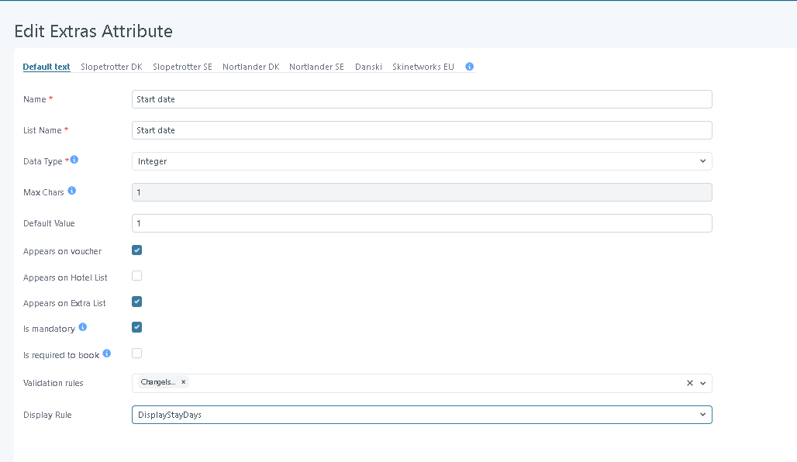
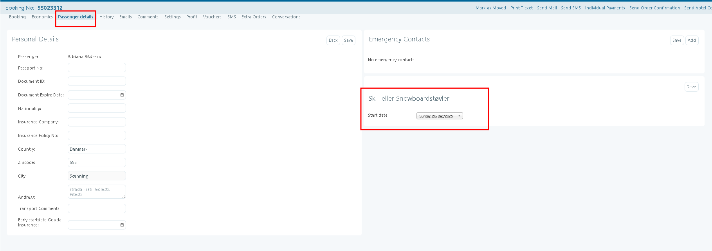
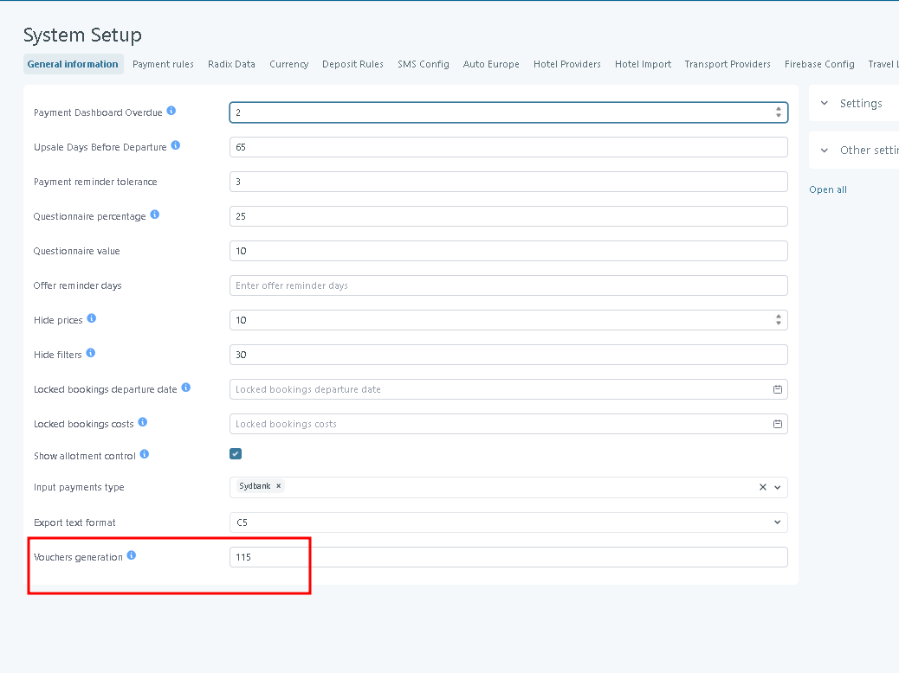
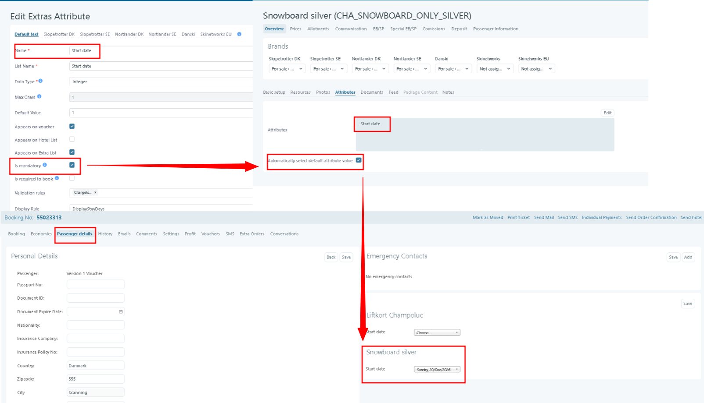
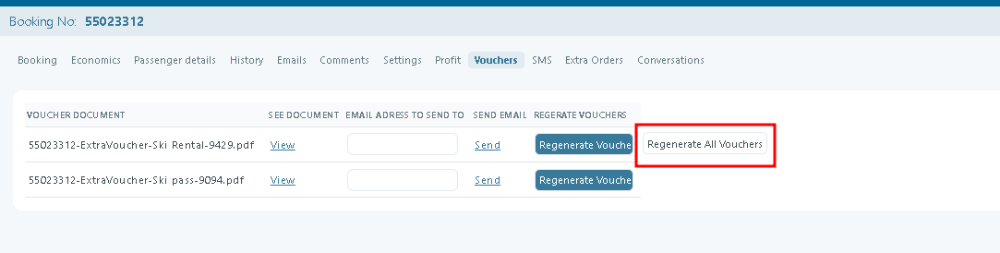
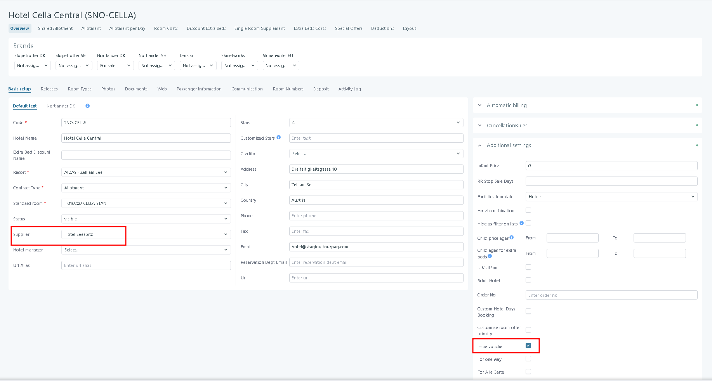

# Vouchers

### Overview

Tourpaq creates voucher documents automatically.

It runs several times per day.

Vouchers can be created for hotels, extras, and discounts.

### Purpose

Vouchers make sure customers and suppliers have the right documents before departure.

The automatic process saves time and helps avoid mistakes.

It also ensures bookings meet the required conditions before creating a voucher.

### Requirements

Before an attribute can appear on an Extra Voucher:

* Create the attribute in [extras-attributes.md](../extras-attributes.md "mention").
* Assign it to the extra in [attributes.md](../extras-setup/extras-general-page/attributes.md "mention").
* Enable **Appears on voucher** for the attribute.
* Select the extra for the relevant passenger.

Enable **Is mandatory** when a value is required before voucher generation.

### Attributes on vouchers

#### Overview

Attributes collect information for an extra, such as equipment size or a service day.

#### Purpose

Use attributes when a supplier needs information beyond the selected extra.

For example, a ski-rental supplier can require **Height** and **Start date**. The Extra Voucher then includes these values.

#### Navigation

Use these locations:

* In checkout, select the extra and complete the **Attributers** fields.
* In Tourpaq Office, open the booking, select **Edit Passenger**, and select the extra.
* In Extras setup, open **Extras → Extra → Attributes**.

<figure><figcaption></figcaption></figure>

#### Enter data in the booking window

1. In Tourpaq Office, open the booking and select **Passenger Details**.
2. Select one passenger.
3. Select the extra in its extra category.
4.  Enter or select the attribute values shown for that extra.&#x20;

    <figure><figcaption></figcaption></figure>
5. Click **Save Passenger**.

#### System behavior

* **Automatically Select Default Attribute Value** populates the configured default when enabled.
* A mandatory attribute without a value blocks Extra Voucher generation.
* An attribute prints on the Extra Voucher only when **Appears on voucher** is enabled.
* Changing an attribute after a voucher exists requires voucher regeneration. Select **Regenerate all vouchers** to update all voucher documents.

#### Example

An extra named Ski Rental has these attributes:

* **Height** uses the **Integer** type and has **Is mandatory** enabled.
* **Start date** uses **display as stay days choices** and has **Appears on voucher** enabled.

During checkout or in **Passenger Details**, the passenger selects Ski Rental. **Attributers** collects Height and Start date.

Tourpaq blocks the Extra Voucher if Height has no value. The voucher prints Start date because **Appears on voucher** is enabled.

### Types of vouchers

* **Hotel vouchers**
* **Extra category vouchers**
* **Discount and supplement vouchers**

### When vouchers are created

Vouchers are created only when all rules below are met.

1. **Timing**
   * Vouchers are created **X days before departure**.
   *   Set **X** in **System Setup → Vouchers Generation**.

       <figure><figcaption></figcaption></figure>
2. **Booking Conditions**
   * Booking status must be **OK**.
   * The booking must be **fully paid**.
   * A voucher of the same type must not already exist.
3. **Extras Conditions**
   * If an extra needs additional details (attributes), you must fill them in first.
   *   If an attribute is marked as **Mandatory** (e.g. **Start date**) and **Automatically select default value** is enabled, the default value will be automatically populated in the booking under **Passenger Details**.

       <figure><figcaption></figcaption></figure>
   * If an **Extra Voucher** contains a **Mandatory** attribute that has no value, the voucher will **not be generated**.
   * If an **Extra Package** contains at least one extra without a **Supplier** assigned, the voucher will **not be generated for the entire package**.
   *   If multiple vouchers have already been generated and another **Extra Voucher** is generated, all existing vouchers must be regenerated by clicking **Regenerate all vouchers**.

       This ensures that all vouchers contain the latest booking information.

       <figure><figcaption></figcaption></figure>
4. **System Setup Constraints**
   * Vouchers are not created for bookings with departure dates in the past.
5. **Entity Requirements**
   * The hotel/extra/discount must have:
     * **Issue Voucher** enabled.
     * A **Supplier** selected.

<figure><figcaption></figcaption></figure>


If a voucher is missing, start by checking the booking status and payment.

Then check that **Issue Voucher** and **Supplier** are set on the hotel/extra/discount.


### Troubleshooting

If you expected a voucher but did not get one, check these common reasons:

* The booking is not **OK**.
* The booking is not **fully paid**.
* It is not yet **X days before departure**.
* A voucher of the same type already exists.
* The hotel/extra category/discount does not have **Issue Voucher** enabled.
* The hotel/extra category/discount is missing a **Supplier**.
* Required extra attributes are not filled in.

### Related pages

* [qr-code-for-vouchers.md](../booking/new-booking/qr-code-for-vouchers.md "mention") — Add QR codes to generated voucher documents.
* [extras-attributes.md](../extras-attributes.md "mention") — Configure mandatory attributes and values used on extra vouchers.
* [extra-suplier.md](../suppliers/extra-suplier.md "mention") — Create suppliers for extras and assign their services.
* [general-settings](../brands/general-settings/ "mention") — Configure voucher numbering for a Brand.
