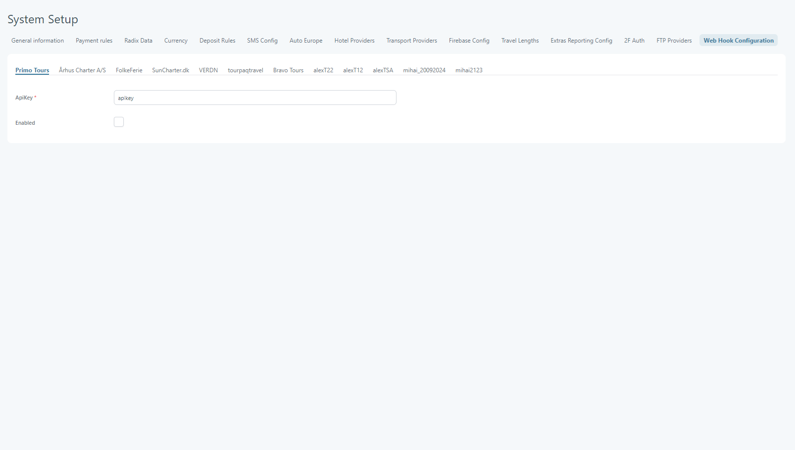
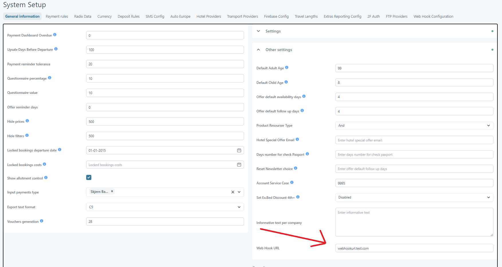

# Web Hook Configuration

Web Hook tab in System Setup is used to either enable/disable the feature on each brand or to set up the apiKey for each brand

### Web Hook Edit 

To save a configuration for any of the brands you are required to have "ApiKey" completed.

<figure><figcaption></figcaption></figure>

After enabling the feature for any brand, when updating a hotel descriptions, photos or facilities a web hook will be sent to the target URL that was set on company in [General Informtation](system-setup.md#general-information) -> Other Settings.

<figure><figcaption></figcaption></figure>

You can find out how this works in API following this [link](https://docsv2.tourpaq.com/docs/hotel-api/webhook)
