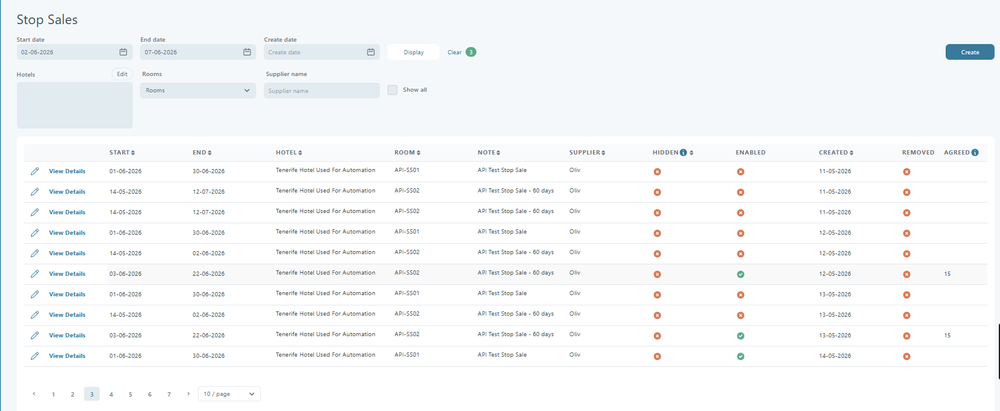

# Stop Sales

### Overview

The **Stop Sale** page allows users to create a stop sale for specific hotels and room types within a selected date range. A _stop sale_ prevents new bookings for the specified period — it is typically used when a hotel reaches full occupancy or temporarily stops accepting reservations.

A supplier can remove a hotel room from selling by creating a stop sale for that room. He can do that by going to the Stop Sale page and filling in the filters for that room and the period. The stop sale will run for each date and reduce the number of rooms available.

**Important:** It is not possible to make Stop Sale for secured and guaranteed rooms.

### Key rules

* Stop sales apply per day in the selected date range.
* Stop sales take effect immediately after saving.
* You cannot create stop sales for **secured rooms**.
* **Note** can be mandatory, based on your System Setup settings.
* Fields marked with a red asterisk (\*) are mandatory.

### Create a stop sale

Navigate to **Stop Sales → Create New Stop Sale**.

1. Select **Start date** and **End date**.
2. Select **Brand** (or leave it as _All brands_).
3. Select the **Hotel**.
4. Select **Room Type** (optional).
5. Add a **Note** (optional unless required).
6. Click **Save**.

<figure><figcaption></figcaption></figure>

### Fields

| Field          | What it controls                                                                                    |
| -------------- | --------------------------------------------------------------------------------------------------- |
| **Start date** | First day of the stop sale period.                                                                  |
| **End date**   | Last day of the stop sale period (inclusive).                                                       |
| **Brand**      | Brand the stop sale applies to. Default is _All brands_.                                            |
| **Hotel**      | The hotel that will be blocked for sale.                                                            |
| **Room Type**  | One or more room types. If empty, the stop sale applies to the whole hotel.                         |
| **Note**       | Reason for the stop sale (for internal reference and reporting). Can be mandatory via System Setup. |

### Example

To stop sales for **Inside Elounda** on **13 October 2025** for room type _DBL.VM_:

* **Start date:** 13-10-2025
* **End date:** 13-10-2025
* **Brand:** All brands
* **Hotel:** 107754 – Inside Elounda
* **Room Type:** DBL.VM
* **Note:** Fully booked for the selected date

Click **Save** to create the stop sale.

### Availability calculation (guaranteed vs booked)

When a stop sale is applied, availability is recalculated against:

* **Guaranteed rooms** (if configured)
* **Booked rooms**

Rules:

* If guaranteed rooms exist and **guaranteed > booked**, availability is reduced to the **guaranteed** number.
* If guaranteed rooms do not exist, or **booked ≥ guaranteed**, availability is reduced to the **booked** number.

#### Scenarios

| Available rooms before | Guaranteed rooms | Booked rooms | Available rooms after |
| ---------------------- | ---------------- | ------------ | --------------------- |
| 10                     | 5                | 4            | 5                     |
| 10                     | 5                | 6            | 6                     |
| 10                     | –                | 6            | 6                     |
| 10                     | –                | 10           | 10                    |

### What happens after saving

After you create a stop sale, the supplier is redirected to the **Hotel Allotment** page.

Filters are automatically filled so you can review the change.

<figure><figcaption></figcaption></figure>

If you create a stop sale for the whole hotel, the system saves it as **one stop sale per room type**.

### Manage stop sales (admin view)

On **Hotel → Stop Sales**, you can see all stop sales, including _ignored_ ones.

Ignored stop sales are shown with a red background.

You can **Enable** or **Disable** any stop sale.

If you disable a stop sale, the Stop Sale service ignores it when recalculating availability.

<figure><figcaption></figcaption></figure>

#### Filters & search

* **Start Date / End Date**: Date range for stop sales.
* **Create Date**: Date the stop sale was created.
* **Hotels**: Select one or more hotels.
* **Rooms**: Filter by room types.
* **Supplier Name**: Search by supplier.
* **Show All**: Remove filters and show everything.
* **Display**: Apply current filters.
* **Clear**: Reset filters.

#### Data table columns

| Column           | Meaning                                      |
| ---------------- | -------------------------------------------- |
| **Edit**         | Edit the stop sale.                          |
| **View Details** | Open log/details view for the stop sale.     |
| **Start / End**  | Date range for the stop sale.                |
| **Hotel**        | Hotel code and name.                         |
| **Room**         | Room type (or blank for full-hotel).         |
| **Supplier**     | Supplier on the stop sale.                   |
| **Hidden**       | Whether the stop sale is hidden on dashboard |
| **Enabled**      | Whether the stop sale is active.             |
| **Created**      | Creation date/time.                          |
| **Remove**       | Whether the stop sale was removed/undone.    |
| **Agreed**       | Agreed allotment                             |

### Stop Sale service

The Stop Sale service validates stop sales (including future dates).

It also checks for cancellations that would change booked room counts.

If cancellations occur, the service **recalculates availability** using the rules above.

To exclude a stop sale from the service, go to **Hotel → Stop Sales** and click **Disable** on that stop sale.

### Stop sale logs

Admins can review changes in the **Release/Stop Sale logs** from the Hotel area.

The last column shows whether the log entry was created by:

* a release
* a stop sale
* the Stop Sale service

<figure><figcaption></figcaption></figure>

### Stop sales in Notifications

Notifications include a tab listing new stop sales.

<figure><figcaption></figcaption></figure>

Select **View Details** to open the log view with filters prefilled from the stop sale.

<figure><figcaption></figcaption></figure>

### Stop sales in Supplier

<figure><figcaption></figcaption></figure>

If a supplier has the **Allow to make stop sale** right, they can view stop sales in **Agent → Stop sales list**.

Suppliers can **Enable** or **Disable** stop sales they created.

### Stop sale email

After a new stop sale is created, an email can be sent to the company with the stop sale filters.

Prerequisites:

1.  In **System Setup**, each company must set an **email address for stop sale**.

    <figure><figcaption></figcaption></figure>
2.  Each agency must create an **email template** in the Email Center.

    <figure><figcaption></figcaption></figure>

### **Stop Sale Room Reservation**

Some hotels can enable a setting that locks room selection during stop sale hours:

* Web Booking and Office users cannot select a room during the stop sale window if nothing is selected yet.
* Web Booking and Office users cannot change an existing room selection during the stop sale window.

<figure><figcaption></figcaption></figure>

### Related tasks

* [Edit Stop Sale](stop-sales/edit-stop-sale.md)
* [Remove (Undo) Stop Sale](stop-sales/remove-undo-stop-sale.md)
* [Agreed Allotment Stop Sale](stop-sales/agreed-allotment-stop-sale.md)
* [Split the Stop Sale Rule](stop-sales/split-the-stop-sale-rule.md)
* [Notification on Dashboard Stop Sale](stop-sales/notification-on-dashboard-stop-sale.md)
