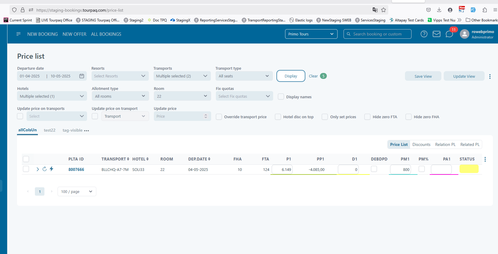

# Agreed Allotment Stop Sale

#### Overview

The **Agreed Allotment Stop Sale** lets you partially adjust the blocked availability by defining an “agreed allotment” — effectively reducing (but not fully removing) the stop sale impact.

#### Purpose

When you don’t want to fully lift a stop sale but still want to reactivate some portions of availability, this feature allows you to agree on an allotment number. The room’s new total allotment becomes the previous final allotment plus the agreed allotment.

In short: **you’re reopening some capacity** without completely turning off the stop sale.

#### Field & Section Explanations

| Name / Section                        | What It Means / Behavior                                                                             |
| ------------------------------------- | ---------------------------------------------------------------------------------------------------- |
| **Filter / Stop Sales List**          | Lists all existing stop sale rules. Filter by date or room type to find the rule you want to adjust. |
| **Edit button**                       | Allows you to modify a stop sale rule.                                                               |
| **Remove or Split section**           | Appears during edit mode; here’s where you add or amend the “agreed allotment”.                      |
| **Enabled checkbox**                  | Toggles whether the rule is active. Must be unchecked to enable editing of the agreed allotment.     |
| **Agreed Allotment field / checkbox** | Lets you input the number of rooms you want to “agree” to open under this stop sale.                 |
| **Save / Cancel buttons**             | Save applies your changes; Cancel discards them.                                                     |

#### Instructions: How to Use Agreed Allotment Stop Sale

1. **Go to Stop Sales**\
   From the main menu: **Hotel → Stop Sales**.\
   The page lists all defined stop sale rules (default filtered to current dates).
2. **Find your rule**\
   Use filters (dates, rooms, status) to locate the stop sale rule you want to adjust.\
   Make sure it’s an **enabled** rule.
3. **Click “Edit”**\
   The rule enters edit mode. A **Remove or Split** section appears underneath.

<figure><figcaption></figcaption></figure>

4. **Disable the rule temporarily**\
   Uncheck the **Enabled** box (this unlocks the agreed allotment field).

<figure><figcaption></figcaption></figure>

5. **Enter the Agreed Allotment**\
   In the **Agreed Allotment** field, type the number of rooms you want reopened under the rule.
6. **Save your changes**\
   Click **Save**.\
   The rule is updated, the edit section closes, and the rule returns to non-edit mode.
7. **(Or) Cancel changes**\
   If you click **Cancel** instead, no changes are applied and the section closes.

#### What to Verify After Setting Agreed Allotment

Once your changes are saved, check that things have updated correctly:

*   **Stop Sales Logs → View details**\
    You should see:

    * _Initial R.No_ =is the final R no after the stop sale was enabled
    * _Final R.No_ = is the initial allotment set before stop sale

    <figure><figcaption></figcaption></figure>
* **Hotel → Allotment per Day tab**\
  In the hotel’s edit page, filter by the same room and dates.\
  Main allotment is restored to the initial allotment before the stop sale.

<figure><figcaption></figcaption></figure>

* **Pricelist**\
  Under **Pricelist**, filter by the hotel, dates, and room type.\
  The **FHA (free-hotel-allotment)** is populated with available number of rooms according to the initial allotment set before the stop sale.

<figure><figcaption></figcaption></figure>

**Setup**

| Steps                                                                                          | Expected Results                                                                                                                                                                                |
| ---------------------------------------------------------------------------------------------- | ----------------------------------------------------------------------------------------------------------------------------------------------------------------------------------------------- |
| 1. Go to "Hotel" menu -> "Stop Sales"                                                          | 
Stop sales page is displayed All stop sales defined in the system are listed with filter on "Start/End date" set as current date by default
                                           |
| 2. Filter the list if necessary to bring the desired stop sale rule and choose an enabled one. | Result list is displayed according to filters used                                                                                                                                              |
| 3. Press "Edit" button                                                                         | New "Remove or Split" button is displayed.                                                                                                                                                      |
| 4. Press "Remove or Split"                                                                     | 
A new dedicated section is displayed underneath. "Add the new agreed allotment. The total allotment for this room will now be previous FINAL ALLOTMENT + new ENABLED  ALLOTMENT"     
 |
| 5. Uncheck "Enabled" checkbox                                                                  | "Agreed Allotment" checkbox becomes enabled/editable                                                                                                                                            |
| 6. Set the "Agreed Allotment"                                                                  | Value is set                                                                                                                                                                                    |
| 7. Press "Save" button                                                                         | Rule is updated and saved. Remove and split section is closed. Rule is not in edit mode anymore                                                                                                 |
| 8. After step 6 press "Cancel"                                                                 | Updates are not saved. Remove and split section is closed.                                                                                                                                      |

**Check results in Stop sales logs**

| Steps                                          | Expected Results                                                                                                                      |
| ---------------------------------------------- | ------------------------------------------------------------------------------------------------------------------------------------- |
| 1. After step 7 in setup, press "View details" | Stop sales logs page is displayed, having the filters automatically set by default for the period and room set on the rule            |
| 2. Check records                               | Initial r.No is the final R no before stop sale was enabled, and Final r. no is final R no before stop sale was enabled+agreed value. |

**Check results in Allotment per day on hotel**

| Steps                                                                                          | Expected Results                                                                      |
| ---------------------------------------------------------------------------------------------- | ------------------------------------------------------------------------------------- |
| 1. After step 7 in setup, go to hotel edit page                                                | Edit page of the hotel is displayed                                                   |
| 2. Go to "Allotment per day" tab and filter the dates and room according to stop sale rule set | Allotment per day for the room is displayed                                           |
| 3. Check allotment                                                                             | Main allotment is updated to new final r no (booked rooms/guranteed+agreed allotment) |

**Check results in Pricelist**

| Steps                                                        | Expected Results                                                                                                  |
| ------------------------------------------------------------ | ----------------------------------------------------------------------------------------------------------------- |
| 1. After step 7 in setup, go to Pricelist menu -> Pricelist  | Edit page of the hotel is displayed                                                                               |
| 2. Filter the dates and room according to stop sale rule set | Corresponding pricelists are listed                                                                               |
| 3. Check FHA                                                 | FHA is populated with available number of rooms according to new agreed allotment set (final R no - booked rooms) |

<figure><figcaption></figcaption></figure>
