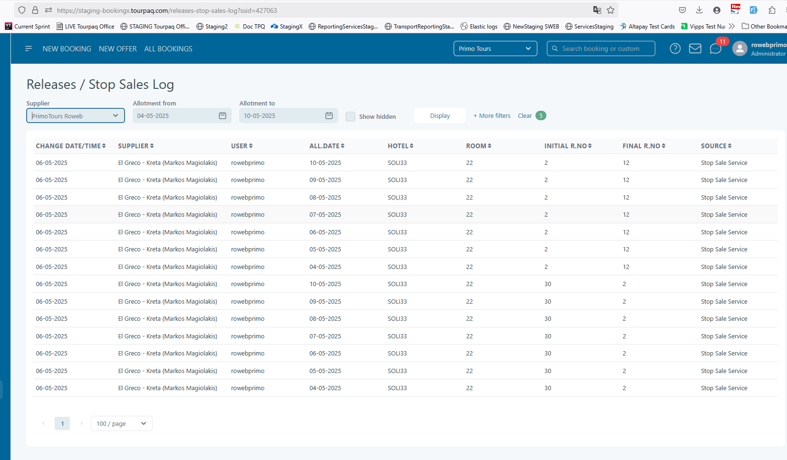
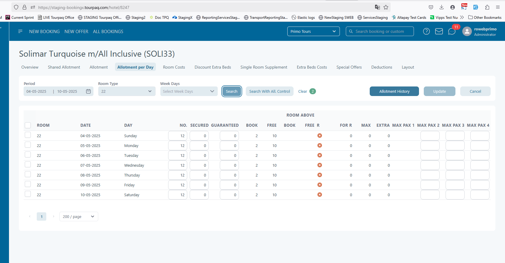

# Agreed Allotment Stop Sale

**Setup**

| Steps                                                                                          | Expected Results                                                                                                                                                                                                                                                                                        |
| ---------------------------------------------------------------------------------------------- | ------------------------------------------------------------------------------------------------------------------------------------------------------------------------------------------------------------------------------------------------------------------------------------------------------- |
| 1. Go to "Hotel" menu -> "Stop Sales"                                                          | 
Stop sales page is displayed All stop sales defined in the system are listed with filter on "Start/End date" set as current date by default
                                                                                                                                                   |
| 2. Filter the list if necessary to bring the desired stop sale rule and choose an enabled one. | Result list is displayed according to filters used                                                                                                                                                                                                                                                      |
| 3. Press "Edit" button                                                                         | New "Remove or Split" button is displayed.                                                                                                                                                                                                                                                              |
| 4. Press "Remove or Split"                                                                     | 
A new dedicated section is displayed underneath. "Agreed Allotment" field is displayed but disabled while stop sale rule is still enabled; Info button displays explanatory text "Add the new agreed allotment. The total allotment for this room will be FINAL All. + ENABLED All." on hover
 |
| 5. Uncheck "Enabled" checkbox                                                                  | "Agreed Allotment" checkbox becomes enabled/editable                                                                                                                                                                                                                                                    |
| 6. Set the "Agreed Allotment"                                                                  | Value is set                                                                                                                                                                                                                                                                                            |
| 7. Press "Save" button                                                                         | Rule is updated and saved. Remove and split section is closed. Rule is not in edit mode anymore                                                                                                                                                                                                         |
| 8. After step 6 press "Cancel"                                                                 | Updates are not saved. Remove and split section is closed.                                                                                                                                                                                                                                              |

<figure><figcaption></figcaption></figure>

**Check results in Stop sales logs**

| Steps                                          | Expected Results                                                                                                                      |
| ---------------------------------------------- | ------------------------------------------------------------------------------------------------------------------------------------- |
| 1. After step 7 in setup, press "View details" | Stop sales logs page is displayed, having the filters automatically set by default for the period and room set on the rule            |
| 2. Check records                               | Initial r.No is the final R no before stop sale was enabled, and Final r. no is final R no before stop sale was enabled+agreed value. |

<figure><figcaption></figcaption></figure>

**Check results in Allotment per day on hotel**

| Steps                                                                                          | Expected Results                                                                      |
| ---------------------------------------------------------------------------------------------- | ------------------------------------------------------------------------------------- |
| 1. After step 7 in setup, go to hotel edit page                                                | Edit page of the hotel is displayed                                                   |
| 2. Go to "Allotment per day" tab and filter the dates and room according to stop sale rule set | Allotment per day for the room is displayed                                           |
| 3. Check allotment                                                                             | Main allotment is updated to new final r no (booked rooms/guranteed+agreed allotment) |

<figure><figcaption></figcaption></figure>

**Check results in Pricelist**

| Steps                                                        | Expected Results                                                                                                  |
| ------------------------------------------------------------ | ----------------------------------------------------------------------------------------------------------------- |
| 1. After step 7 in setup, go to Pricelist menu -> Pricelist  | Edit page of the hotel is displayed                                                                               |
| 2. Filter the dates and room according to stop sale rule set | Corresponding pricelists are listed                                                                               |
| 3. Check FHA                                                 | FHA is populated with available number of rooms according to new agreed allotment set (final R no - booked rooms) |

<figure><figcaption></figcaption></figure>
