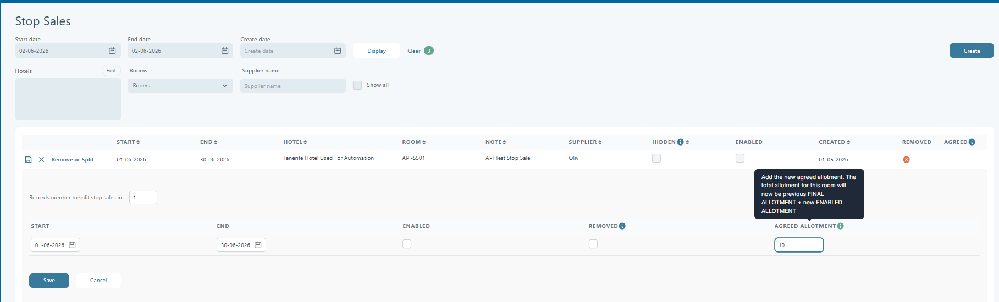

# Agreed Allotment Stop Sale

### Overview

Use **Agreed Allotment** to reopen _some_ availability while a Stop Sale is still in place.

It reduces the impact of the Stop Sale without removing it.

### When to use it

* You want to keep a Stop Sale active.
* You need to sell a limited number of rooms anyway.
* You agreed a fixed allotment with the supplier for a blocked period.

If you want to fully restore availability, use [Remove (Undo) Stop Sale](remove-undo-stop-sale.md).

### How it works

The system increases the Stop Sale’s _final_ allotment by your agreed amount.

Formula: `new final allotment = current final allotment + agreed allotment`.

Example: if the Stop Sale reduces final allotment to `0` and you set `5`, you reopen `5`.

### Key fields and sections

| Name / section               | Meaning / behavior                                                                |
| ---------------------------- | --------------------------------------------------------------------------------- |
| **Filter / Stop Sales list** | Shows existing Stop Sale rules. Filter by dates, room type, or status.            |
| **Edit** (pencil icon)       | Opens the rule in edit mode.                                                      |
| **Remove or Split**          | Expands a section under the rule. This is where you set agreed allotment.         |
| **Enabled**                  | Turns the rule on or off. You must uncheck it to edit the agreed allotment value. |
| **Agreed Allotment**         | Number of rooms you reopen under this Stop Sale.                                  |
| **Save / Cancel**            | Save applies the changes. Cancel discards them.                                   |

### Set an agreed allotment


Start from [Edit Stop Sale](edit-stop-sale.md) if you are unsure how to open **Remove or Split**.




**Open the rule in edit mode**

1. Go to **Hotel → Stop Sales**.
2. Find the Stop Sale rule you want to adjust.
3. Click **Edit** (pencil icon).

<figure><figcaption></figcaption></figure>



**Unlock the Agreed Allotment field**

Uncheck **Enabled**. This unlocks the agreed allotment input.

<figure><figcaption></figcaption></figure>



**Set the agreed allotment and save**

1. Enter the **Agreed Allotment** value.
2. Click **Save**.

Use **Cancel** to discard changes.



### Verify the result

After you save, verify the same hotel, room, and date range in these places:

* **Stop Sales Logs → View details**
  * The log should reflect the agreed allotment adjustment.
  * `Final r.No` should increase by the agreed allotment compared to `Initial r.No`.

<figure><figcaption></figcaption></figure>

* **Hotel → Allotment per Day**
  * Filter on the same room and dates.
  * You should see the reopened capacity reflected in allotment.

<figure><figcaption></figcaption></figure>

* **Pricelist**
  * Filter by hotel, room type, and dates.
  * `FHA` (free-hotel-allotment) should reflect the reopened rooms minus bookings.

<figure><figcaption></figcaption></figure>
