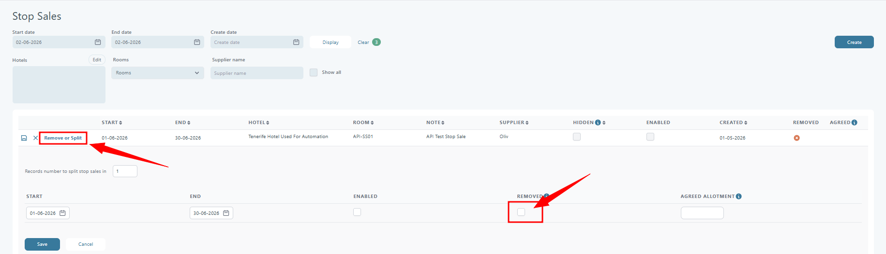

# Remove (Undo) Stop Sale

### Overview

Use **Remove (Undo)** to remove a Stop Sale rule and restore availability.

### Purpose

Remove a Stop Sale when the restriction is no longer needed. Tourpaq restores the original allotment and availability for the same dates.

### When to use it

* The hotel/room should be sellable again.
* The supplier lifted a restriction.
* A Stop Sale was created by mistake.


You remove Stop Sales from **Hotel → Stop Sales**. Start from [Edit Stop Sale](edit-stop-sale.md) if you are unsure which rule to edit.


### Key fields and sections

* **Stop Sales list**: Shows Stop Sale rules. It is filtered by current dates by default.
* **Edit** (pencil icon): Opens the rule in edit mode.
* **Remove or Split**: Expands the section where you can remove or split the rule.
* **Remove** checkbox: Removes the Stop Sale and restores the original allotment.
* **Info** (tooltip): Explains what Remove does.

### Remove a Stop Sale

Only want to undo part of the date range? Use [Split the Stop Sale Rule](split-the-stop-sale-rule.md).



**Open the rule in edit mode**

1. Go to **Hotel → Stop Sales**.
2. Find the rule you want to undo.
3. Click **Edit** (pencil icon).

<figure><figcaption></figcaption></figure>


Only **enabled** rules can be removed or split.




**Open “Remove or Split”**

Click **Remove or Split**. The section opens under the rule.



**Select “Remove”**

Check the **Remove** box. If the checkbox is disabled, you are not in edit mode yet.



**Save or cancel**

Click **Save** to apply the removal. Click **Cancel** to discard changes.

<figure><figcaption></figcaption></figure>



### Verify availability was restored

After you save, check these spots:

* **Stop Sales Logs → View details**
  * `Initial r.No`: the record number created when the Stop Sale was enabled.
  * `Final r.No`: the original allotment record number restored after removal.
* **Hotel → Allotment per Day** (same room and dates)
  * Allotment values should match the pre-Stop Sale values.
* **Pricelist** (same hotel, room type, and dates)
  * `FHA` (free-hotel-allotment) should show the restored availability.
