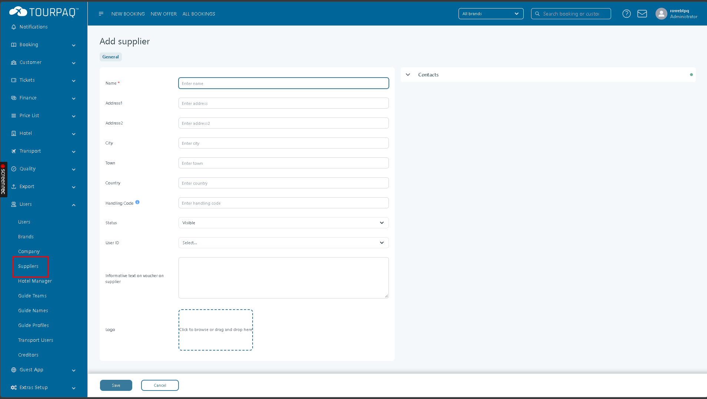
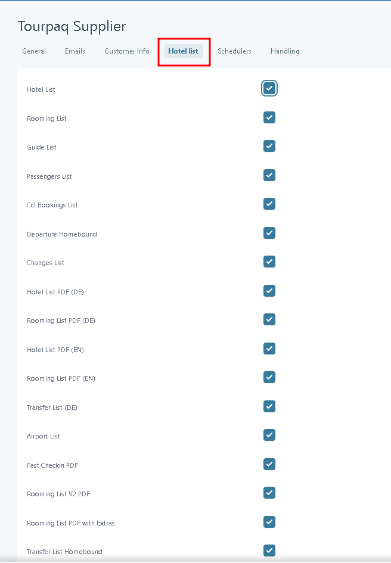

# Hotel supplier

A hotel supplier is usually a hotel group or handling agent that receives booking reports from you and may charge a handling fee per booking. This page covers setting one up end to end.

#### Overview

A **hotel supplier** is a supplier record that represents an external hotel provider. It is linked to a user with the **Supplier** role, which lets the supplier log in to Tourpaq.

The supplier record has six tabs:

* **General** — name, address, contact details, and the linked user.
* **Emails** and **Customer Info** — see the TO VERIFY note under Field Reference.
* **Hotel list** — the report types available for this supplier.
* **Schedulers** — automated delivery of those reports by email or FTP.
* **Handling** — the handling fee, its creditor, and the hotels it applies to.

#### Purpose

Use a hotel supplier to:

* Give a hotel provider its own login to Tourpaq.
* Send the provider its booking reports automatically, on a schedule, by email or FTP.
* Charge a handling fee on bookings for selected hotels, shown in the booking's **Profit** tab.

#### Preconditions

* You have the user rights to create users and suppliers.
* The hotels the supplier will handle already exist — see Hotels.
* If you charge a handling fee, the creditor exists — see How to create a creditor.
* You know the supplier's report requirements: which reports, how often, and whether by email or FTP.
* For FTP delivery, the FTP system is already configured.

#### How-to



**Create the supplier user**

1. Go to **Users → Users** and click **New User**.
2. Set **Role** to `Supplier`.
3. Enter **Username**, **Password**, **First Name** and **Last Name**.
4. Enter **Seller ID** and select the **Associated Agencies**.
5. Add any further roles or permissions the supplier needs, then click **Save**.

The user now exists and can be linked to a supplier record. See Users.



**Create the supplier record**

1. Go to **Users → Suppliers** and click **Create**.
2. On the **General** tab, enter the **Name** and **Town**. Both are required.
3. In **User ID**, select the Supplier user from the previous step.
4. Under **Contacts**, enter **Fax2** (required) and the **Email** and **Reservation Depth Email** addresses.
5. Click **Update**.

The supplier appears in the list on Suppliers.

<figure><figcaption></figcaption></figure>



**Choose the available reports**

1. Open the supplier and go to the **Hotel list** tab.
2. Select each report type the supplier should receive, such as **Rooming List** or **Hotel List PDF (EN)**.
3. Click **Save**.

<figure><figcaption></figcaption></figure>



**Schedule report delivery**

1. Go to the **Schedulers** tab and select the **Hotel Schedulers** sub-tab.
2. Click **Add schedule**.
3. Set **Interval**, then enter either **Bookings Made** or **Days After**. Not both.
4. Set **Hour**, choose the **Reporting** format and choose the **Method**.
5. For `Mail`, enter the recipient **Email**. For `FTP`, select the **FTP System**.
6. Select **Empty List** if the report should be sent even when it has no rows.
7. Click the save icon at the start of the row.

The schedule appears in the **Hotel Schedulers** table and runs from its next scheduled **Hour**. To change it, click the pencil icon.



**Configure handling**

1. Go to the **Handling** tab and open the **Handling Options** sub-tab.
2. Select the **Creditor** and enter the **Account Debit**.
3. Select **Add Own Schedule** if required.
4. On the **Prices** sub-tab, click **Create** and enter the arrival and booking date ranges, the **Price**, and the age range it applies to.
5. On the **Hotels** sub-tab, select the hotels the handling fee applies to.
6. Click **Save**.

Handling fees appear in the **Profit** tab of matching bookings.



The supplier can now log in, receives its scheduled reports, and handling fees apply to new bookings at the selected hotels.

#### Field Reference

**General tab**

<figure><figcaption>
The General tab of the supplier record.
</figcaption></figure>

| Field                                             | Description                                                              |
| ------------------------------------------------- | ------------------------------------------------------------------------ |
| **Name**                                          | The supplier name shown in lists and reports.                            |
| **Address1**, **Address2**, **City**, **Country** | The supplier's postal address.                                           |
| **Town**                                          | The supplier's town.                                                     |
| **Status**                                        | Whether the supplier is shown in the supplier list.                      |
| **User ID**                                       | Links the supplier to its Supplier user login.                           |
| **Informative text on voucher on supplier**       | Text printed on vouchers for this supplier's services.                   |
| **Logo**                                          | The supplier logo.                                                       |
| **Phone1**, **Phone2**, **Fax1**                  | Contact numbers.                                                         |
| **Fax2**                                          | A second fax number.                                                     |
| **Latitude**, **Longitude**                       | The supplier's location.                                                 |
| **Email**                                         | The address for general supplier communications.                         |
| **Reservation Depth Email**                       | The reservation department address used for dynamic hotel confirmations. |
| **Link Address**                                  | A web address for the supplier.                                          |
| **Quest. Filter**                                 | TO VERIFY.                                                               |

**Hotel list tab**

<figure><figcaption>
The Hotel list tab with every report type selected.
</figcaption></figure>

| Field                  | Description                                                                                                               |
| ---------------------- | ------------------------------------------------------------------------------------------------------------------------- |
| Report type checkboxes | Selects each report type for this supplier, for example **Rooming List**, **Transfer List (EN)** or **Changes List XML**. |

**Schedulers tab**

The **Schedulers** tab has two sub-tabs: **Extra Schedulers** and **Hotel Schedulers**. This page covers **Hotel Schedulers**. For **Extra Schedulers**, see Extra supplier.

<figure><figcaption>
A new Hotel Schedulers row, before saving.
</figcaption></figure>

| Field             | Description                                                      | Notes                                                                              |
| ----------------- | ---------------------------------------------------------------- | ---------------------------------------------------------------------------------- |
| **Interval**      | How often the report repeats.                                    | `Daily`, `Weekly`, `Monthly` or `Annually`.                                        |
| **Bookings Made** | Sends the report once a set number of bookings is reached.       | You cannot use it together with **Days After**.                                    |
| **Days After**    | Sends the report a set number of days after a reference point.   | You cannot use it together with **Bookings Made**. TO VERIFY: the reference point. |
| **Hour**          | The time of day the schedule runs.                               | .                                                                                  |
| **Reporting**     | The report format to generate, for example `Hotel Manifest CSV`. |                                                                                    |
| **Method**        | How the report is delivered.                                     | `Mail` or `FTP`.                                                                   |
| **Email**         | The recipient address.                                           |                                                                                    |
| **FTP System**    | The FTP destination.                                             |                                                                                    |
| **Empty List**    | Sends the report even when it has no rows.                       |                                                                                    |
| **Resend**        | Sends the most recent report again, straight away.               |                                                                                    |
| **View**          | Shows the delivery history for the row.                          |                                                                                    |


The trash icon deletes a schedule, and **Resend** sends the last report to the hotel again at once. Both take effect immediately.


**Handling tab**

<figure><figcaption>
Handling Options.
</figcaption></figure>

<figure><figcaption>
Handling prices.
</figcaption></figure>

<figure><figcaption>
Hotels the handling fee applies to.
</figcaption></figure>

#### Related pages

* [Suppliers](./)
* [Extra supplier](extra-suplier.md)
* [Users](../users/users/)
* [Hotels](../hotel/hotels/)
* [How to create a creditor](../autobilling/how-to-create-a-creditor.md)
