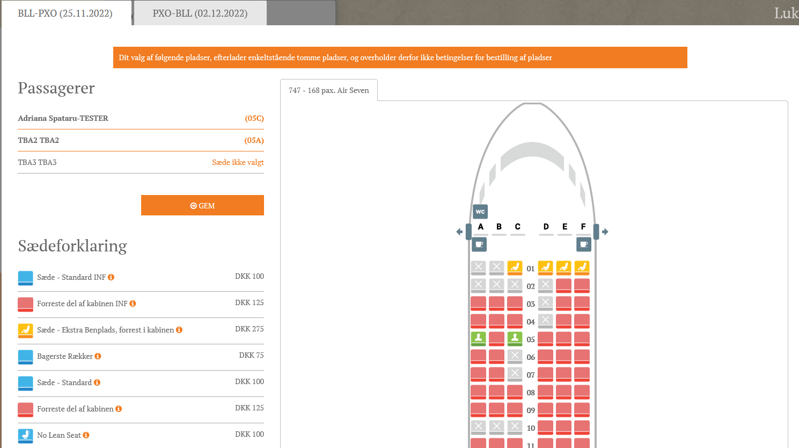

# Transport Layouts

### Overview

Transport Layouts lets you design and maintain seat maps for aircraft.\
A layout represents the physical cabin configuration for one aircraft setup.

Each layout contains one or more **sections**.\
Use sections for cabin areas like front/rear or business/economy.


To properly use this, the Layout feature has to be enabled. To have this enabled, please contact Tourpaq Support.


When Layouts is enabled, Tourpaq uploads a starter set of elements in [Layout Elements](layout-elements.md).\
These include aircraft parts (nose, tail, wings) and common seat icons.\
You can add more elements if you need them.

### Fields and elements

<figure><figcaption></figcaption></figure>

| Field / element  | Description                                                                                                                                           |
| ---------------- | ----------------------------------------------------------------------------------------------------------------------------------------------------- |
| **Name**         | Layout name. Include capacity and aircraft type/route when useful. Example: _110 pax A7 BLLLPA_.                                                      |
| **Type**         | Defines the layout type. Currently, all layouts are of type **Airplane**, but this field allows support for other transport types (e.g., Bus, Train). |
| **Sections**     | Cabin sections inside the layout. Each section has its own rows and seat configuration.                                                               |
| **Add section**  | Adds a new section to the layout. A section defines the rows, seat numbering, and seat types available in that area.                                  |
| **Delete (🗑️)** | Deletes a layout or section. You must confirm first.                                                                                                  |
| **Create**       | Creates a new, blank layout.                                                                                                                          |
| **Show hidden**  | Shows layouts marked as hidden. Useful for seasonal setups.                                                                                           |

### Related concepts (Seat types, seat lists, and layout elements)

You build layouts from three building blocks:

1. **Layout elements**\
   Icons and structural parts used by the editor.\
   Manage these in [Layout Elements](layout-elements.md).
2. **Seat types + seat lists**\
   Seat types define the seat “kind”.\
   Seat lists define rows/columns and the generated seats for an aircraft setup.\
   Manage both in [Seating](seating/).
3. **Layouts**\
   The actual cabin map.\
   Layouts reference seat lists and place elements visually.

### Create or edit a seat list

Seat lists are created in **Transport → Seating**.\
They define the generated seats you later place in a layout.

<figure><figcaption></figcaption></figure>

Key fields:

* **Rows**: Number of rows.
* **Columns**: Number of columns per row.
* **Name** – A custom name for the seating configuration.
* **Column distribution**: Seat split per row (example: `3x3`).
* **Layout Type** – The seating layout style.
* **Default seat type**: The seat type assigned by default.

You can fine-tune generated seats via **Assign seats**:

* Row number
* Seat number
* Seat name
* Seat type

<figure><figcaption></figcaption></figure>

If the **Default seat type** option has been chosen, all seats will be of the selected type.


Seat types and seat lists are described in detail in [Seating](seating/).


### Create or edit a layout

Use layouts to design the aircraft interior and seat positions.



### Create the layout

Open **Transport Layouts** and click **Create**.

<figure><figcaption></figcaption></figure>



### Add a section

Name the section and select a **seat list**.

<figure><figcaption></figcaption></figure>

You can also copy an existing layout.



### Place seats and elements

Use **Place automatically** to generate a standard section.\
Then tweak it in the editor.

<figure><figcaption></figcaption></figure>

Drag and drop elements to reposition them.



### Adjust aircraft shape (nose/tail)

The aircraft width is defined by the nose and tail widths.\
Keep nose and tail at the same width and roughly aligned on the same axis.

You can adjust aircraft length by dragging the tail up or down.\
The editor canvas reflows when you move the tail.



### Seat pricing (Seating Price Rules)

Seat pricing is configured in **Transport → Seating Price Rules**.\
See [Seating Price Rules](seating-price-rules.md).

From here, prices can be set for seats. The following information will be required:

* Name
* Transport - if left blank, the price will be applied to all transports, if a transport is selected, than only that transport will have the inserted price
* Seat type
* Out/Home
* Bk. Date start
* Bk. Date End
* Dept. Date start
* Dept. Date end
* Agency
* Price
* Cost
* Enabled - if checked, than the price rule is active
* Order

### Assign seat layouts to transports

Assigning is done on the **Transport** record in the **Layout** tab.

<figure><figcaption></figcaption></figure>

Layouts can vary by departure/arrival flight.\
This supports aircraft swaps across dates.


When changing an existing layout, the new layout must have the same or a higher seat count than the current one.


### Seats in bookings (Office)

To sell seats as an extra, you need:

* An **extra category** for seating.
* An **extra** under that category.
* The relevant transports assigned under **Resources** on the extra.

After you save passengers on a booking, a new tab appears: **Transport seating**.\
Select seats for each passenger there.

<figure><figcaption></figcaption></figure>

Seat info also shows on:

* Passenger grid

<figure><figcaption></figcaption></figure>

* Ticket

<figure><figcaption></figcaption></figure>

Transport seating is also available for real transports and follow the same rules. The only difference is that the layouts have to be assigned on the real transport and not the charter.

### Shared layouts (parent/child transports)

If you use parent-child transports, you can share the same layout.\
In case of a parent-child transport, the same layout can be shared between them. The condition of shared layouts is that the same layout as the parent transport be selected for the child transport in the **Layout Tab**.

That means seat selected on a booking created with child transport will be displayed as occupied on a booking created with parent transport and vice-versa.\
This also applies when one parent transport has multiple child transports.


Enable **Automatic Seating** for each child transport.


### Empty seats

Empty seats lets the customer reserve extra seats next to a passenger.\
This is activated in **SuperAdmin**.

<figure><figcaption></figcaption></figure>

#### Set up empty seats

1. Open the relevant transport.\
   Go to the fixed quota section and update the **GESO** columns.
2. Ensure **AOT** equals the sum of all normal-seat intervals plus empty-seat intervals.
3. Update **GESH** to support empty seats on homebound.

<figure><figcaption></figcaption></figure>

4. Create pricing in **Transport → Seating Price Rules**.

<figure><figcaption></figcaption></figure>

#### Book empty seats

In **Transport seating**, the price table shows normal vs. empty-seat pricing per seat type.

<figure><figcaption></figcaption></figure>

Rules:

* You must assign at least one passenger to a normal seat first.
* Empty seats must be adjacent (front/behind/next to the passenger).
* You cannot pick diagonals or seats more than one seat away.
* The same rules apply on homebound.
* The ticket shows empty seats separately per passenger.

### Web controls

#### Stop web transport seating

This disables seat selection on WebBooking for a transport type (plane/train/bus).\
Office seat selection still works.

This setting is configured on the **Seating product**.

<figure><figcaption></figcaption></figure>

#### Restricted seating

Restricted seating limits which seat combinations customers can choose.

Rules:

* No single empty seat may be left by a window.

<figure><figcaption></figcaption></figure>

* No empty seat may be left between two passengers in the same row.

<figure><figcaption></figcaption></figure>

* A single passenger cannot be left in the middle seat of a row.

<figure><figcaption></figcaption></figure>

Technical notes (WebBooking / CC)

* In NewWebBooking, full validation is applied.\
  If a seating link is returned, seat selection is allowed.\
  No warning is shown when opening the seating popup.
* For CC, `TransportSeating` from `VisibleTabs` is always `true`.
* CC without selected seats:
  * Not eligible to select seats (no price rule, etc.) → `allowToChangeSeating = false`.
  * Container visibility comes from `help:transportseating` links.\
    If at least one link is returned, the container is visible.
* CC without selected seats but eligible to select seats for outbound only:
  * `allowToChangeSeating = true`
  * Homebound selection is not possible (popup link is missing).
* CC with selected seats but no longer eligible to change seats:
  * `allowToChangeSeating = false`
  * Popup can open for viewing.\
    An info message is shown and changes are blocked.

### FAQ

#### Why can’t I see Transport Layouts?

Layouts are tenant-controlled.\
Ask Tourpaq Support to enable the Layouts feature.

#### What’s the difference between a seat type, a seat list, and a layout?

* **Seat type**: The “kind” of seat (standard, premium, etc.).
* **Seat list**: The generated seats (rows/columns/seat names).
* **Layout**: The visual cabin map that places seats and elements.

#### Where do the icons (nose, tail, wings, seats) come from?

They come from [Layout Elements](layout-elements.md).\
Tourpaq uploads a starter set when enabling Layouts.

#### Why can’t I assign a new layout to a transport?

Usually one of these is missing:

* The layout is hidden.
* The transport or real transport is not configured for seating.
* The new layout has fewer seats than the existing assigned layout.

#### Why are seats “occupied” when booking on a child transport?

Layouts can be shared between parent/child transports.\
When shared, occupancy is synced across them.

#### Why can’t the customer select empty seats immediately?

Empty seats require at least one passenger to be seated first.\
Then adjacent empty seats become selectable.

#### Why does WebBooking not show seat selection, but Office does?

Check the **Seating product** settings first.\
If **Stop web transport seating** is enabled, WebBooking seat selection is disabled.

Also verify the booking is eligible for seat selection.\
Missing seat price rules can also block selection on web.

#### How do I price seats (or empty seats)?

Create rules in **Transport → Seating Price Rules**.\
You can set price per seat type, outbound/homebound, date ranges, agency, and order.

See [Seating Price Rules](seating-price-rules.md).

#### Can I delete a seat list or layout that’s in use?

Avoid it.\
It can break existing transports, departures, or bookings that reference it.

Hide it instead, then migrate transports to a replacement.
