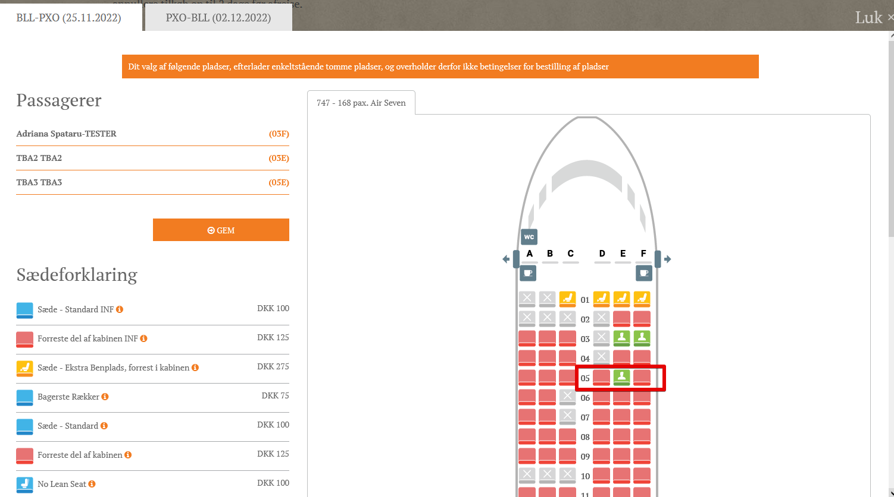

# Transport Layouts

Available for Administrator.

Can be found in **Transport/Layouts**.

To properly use this, the Layout feature has to be enabled. To have this enabled, please contact Tourpaq Support.

After the layout feature has been enabled, a series of standard transport layout elements will be uploaded in **Setup/Layout Elements**. These will be airplane parts such as head, tail, wings and some seat types. Other elements can be uploaded by the users if they require them.

### Seating 

Is found in **Transport/Seating**

In here the **Seat types** and the **Seat lists** are created.

### Seat type 

<figure><figcaption></figcaption></figure>

### Seat list 

Seat list are generated from here according to the airplane specifications.

<figure><figcaption></figcaption></figure>

* **Rows** – The number of rows in the seating arrangement.&#x20;
* **Columns** – The number of columns in each row.&#x20;
* **Name** – A custom name for the seating configuration.&#x20;
* **Default Seat Type** – The type of seat assigned by default.&#x20;
* **Layout Type** – The seating layout style.&#x20;
* **Column Distribution** – The distribution of seats within the columns.&#x20;

This interface likely allows users to define seating configurations for airplanes or similar environments.

Seat lists can be edited by clicking on the **Assign seats** button. The following can be edited:

* Row Number
* Seat Number
* Seat Name
* Seat Type

If the **Default seat type** option has been chosen, all seats will be of the selected type.

<figure><figcaption></figcaption></figure>

### Layouts 

Allows the user to set up the interior of the airplane and the seat places.

To create a new layout, go to Transport Layouts menu and  use Create **New layout** button.

<figure><figcaption></figcaption></figure>

The user is sent the to the Layout editor section where he can design the airplane interior according to his wish.

<figure><figcaption></figcaption></figure>

The first step is naming the section and selecting the **Seat list** from those already created.

Also, the user can copy an already existing layout.

The user can begin configuring the layout by using the **Place automatically** option. This will generate a standard airplane section which the user can edit.

<figure><figcaption></figcaption></figure>

Elements can be moved by clicking and dragging them to their desired place. The width of the airplane is given by the width of the nose and tail. Please have them of the same width and on the roughly same axys, as the body of the airplane is automatically created by taking into account the nose and tail's positions and width.

The lenght of the plane can be edited by dragging the tail down. The editing field is automatically reconfiguring itself when moving the tail up or down the screen.

**Transport seating price rules**

Found in **Transport**/**Seating Price Rules**

From here, prices can be set for seats. The following information will be required:

* Name
* Transport - if left blank, the price will be applied to all transports, if a transport is selected, than only that transport will have the inserted price
* Seat type
* Out/Home
* Bk. Date start
* Bk. Date End
* Dept. Date start
* Dept. Date end
* Agency
* Price
* Cost
* Enabled - if checked, than the price rule is active
* Order

**Assigning seat layouts to transports**

This is done in the **Transport** from the **Layout** tab.

Seat layouts can be assigned for each departure and arrival flights in part. Seat layouts can be different from flight to flight, depending on the transport type used.

<figure><figcaption></figcaption></figure>

Layouts can be changed, but the new layout needs to have the same or a higher number of seat than the existing layout.

### Seats in booking 

To use the seats in bookings, a new extra category is needed along with a new extra for this category. Also, the extra will need to have the transports that use layouts to be assigned under **Resources**.

When a booking is made, after the passengers have been saved, a new tab will appear in the booking, named **Transport seating**. From there seats can be selected for passengers.

<figure><figcaption></figcaption></figure>

On the passenger grid, the seating will look like this:

<figure><figcaption></figcaption></figure>

On the ticket, seats will look like this:

<figure><figcaption></figcaption></figure>

Transport seating is also available for real transports and follow the same rules. The only difference is that the layouts have to be assigned on the real transport and not the charter.

### Shared layouts 

In case of a parent-child transport, the same layout can be shared between them. The condition of shared layouts is that the same layout as the parent transport be selected for the child transport in the **Layout Tab**.

That means seat selected on a booking created with child transport will be displayed as occupied on a booking created with parent transport and vice-versa.

### Empty seats 

Transport seating empty seats feature allows the customer to reserve extra seats on a plane. It can be activated from SuperAdmin.

<figure><figcaption></figcaption></figure>

**How to set up seating for empty seats**

For this feature to work, it needs some settings done.

**First**, go to the transport where empty seats need to be added. In the fix quota section, the **"GESO"** columns should be modified.

Notice that the empty seats are divided into intervals, mentioning that the first column contains seats for interval 1 and OWO.

For the change to be successfully saved, the AOT column should be the sum between all the intervals of normal seats and empty seats.

Plus, it needs to modify **“GESH”**, too, in order to have empty seats on homebound.

<figure><figcaption></figcaption></figure>

**Second**, define the price rules for empty seats, from TRANSPORT -> SEATING PRICE RULES

<figure><figcaption></figcaption></figure>

**How to book empty seats**

The selection process for empty seats on a booking is the same on Office and WB. Now it will be presented from Office.

To use transport seating empty seats feature on the booking, go to the "Transport seating" tab.

Notice that in the content table, the price for normal and empty seats are displayed for each seat type.

<figure><figcaption></figcaption></figure>

First, the selection is enabled for the normal seats. After at least a passenger from the booking is assigned to a normal seat, the empty seats can be chosen too.

The selection must be only in front, behind or next to the passenger. It cannot be made diagonally or more than one seat apart.

The process is the same for homebound, too.

The price for the selected empty seats is added to the respective passengers.

Plus, on the ticket, the empty seats selection is displayed separately for each passenger.

### Programming Environment 

* NewWebBooking: Full Validations are made: if seating link is returned, then the system should allow you to select seats(no warning message when open Seating popup).
* for CC TransportSeating from VisibleTabs is always set to true
* CC without selected seats -> not eligible to select seats Out and Home(no price rule available, etc.) -> allowToChangeSeating = false. Visibility of Container for selecting seats come from help:transportseating links. If at least one link is returned, container is visible.
* CC without selected seats -> eligible to select seats only for Out allowToChangeSeating = true. Selection for Homebound should not be possible (link to open popup is missing)
* CC with selected seats -> not eligible to select seats(no price rule available, etc.) -> allowToChangeSeating = false. Popup could be opened, so the Customer can show seat's position in the airplane An Info message is displayed and no change is allowed.

### Stop Web Transport Seating 

This feature will allow the user to disable the transport seating on WEB on a specific transport type: plane, train, or bus. Still, the seating will allow the seating in Office. This setting is on the Seating Product.

<figure><figcaption></figcaption></figure>

### Restricted Seating 

This feature permits to limit the capacity of the customer to choose the seats in the transport layout. It will have the following rules:

* **No empty seat should be left empty on the window.**

<figure><figcaption></figcaption></figure>

* **No seat should be left empty between two passengers on a row.**

<figure><figcaption></figcaption></figure>

* **One passenger could not be left in the middle of the row.**

<figure><figcaption></figcaption></figure>
