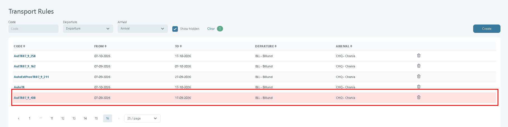
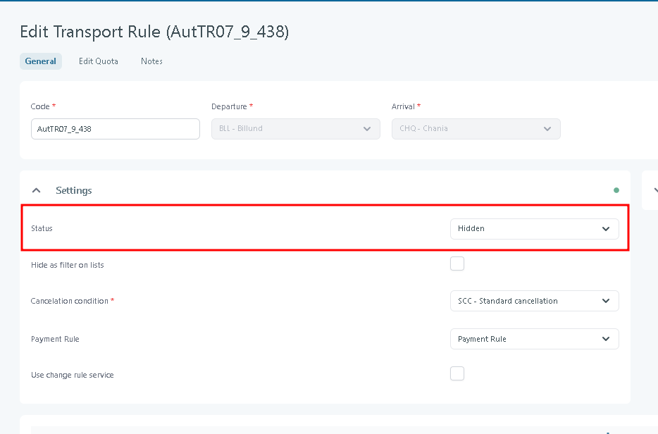

# Transport Rules

### Overview

The **Transport Rules** module allows administrators to define and manage rules for specific transport routes within a given time period. These rules are used in pricing, seat control, and operational planning. Each rule specifies the departure and arrival airports, along with the validity period during which the rule applies.

### Purpose

The purpose of this functionality is to provide a flexible framework for handling route-specific transport regulations, enabling the system to apply pricing, restrictions, or special conditions automatically. By centralizing these rules, administrators ensure consistent application across bookings and departures.

<figure><figcaption></figcaption></figure>

### **Columns in the Transport Rules Table**

1. **Code**
   * A unique identifier or label for the transport rule.
   * Often based on departure/arrival airport codes (e.g., `BLL_AYT` for Billund → Antalya).
   * Used to quickly search, filter, or identify specific rules.
2. **From**
   * The start date of validity for the rule.
   * Bookings and transport assignments will only follow this rule if the travel date falls **on or after** this date.
3. **To**
   * The end date of validity for the rule.
   * Defines the last date the rule applies.
   * Together with the **From** column, this creates a validity period (e.g., 09-07-2025 → 31-07-2025).
4. **Departure**
   * The **departure airport and city** associated with the rule.
   * Example: `BLL - Billund`.
   * Defines the starting point of the transport (where the passenger is flying out from).
5. **Arrival**
   * The **arrival airport and city** associated with the rule.
   * Example: `AYT - Antalya Havalimani` or `CHQ - Chania`.
   * Defines the destination for the transport leg.

***

### **Other Elements in the Table**

* **Pencil icon (✏️) -** Used to edit an existing transport rule.
* **Trash bin icon (🗑️) -** Deletes the selected transport rule.
* **Create button (top right) -** Allows users to create a new transport rule by defining all the above fields.
* **Filter row (Code, Departure, Arrival, Clear)**
  * Located above the table.
  * Allows filtering by **rule code**, **departure airport**, or **arrival airport**.
  * **Show hidden** - Includes transport rules that are hidden from normal selection. With this checkbox cleared (the default), hidden rules are left out of the result set entirely; enabling it adds them back into the list so they can be reviewed.
  * "Clear" resets all applied filters.

**Hidden rows** - When **Show hidden** is enabled, any transport rule that is hidden is displayed with its entire table row highlighted in red, distinguishing it at a glance from active, non-hidden rules. There is no separate icon or tooltip marking a hidden rule; the red row shading is the only visual indicator.

<figure><figcaption></figcaption></figure>

What marks a transport rule as hidden? - This filter relates to the transport rule **Status** set in the [Transport Rule](create-transport-rule.md).&#x20;

<figure><figcaption></figcaption></figure>
