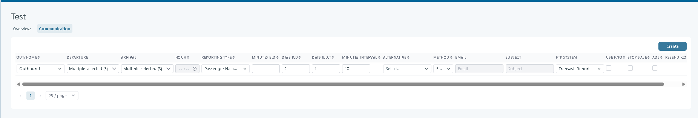
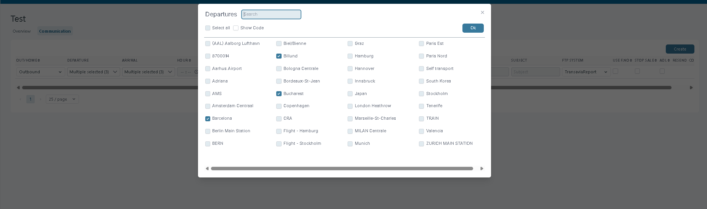
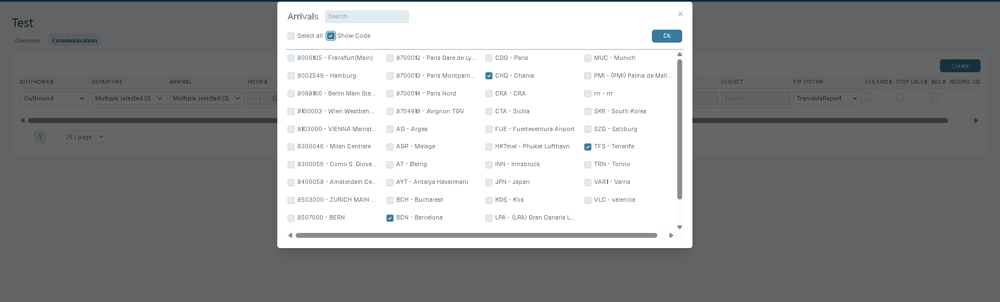
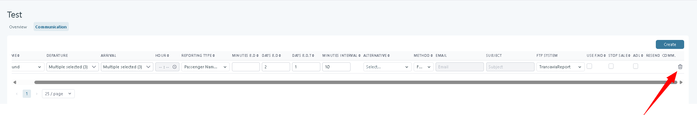

# Communication Configuration – Transport Supplier

### Overview

Communication Configuration defines how Tourpaq sends transport reporting for a **Transport Supplier**.

Each rule sets the transport direction, delivery timing, reporting format, and delivery method. Rules can send reporting by email or FTP. This configuration becomes available after creating a [Transport Supplier](create-a-transport-supplier.md).

### Purpose

Use communication rules to deliver the right transport information to each supplier.

Schedule reports relative to departure and select the required **Reporting Type**. Use **ADL (Adding Deletion List for A7)** to send changes after initial reporting. Use [Transport Suppliers](./) to manage the supplier record.

***

### Accessing the configuration page

Navigate to:\
Transport **Supplier → \[Transport Supplier Name] → Communication tab**

***

### Field descriptions

<figure><figcaption></figcaption></figure>

| Field                                 | Description                                                                                                                                                                                                                                                                                                                                                                                                                                     |
| ------------------------------------- | ----------------------------------------------------------------------------------------------------------------------------------------------------------------------------------------------------------------------------------------------------------------------------------------------------------------------------------------------------------------------------------------------------------------------------------------------- |
| **Out/Home**                          | Select the direction of the transport communication: `Outbound` or `Homebound`.                                                                                                                                                                                                                                                                                                                                                                 |
| **Departure**                         | 

 Restrict the communication rule to transports departing from specific departure points.
<blockquote>
<strong>Tooltip:</strong> Only transports with matching departure will use the specified communication rule.
</blockquote>                                                                                                                                                                                              |
| **Arrival**                           | 

Restrict the communication rule to transports arriving at specific arrival points.
<blockquote>
<strong>Tooltip:</strong> Only transports with matching arrival (or Alternative arrival is set) will use the specified communication rule.
</blockquote>                                                                                                                                                                      |
| **Hour**                              | Set the scheduled hour (HH:MM) for communication dispatch.                                                                                                                                                                                                                                                                                                                                                                                      |
| **Reporting Type**                    | Choose the reporting format. Example: `Paxport`.                                                                                                                                                                                                                                                                                                                                                                                                |
| **Minutes B.D.**                      | Set the minutes before departure when the communication should be triggered.                                                                                                                                                                                                                                                                                                                                                                    |
| **Days B.D.**                         | Enter how many days before departure the email should be sent.                                                                                                                                                                                                                                                                                                                                                                                  |
| **Days B.D.To**                       | Enter the end of the interval how many days before departure to, the email shold be sent                                                                                                                                                                                                                                                                                                                                                        |
| **Minutes Interval**                  | Define the time gap between repeated messages (is active only if the DAYS B.D & DAYS B.D.TO is set).                                                                                                                                                                                                                                                                                                                                            |
| **Alternative**                       | Select an alternative reporting type                                                                                                                                                                                                                                                                                                                                                                                                            |
| **Method**                            | Choose the method of communication (Email, FTP).                                                                                                                                                                                                                                                                                                                                                                                                |
| **Email**                             | Enter the recipient's email address.                                                                                                                                                                                                                                                                                                                                                                                                            |
| **Subject**                           | Define the subject line of the email.                                                                                                                                                                                                                                                                                                                                                                                                           |
| **FTP System**                        | If using FTP, select the appropriate FTP configuration/system. (is defined in System Setup FTP menu)                                                                                                                                                                                                                                                                                                                                            |
| **Use F.No**                          | Checkbox: Use flight number if enabled.                                                                                                                                                                                                                                                                                                                                                                                                         |
| **Stop Sale**                         | Checkbox: Mark if this triggers a Stop Sale action.                                                                                                                                                                                                                                                                                                                                                                                             |
| **ADL (Adding Deletion List for A7)** | 
Checkbox: Enable ADL flag if needed. ADL reporting must is done whenever there are changes to a flight after the initial reporting is sent.

Example:

The full list is sent 08:00 4 days before departure

There is a last minute booking done 3 days before departure => ADL sent

There is a cancellation 2 days before departure => ADL sent

There is a name change 2 days before departure => ADL is sent
 |
| **Resend**                            | Work only with ADL checkbox marked and offer the posibility to resend any ADl report for a specific date.                                                                                                                                                                                                                                                                                                                                       |
| **Comm. (View)**                      | Click **View** to see detailed communication reporting                                                                                                                                                                                                                                                                                                                                                                                          |

***

### Creating a new communication rule

1. In the communication rules list, click **Create**.
2. Fill in the required fields based on the transport and business rules.
3. Press **Save** to add the new communication setup.

***

## Communication Configuration

Transport Supplier communication rules define how transport reporting is sent to transport suppliers. Communication rules can be configured for specific transport conditions so that the correct information is sent to the appropriate recipient.

### Communication Filters

In **Transport > Transport Supplier > Communication**, communication configurations can be filtered by **OUT/HOME**, **Departure**, and **Arrival**.

The **Departure** and **Arrival** filters are optional. When they are configured, the communication rule is applied only to transports matching the selected departure and/or arrival points.

#### Departure

Use this field to restrict the communication rule to transports departing from specific departure airport.

> **Tooltip:** Only transports with matching departure will use the specified communication rule.

Multiple departure airports can be selected for the same communication rule.

<figure><figcaption></figcaption></figure>

The departure selector uses the standard multi-select interface and supports the **Show code** option. Enable **Show code** to display the code associated with each departure point, making it easier to identify the required departure when multiple points have similar names.

If no departure is selected, the communication rule is not restricted by departure.

#### Arrival

Use this field to restrict the communication rule to transports arriving at specific arrival airport.

> **Tooltip:** Only transports with matching arrival (or Alternative arrival is set) will use the specified communication rule.

Multiple arrival points can be selected for the same communication rule.

<figure><figcaption></figcaption></figure>

The arrival selector uses the standard multi-select interface and supports the **Show code** option. Enable **Show code** to display the code associated with each arrival point.

If no arrival is selected, the communication rule is not restricted by arrival.

### How Departure and Arrival Filters Affect Reporting

When transport reporting is generated, the configured communication filters determine which communication rule can be used for a transport.

For a rule with a configured **Departure**, only transports with a matching departure are eligible to use that communication rule.

For a rule with a configured **Arrival**, only transports with a matching arrival are eligible. If an **Alternative arrival** is configured for the transport, the alternative arrival is also considered when is used the Arrival filter.

When both **Departure** and **Arrival** are configured, the transport must satisfy both filters for the communication rule to apply.

If either field is left empty, that field does not restrict the communication rule.

#### Supported Transport Types

The Departure and Arrival filters apply to transport reporting for:

* **Real Transports**
* **Charter Transports (normal Transports)**

This allows reporting to be limited to the airport-specific transport information required for each departure and arrival.

#### Example

Assume a transport supplier receives different reporting for transports operating through different airports.

A communication rule can be configured using the **OUT/HOME**, **Departure**, and **Arrival** filters. These filters can be used independently or together to determine which transports the rule applies to.

For example, the following rule is configured:

| OUT/HOME | DEPARTURE | ARRIVAL  |
| -------- | --------- | -------- |
| Outbound | Billund   | Tenerife |

The rule is used only for transports matching **all configured filters**:

* **OUT/HOME:** Outbound
* **Departure:** Billund
* **Arrival:** Tenerife

Therefore:

* A transport departing from **Billund** and arriving in **Tenerife** matches the rule.
* A transport departing from another airport does **not** match the rule, even if its arrival is Tenerife.
* A transport arriving at another airport does **not** match the rule, even if its departure is Billund.
* A transport that is not **Outbound** does **not** match the rule.

The filters are optional and can be combined as needed:

| Departure      | Arrival        | Result                                                                                                                           |
| -------------- | -------------- | -------------------------------------------------------------------------------------------------------------------------------- |
| Not configured | Not configured | The rule is not restricted by departure or arrival. It can apply to transports regardless of their departure or arrival airport. |
| Configured     | Not configured | Only transports matching a selected departure use the rule.                                                                      |
| Not configured | Configured     | Only transports matching a selected arrival use the rule.                                                                        |
| Configured     | Configured     | Only transports matching both a selected departure and arrival use the rule.                                                     |

If multiple departures or arrivals are selected, a transport can match **any of the selected values** for that filter.

For example, if **Departure** is configured with **Billund** and **Copenhagen**, a transport departing from either airport can match the rule. If **Arrival** is also configured with **Tenerife** and **Gran Canaria**, the transport must arrive at one of those airports.

This allows transport supplier communication rules to be configured with specific airport conditions while keeping the filters flexible. Depending on the configuration, a rule can apply to all transports or only to transports operating through specific departure and/or arrival airports.

I think this is cleaner than having separate **Example** and **Configuration Behavior** sections because the table and the example now explain the same matching logic in one place.

### Deleting a rule

For the rule, click the trash bin icon. A confirmation prompt appears.

<figure><figcaption></figcaption></figure>

### Notes

* **Resend** only works when **ADL (Adding Deletion List for A7)** is selected.
* **FTP System** requires a matching configuration in [**System Setup FTP**](../setup/system-setup-ftps.md).
* Select **Stop Sale** only when the communication rule must trigger a stop sale.
