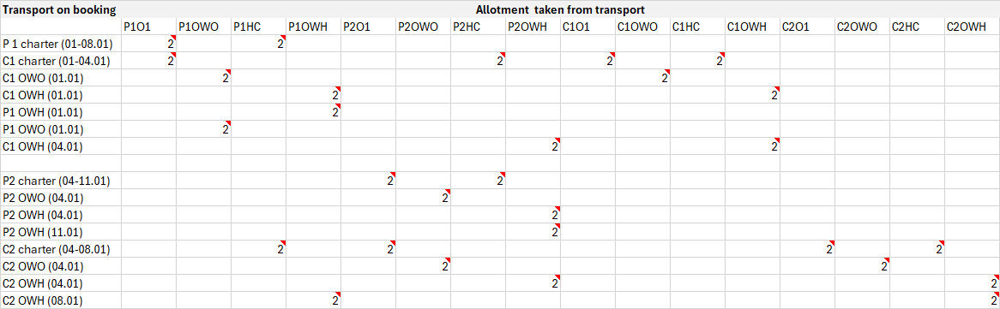

# Allotments

#### Overview

The **Allotments** section is used to manage the number of transport seats available for sale. Allotments ensure proper control over seat availability across different departure and return intervals, while preventing overbooking.

#### Purpose

The purpose of transport allotments is to:

* Define selling periods and associated seat availability.
* Configure price-related parameters (tax, pro rates, guaranteed seats).
* Prevent overbooking by tracking available, booked, and free places.
* Handle parent-child transport relationships where bookings affect multiple transports simultaneously.

The first step is to establish a selling period, together with the relevant information for that period. This information must be stored:

* Start date
* End date
* Total number of places
* Generate days number
* Transport allotment price
* Guaranteed seats
* Tax
* Pro rate I1 (cost price for one seat that is not guaranteed)
* Pro rate I2
* Pro rate I3
* Pro rate I4
* Places number for I1
* Places number for I2
* Places number for I3
* Places number for I4

Example:

| Start date | End date   | Price  | Total no of places | Generate days no | Places no for I1 | Places no for I2 | Places no for I3 | Places no for I4 |
| ---------- | ---------- | ------ | ------------------ | ---------------- | ---------------- | ---------------- | ---------------- | ---------------- |
| 05/05/2010 | 01/06/2010 | 255780 | 147                | 7                | 120              | 17               | 0                | 0                |

Choosing a value for Generate days number must not be possible if there are no corresponding interval definitions. A corresponding period interval fulfills this condition:

Period interval start date `<=` Start date and End date `<=` Period interval end date

Considering the example from the previous section, only the values 7 and 14 can be used for Generate days number.

Another important aspect is that Places number for I3 and Places number for I4 cannot have a value greater than 0, as there are no corresponding intervals defined for I3 and I4.

Timetables must also be defined for both Transport out and Transport home values and should fulfill this condition:

Start date from timetable `<=` Start date and End date `<=` End date from timetable

So the conditions for defining a selling period and generating allotments should be:

* Interval periods defined (for defining a selling period)
* Timetables defined (for generating allotments)

Having a selling period established, transport allotments can be generated. Transport allotments are used to prevent seats from being overbooked.

The following is an extract from the information that will be available for a transport allotment:

* Departure date
* Total available places for outbound transport (AOT)
* Total available places for outbound transport for period interval I1 (AO1)
* Total available places for outbound transport for period interval I2 (AO2)
* Total available places for outbound transport for period interval I3 (AO3)
* Total available places for outbound transport for period interval I4 (AO4)
* Total booked places from outbound transport (BOT)
* Total booked places from outbound transport for period interval I1 (BO1)
* Total booked places from outbound transport for period interval I2 (BO2)
* Total booked places from outbound transport for period interval I3 (BO3)
* Total booked places from outbound transport for period interval I4 (BO4)
* Total free places for outbound transport (FOT = AOT – BOT)
* Total free places for outbound transport for period interval I1 (FO1)
* Total free places for outbound transport for period interval I2 (FO2)
* Total free places for outbound transport for period interval I3 (FO3)
* Total free places for outbound transport for period interval I4 (FO4)
* Total available places for homebound transport (AHT)
* Total booked places for homebound transport (BHT)
* Total free places for homebound transport (FHT)
* Transport allotment price
* Guaranteed seats total price
* Guaranteed seats number
  * Seats that are bought anyway, even if they are not sold to the customer.
* Pro rate 1 – seat cost price for interval period 1
* Pro rate 2 – seat cost price for interval period 2
* Pro rate 3 – seat cost price for interval period 3
* Pro rate 4 – seat cost price for interval period 4
* Tax

| Departure date | Price  | AO1 | AO2 | AO3 | AO4 | BO1 | BO2 | BO3 | BO4 | Tax |
| -------------- | ------ | --- | --- | --- | --- | --- | --- | --- | --- | --- |
| 05/05/2010     | 255780 | 147 | 17  | 0   | 0   | 0   | 0   | 0   | 0   | -80 |
| 12/05/2010     | 255780 | 147 | 17  | 0   | 0   | 0   | 0   | 0   | 0   | -80 |
| 19/05/2010     | 255780 | 147 | 17  | 0   | 0   | 0   | 0   | 0   | 0   | -80 |
| 26/05/2010     | 255780 | 147 | 17  | 0   | 0   | 0   | 0   | 0   | 0   | -80 |

In our case, I1 means a period of 7 days.

Let’s consider a booking that uses a transport from Billund to Varna having the previous allotments. The booking has 5 passengers.

| Departure date | Price  | AO1 | AO2 | AO3 | AO4 | BO1 | BO2 | BO3 | BO4 | BHT | Tax |
| -------------- | ------ | --- | --- | --- | --- | --- | --- | --- | --- | --- | --- |
| 05/05/2010     | 255780 | 147 | 17  | 0   | 0   | 5   | 0   | 0   | 0   | 0   | -80 |
| 12/05/2010     | 255780 | 147 | 17  | 0   | 0   | 0   | 0   | 0   | 0   | 5   | -80 |
| 19/05/2010     | 255780 | 147 | 17  | 0   | 0   | 0   | 0   | 0   | 0   | 0   | -80 |
| 26/05/2010     | 255780 | 147 | 17  | 0   | 0   | 0   | 0   | 0   | 0   | 0   | -80 |

The number of booked places is reflected in the BO1 field for outbound transport and in the field BHT for homebound transport.

Let’s consider now another booking with the same departure date, 2 passengers, but with period interval 2 (the customer chooses to stay at the destination 2 weeks). This is how allotments will look after the booking is made:

| Departure date | Price  | AO1 | AO2 | AO3 | AO4 | BO1 | BO2 | BO3 | BO4 | BHT | Tax |
| -------------- | ------ | --- | --- | --- | --- | --- | --- | --- | --- | --- | --- |
| 05/05/2010     | 255780 | 147 | 17  | 0   | 0   | 5   | 2   | 0   | 0   | 0   | -80 |
| 12/05/2010     | 255780 | 147 | 17  | 0   | 0   | 0   | 0   | 0   | 0   | 5   | -80 |
| 19/05/2010     | 255780 | 147 | 17  | 0   | 0   | 0   | 0   | 0   | 0   | 2   | -80 |
| 26/05/2010     | 255780 | 147 | 17  | 0   | 0   | 0   | 0   | 0   | 0   | 0   | -80 |

In case of **child transport**, when a booking is created, the allotment is taken from both the child transport and the parent transport. If there are two different transport sets, then the outbound allotment is also booked from the parent transport allotment set on that departure date, and the homebound allotment is also booked from the other parent transport set for the return flight.

**Example**:

For the following transports, bookings (with 2 passengers) for all combinations were created (both charter and one-way trips):

* P1: charter transport (7 days) that departs every Wednesday, (01.01.2025 - 31.12.2025)
* P2: charter transport (7 days) that departs every Saturday, (04.01.2025 - 27.12.2025)
* C1 - child transport having P1 outbound parent and P2 homebound parent - charter transport (3 days) that departs every Wednesday (homebound is every Saturday) (01.01.2025 - 27.12.2025)
* C2 - child transport having P2 outbound parent and P1 homebound parent - charter transport (4 days) that departs every Saturday (homebound is every Wednesday) (04.01.2025 - 31.12.2025)

This is how the allotment is booked for each case:

<figure><figcaption></figcaption></figure>

#### FAQ

**What is “Generate days number”?**\
It’s the interval length (in days) used to generate departure dates inside a selling period. You can only pick values that match defined period intervals (for example, 7 or 14).

**What do I1–I4 mean?**\
They are period intervals. Each interval gets its own seat availability and bookings (AO1/BO1/FO1, etc.).

**What do AO/BO/FO fields mean?**\
AO\* fields are available places, BO\* fields are booked places, and FO\* fields are free places (available minus booked).

**What happens with child transport bookings?**\
A child transport booking reduces availability on the child transport and its configured parent transport(s). This applies separately to outbound and homebound sets.

**Can I create a selling period if interval periods are missing?**\
No. You must define interval periods first. Otherwise, Generate days number has no valid options.

**Can I generate allotments if timetables are missing?**\
No. Allotments are generated from timetable dates. Without timetables, there are no valid departures/returns to generate.

**What prevents overbooking in practice?**\
Free places (FO\*/FOT/FHT) are calculated from available minus booked. A booking should only be allowed when the relevant free places are sufficient.

**When should I use guaranteed seats?**\
Use them when seats are purchased upfront from a supplier. They remain a cost even if you do not sell them.
