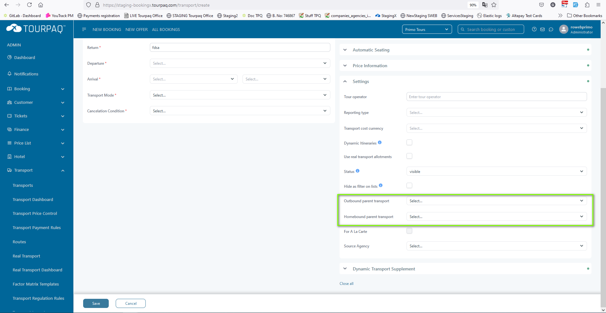
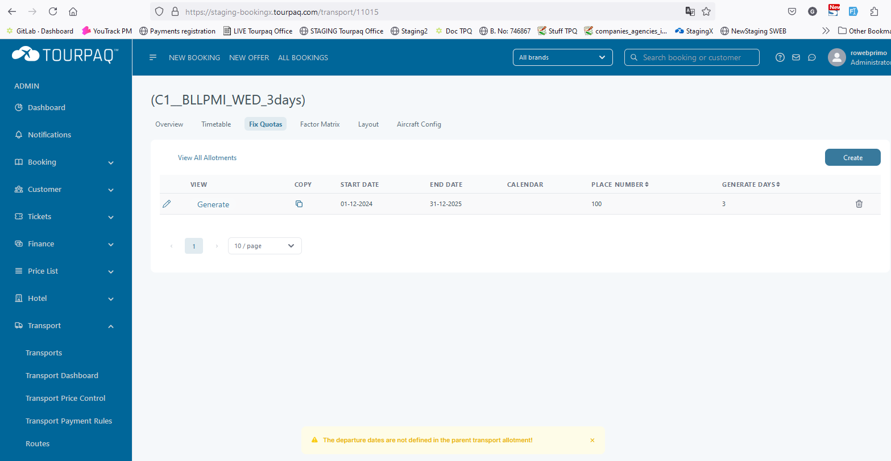

# Transport creation

This feature is available for administrator user type.

More information can be found in [Transport](https://docs.tourpaq.com/docs/transport/transport)

### General 

Mandatory fields:

* Code - name of the transport, mostly it's the abbreviation of the departure and arrival names.
* Return - return code
* Departure - place from which the transport leaves
* Arrival - place where the transport arrives
* Cancelation condition
* Transport mode
* Travel lenght (in minutes)
* Dynamic itineraries (only if you are using real transport feature or GDS)

Other fields:

* Infant price - price the infants pay
* Payment rule
* Use Change Rule Service
* Seat map (only if transport layout is enabled) - allows for guest the select their seats
* Airline (only if Transport mode is FLY)
* Transport type
* Pickup point - please check \[\[Routes]]
* Show on dashboard
* Shift checkin date by +/- days - controls checking days in the hotel
* Estimated seats sale percentage
* Hotel nights correction +/- days -
* Tour operator
* Reporting type
* Dynamic Itineraries - setting for Real Transports and GDS
* Use real transport allotments (only if Dynamic itineraries is checked)
* Status
* Outbound parent transport - select a transport from which the created transport can draw seats. (**Example**: Transport1 departs from DepartureA, has a stop in PointB and then goes to DestinationC. The two transports DepA-DestC and PointB-DestC indeed share the same transport seats allotment); the new created transport will share the alltoments and layout with the parent set for outbound flight.
* Homebound parent transport - select a transport from which the created transport can draw seats. Cand be a different transport for the homebound flight. (**Example**: P1: charter transport (7 days) that departs every Wednesday, (01.01.2025 - 31.12.2025), P2: charter transport (7 days) that departs every Saturday, (04.01.2025 - 27.12.2025), C1 - child transport having P1 outbound parent and P2 homebound parent - charter transport (3 days) that departs every Wednesday (homeboud is every Saturday) (01.01.2025 - 27.12.2025), C2 - child transport having P2 outbound parent and P1 homebound parent - charter transport (4 days) that departs every Saturday (homebound is every Wednesday) (04.01.2025 - 31.12.2025) ). Once "outbound parent transport" is set, is mandatory to have also homebound parent. You cannot set one without the other. So if there are no different parent transports for outbound and homebound, just set the same one on both legs.

<figure><figcaption></figcaption></figure>

* Dynamic Transport Supplement - when checked, transport price will be added as a supplement to guests in the booking (needs DTS supplement)

<figure><figcaption></figcaption></figure>

### Brands 

Select a brand for the transport

### Interval Def 

Set the interval between flights.

* Interval - from 1-4
* Date From - start date
* Date To - end date
* Days - days between the flights
* API Text It's used in setting the fix quota. Multiple intervals can be set.

<figure><figcaption></figcaption></figure>

### Timetable 

Used to set the date and time of the flights.

* Out/Home - flight type
* Start period
* End period
* Departure time (hour) – hour when the departure is
* Arrival time (hours) - hour when the transport arrives at destination
* Airline - Airline name
* Flight number - flight number
* Days - the transport arrives at the destination with a delay of x days from the departure date (eg: departure 01-05-2025 00:00, arrival 02-05-2025 00:00)
* Land days (should be disabled for travel out)
* Extra day out - controls hotel check-in days
* FL - flinght changes (After changing time and date of a flight, check this and update; an e-mail will be sent to all bookings made on this flight that the flight hours have been changed. Requires **Flight change e-mail** template
* Alternative Airport - this can be set for both Travel Out and Travel home lines and can change the returning airport. It will be shown on booking and ticket. (Example: Flight leaves from Billund to Antalya and returns to Billund, but the departure home airport will be Istanbul instead of Antalya).

<figure><figcaption></figcaption></figure>

### Fix quota 

Used to generate and divide the places on the transport between flights and intervals.

* Start Date - is the date of the first departure and next departures will be generated every number of days defined by the value selected in Period (or interval) dropdown
* End Date
* Place Number - number of seats in the transport (Place number = I1 + I2 + I3 + I4 + One way out)
* Period - sets trip lenght
* Override Period - is used to generate departure dates using the same interval but with a gap of x days between departures
* Simple cost - is used to calculate transport cost per passenger (superadmin setting; when active removes Transport All Price, Guaranteed Seats, Tax and ProRate columns)
* Transport All. Price - is the cost for guarantee seats. The value should be total cost of the guarantee seats. In this case you also fill Guarantee seats field.
* Guaranteed seats - number of seats that will be paid wheter they will be booked or not
* Tax - is an additional cost you pay per seat sold
* ProRate1
* ProRate2
* ProRate3
* ProRate4
* I1 - number of seats for interval 1
* I2 - number of seats for interval 2
* I3 - number of seats for interval 3
* I4 - number of seats for interval 4

When using Pro Rate allotment, which means you pay for seat sold you fill the pro rate cost for each interval. If you are not using 4 intervals fill only what is needed. I1, I2, I3 and I4 is allotment available for each interval. In case you want to sell one-ways fill allotment for one-way out and one-way home. Note that sum of values from this 6 fields must equal value from place number field.

The guarantee empty seats fields are linked to Empty seats feature, which you will be presented in a different video. If you use it, here you can define how many seats will the system block to be sold only as empty seats. You can do this for each interval including for one way.

* One way out - number of seats for one way out
* One way home - number of seats for one way home

<figure><figcaption></figcaption></figure>

To finish click on Insert and then Generate. The end result is:

<figure><figcaption></figcaption></figure>

or

<figure><figcaption></figcaption></figure>

This depends on the simple cost being active or not In fix quota you can control the number of seats to be sold, costs, etc. For more information please check [Transport](../) and [Transport dashboard](../../../transport-dashboard.md)

In case of a **child transport** creation (that has one or two different transports set as outbound and homebound parent transport) fix quota definition depends on the fixquotas of the parent transports. The start and end date must be included in the corresponding dates from parent transports. Otherwise fix quota will no be generated

<figure><figcaption></figcaption></figure>

To view departure in a fix quota click view button. Here you can view the generated departures. You can change values for each departure.&#x20;

You have allotment in the green columns, the booked seats in yellow columns, free seats in red colored columns and costs in blue columns. On each departure the sum of allotment out total must be equal to sum of allotment for intervals 1, 2,3,4, one way out and guarantee empty seats for intervals 1,2,3 and 4.&#x20;

Allotment home total is calculated as the sum of allotment home charter, one-way home and guarantee empty seats home. You can view booked seats: total booked seats outbound and of each interval, including one way out and also booked seats on return, total, charter and one-way home.&#x20;

Free seats are shown in red columns: total free seats on outbound and for each interval, including one way out and also free seats on return: total, charter and one-way home.&#x20;

The empty seats – over bookings column is a check to ensure that you do not allocate more seats on outbound than the number of seats available on return.&#x20;

The column displays the difference between Allotment Home Charter column and the sum of Allotment Out for interval 1 from one week before, Allotment Out for interval 2 from two weeks before, Allotment Out for interval 3 from three weeks before and Allotment Out for interval 4 from 4 weeks before.&#x20;

Insert the allotment for each interval and for each departure day.&#x20;

The price column is the total cost price for guarantee seats.&#x20;

The pro rate fields are the costs for each interval.&#x20;

You also have tax per seat sold and passenger handling cost.&#x20;

In case you have a reserved PNR you can use the PNR field to store it. You can set a PNR for each interval where you have allotment.&#x20;

Note that on last departure you can only have one way out allotment.&#x20;

If you do not use one way's fill out 0 one allotment total.

### Layout 

Used for seating passengers in bookings. Available only if agency transport layout service is activated.

This is done in the Transport from the Layout tab. Click on layout tab.&#x20;

Select a fix quota Click display.&#x20;

Seat layouts can be assigned for each departure and arrival flights in part. Seat layouts can be different from flight to flight, depending on the transport type used. We can assign for each departure date different layout type.&#x20;

Click on the dropdown list and choose the desired layout.&#x20;

Click save and we see the seats type price. We do the same thing for the next departure date, and we can select another Layout type, different from the previously chosen one. Click save and we can continue for the next departures date with different layouts type. Layouts can be changed, but the new layout needs to have the same or a higher number of seats than the existing layout.&#x20;
