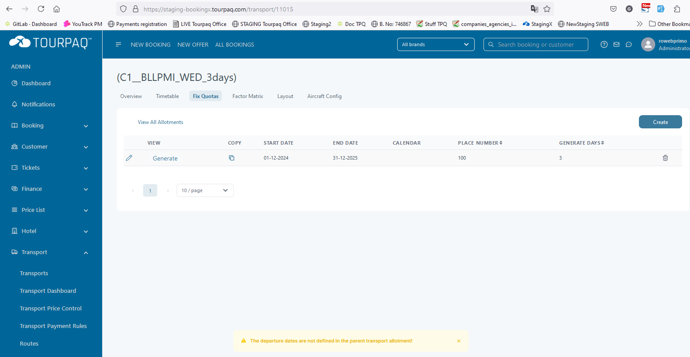

# Transport creation

### Basic setup

#### Overview

The **Basic setup** screen configures transport routes between departure and arrival locations. It defines travel details, customer info, operational rules, and system settings.

#### Purpose

Use Basic setup to ensure each transport is configured for sales, reporting, and operations. It controls passenger details, supplier connections, seating, and financial rules.

#### Preconditions

* The transport route (departure and arrival airports/codes) must be defined.
* Related master data (suppliers, agencies, reporting rules, payment rules, etc.) must exist in the system.
* You must have permission to create or update transports.

***

#### Instructions & field explanations

<figure><figcaption></figcaption></figure>

**1. Destination**

Defines the route and core identifiers.

* **Code**: Unique identifier for the transport (e.g., BLL-TFS-2).
* **Return**: Code for the return route.
* **Departure**: Departure airport/location.
* **Arrival**: Arrival airport/location.
* **Transport Mode**: Type of transport (e.g., Fly, Bus, Train).
* **Cancellation Condition**: Defines the cancellation policy linked to this transport.

***

**2. Customer Information**

<figure><figcaption></figcaption></figure>


If the transport uses **Dynamic itineraries**, set customer-facing information on the **Real Transport**.


Controls text and allowances shown to customers.

* **Info Customer 1, 2, 3**: Customizable text fields for passenger information.
* **Text to add on ticket**: Extra text to be printed on tickets.
* **Show Baggage Allowance**: Displays baggage allowance on customer-facing documents. If enabled, the ticket shows luggage allowance as extra columns in the itinerary.

***

**3. Transportation**

<figure><figcaption></figcaption></figure>

Manages seat maps, airlines, and key operational rules.

* **Seat map** (only if transport layout is enabled): Link to the seating layout. It lets guests select seats.
* **Airline** (only if Transport mode is **FLY**): Airline operating the transport.
* **Transport Type**: Specifies transport category.
* **Pickup point required**: Marks if pickup point selection is mandatory.
* **Show on dashboard**: Checkbox to display transport on the system dashboard.
* **Travel Length Correction**: Adjusts travel length (in days).
* **Shift check-in date by +/- days**: Shifts the hotel check-in date.
* **Hotel nights correction +/- days**: Adjusts the number of hotel nights linked to transport.
* **Estimated seat sales percentage**: Forecast of seat sales (%).
* **Free Sell**: Marks transport as available without allotments.

***

**4. Name Change Rule**

<figure><figcaption></figcaption></figure>

Controls passenger name change options. When enabled, the system allows passenger name changes.

* **Do Not Allow Name Change Office**: Restricts name changes in Office. This rule applies after payment.
* **Do Not Allow Name Change Web**: Restricts name changes in online bookings.
* **Name change deadline (days before departure)**: Defines how many days before departure the system will allow a passenger name change.

***

**5. Automatic Seating**

<figure><figcaption></figcaption></figure>

Manages automatic seat assignment for passengers. When enabled, the system distributes passengers into the aircraft automatically.

* **Use Automatic Seating**: Checkbox to enable automatic seat distribution.
* **Hour before departure**: Defines when seats are assigned. Seats are assigned this many hours before departure.
* **Email address(es)**: Recipients of automatic seating notifications (can add multiple email addresses, separated by a comma).

***

**6. Settings**

<figure><figcaption></figcaption></figure>

Defines operational and financial settings for the transport.

* **Tour operator**: Name of the responsible tour operator.
* **Reporting type**: Defines the reporting type.
* **Transport Supplier**: Supplier providing the transport service.
* **Transport cost currency**: Currency for transport costs.
* **Dynamic Itineraries**: For dynamic transports, set the Dynamic Transport Supplement (DTS) on the **Leg**.
* **Use real transport allotments** (only if Dynamic itineraries are checked): Checkbox to enforce supplier allotments.
* **Status**: Sets the transport as **Visible** or **Hidden**. For GDS transports: if you set status to **Hidden**, active flights are removed. Your brand should be set to **For Sale**.
* **Hide as filter on lists**: Prevents the transport from being used as a filter in searches. It hides the transport in lists across the system.
* **For A La Carte**: Makes transport available as a standalone option.
* **Source Agency**: Defines the responsible sales agency.
* **Payment rule**: Sets payment conditions for this transport.
* **Use Change Rule Service**: Enforces system change rules for bookings.

***

**7. Dynamic Transport Supplement**

<figure><figcaption></figcaption></figure>

Adds pricing flexibility by handling supplements dynamically.

* **Dynamic Supplement**: When enabled, the transport price is added as a supplement in the booking. Requires a DTS supplement.

### Brands 

Select one or more brands for the transport.

<figure><figcaption></figcaption></figure>

### Infant 

<figure><figcaption></figcaption></figure>

#### Overview

Use the _Infant_ section to configure pricing and allotments for infant passengers. Rules apply for specific departure and booking periods.

#### Purpose

* To define infant pricing based on travel and booking periods.
* To set allotments (maximum availability) for infants on a given departure period.
* To determine whether infant allotments should be actively checked against availability rules.

This setup helps the booking system manage reservations efficiently and ensures accurate pricing and capacity control for infants.

#### Fields

#### 1. Departure from

Start date of the travel period where the rule applies.

* **Usage**: Only bookings with departure dates on or after this date will be affected.
* **Example**: _01-09-2025_ → Rules apply starting from September 1, 2025.

#### 2. Departure to

End date of the travel period where the rule applies.

* **Usage**: Ensures the configuration is valid only up to this date.
* **Example**: _30-09-2025_ → Rules apply until September 30, 2025.

#### 3. Booking date from

Earliest date when infant bookings can use this rule.

* **Usage**: Prevents the rule from applying to earlier bookings.
* **Example**: _01-07-2025_ → Infant bookings are valid starting from July 1, 2025.

#### 4. Booking date to

Last date when infant bookings can use this rule.

* **Usage**: Blocks infant pricing/allotment after this date.
* **Example**: _31-08-2025_ → Infant bookings must be made before or on August 31, 2025.

#### 5. Infant price

Price charged for an infant passenger (often under 2 years old).

* **Usage**: Defines how much the customer pays for adding an infant to the booking.
* **Example**: _300_ → Infant price is 300 (currency depends on system setup).

#### 6. Check infant allotment

Enables allotment checking for infants. If enabled and the infant allotment is 0, infants cannot be booked.

* **Values**:
  * ✅ (Enabled) → Infant bookings are limited to available allotments.
  * ❌ (Disabled) → No allotment restrictions; any number of infants can be booked.
* **Example**: _❌_ → Infant allotment is not enforced.

#### 7. Infant total allotment

Maximum number of infants allowed within the defined departure and booking period.

* **Usage**: Controls capacity to prevent overbooking of infants.
* **Example**: _5_ → Only 5 infants can be booked for this period.

#### Instructions

1. **Click “Create”** to define a new infant rule.
2. **Fill in all required fields**: departure dates, booking dates, infant price, and allotments.
3. **Enable or disable allotment checking** depending on business rules.
4. **Save** the configuration to activate it for bookings.
5. **Edit or delete** existing rules using the edit (pencil) or delete (bin) icons.

### Passenger information

#### Overview

Use Passenger information to define notes (errata) that apply to bookings for specific stay periods. These messages are shown to customers or internal staff.

#### Purpose

* To communicate relevant information related to bookings and stays (e.g., transport notes, exceptions, overlapping rules).
* To ensure passengers and staff are aware of important details connected to their travel.
* To manage conditions within specific booking and stay periods.

#### Fields

<figure><figcaption></figcaption></figure>

#### 1. Stay from

Start date of the stay period where this information applies.

* **Usage**: Notes will only apply if the passenger’s stay begins on or after this date.
* **Example**: _29-10-2025_ → Information applies starting October 29, 2025.

#### 2. Stay to

End date of the stay period where this information applies.

* **Usage**: Ensures the message is only relevant until this date.
* **Example**: _29-10-2025_ → Information is valid up to October 29, 2025.

#### 3. Booking date from

Earliest booking date where this information applies.

* **Usage**: Prevents the rule from applying to earlier bookings.
* **Example**: _04-06-2025_ → Only bookings made on or after June 4, 2025, are affected.

#### 4. Booking date to

Latest booking date where this information applies.

* **Usage**: Ensures the rule is limited to a certain booking period.
* **Example**: _04-06-2025_ → Only bookings made up to June 4, 2025, are affected.

#### 5. Information

The message or note that will be displayed or associated with the booking.

* **Usage**: Describes transport notes, errata, or booking conditions.
* **Example values**:
  * _Transport test_ → internal test note.
  * _Transport errata def overlapping_ → indicates overlapping transport information.

#### 6. Acknowledge

Indicates whether the information must be acknowledged by the user.

* **Values**:
  * ✅ (Enabled) → Acknowledgement required; ensures the message is seen.
  * ❌ (Disabled) → Acknowledgement not required.
*   **Example**:

    <figure><figcaption></figcaption></figure>

#### Instructions

1. **Click “Create”** to define a new passenger information entry.
2. **Fill in stay and booking dates** to specify the valid period.
3. **Enter the information text** with clear and concise notes (e.g., transport conditions, exceptions).
4. **Enable or disable acknowledgment** depending on whether users must confirm having seen the information.
5. **Save** the configuration to apply it to the system.
6. **Edit (pencil)** to update or **delete (bin)** to remove an entry when it is no longer relevant.

### Interval definition 

Set the interval between flights.

* **Interval**: 1–4
* **Date From**: Start date
* **Date To**: End date
* **Days**: Days between flights
* **API Text**: Used when setting fix quota. You can create multiple intervals.

<figure><figcaption></figcaption></figure>

### Notes 

Offer the posibility to the user to add a note related to a specific transport. Used for internal documentation

<figure><figcaption></figcaption></figure>

A free-text field used only internally.

Use this field to:

* Document special agreements or exceptions
* Leave operational notes for colleagues

These notes are not visible to customers and do not affect booking logic.

### Timetable 

Used to set the date and time of the flights.

* **Out/Home**: Flight type
* **Start date**: Date of the first flight
* **End date**: Final date of the transport
* **Departure time (hour)**: Departure time
* **Arrival time (hour)**: Arrival time at destination
* **Airline**: Airline name
* **Flight number**: Flight number
* **+Days**: Arrival is delayed by _x_ days from the departure date. Example: depart `01-05-2025 00:00`, arrive `02-05-2025 00:00`.
* **+Land days**: Should be disabled for travel out.
* **Extra day out**: Controls hotel check-in day logic.
* **FL**: Flight change notification. After changing time/date, enable **FL** and update. An email is sent to all bookings on the flight. Requires the **Flight change e-mail** template.
* **Alternative Airport**: Can be set on both Travel Out and Travel Home lines. It changes the return airport shown on booking and ticket. Example: Outbound Billund → Antalya, but return departs from Istanbul.

<figure><figcaption></figcaption></figure>

### Fix quota 

Used to generate and divide the places on the transport between flights and intervals.

* **Start date**: Date of the first departure. Next departures are generated based on the selected **Period** (or **Interval**).
* **End date**: Last date included in generation.
* **Place number**: Total seats in the transport. `Place number = I1 + I2 + I3 + I4 + One way out`
* **Period**: Trip length.
* **Override period**: Generates departure dates using the same interval, but with a gap of _x_ days.
* **Simple cost**: Calculates transport cost per passenger (superadmin setting). When enabled, it removes **Transport All Price**, **Guaranteed Seats**, **Tax**, and **ProRate** columns.
* **Transport All. Price**: Cost for guaranteed seats. Enter the total cost, then fill **Guaranteed seats**.
* **Guaranteed seats**: Seats you pay for, whether booked or not.
* **Tax**: Additional cost per sold seat.
* **ProRate1–4**: ProRate costs for intervals 1–4.
* **I1–I4**: Seat allotment for intervals 1–4.

If you use **ProRate**, you pay per sold seat. Enter a ProRate cost for each interval you use.

`I1–I4` define the seat allotment per interval. If you sell one-way seats, also fill **One way out** and **One way home**.

The sum of `I1 + I2 + I3 + I4 + One way out` must match **Place number**.

The **guaranteed empty seats** fields are linked to the Empty Seats feature. If you use it, define how many seats the system blocks for sale as empty seats. You can set this per interval and for one-way.

* **One way out**: Number of seats for one-way outbound.
* **One way home**: Number of seats for one-way homebound.

<figure><figcaption></figcaption></figure>

Click **Insert**, then **Generate**. The end result is:

<figure><figcaption></figcaption></figure>

or

<figure><figcaption></figcaption></figure>

This depends on whether **Simple cost** is enabled. In Fix quota you control seats for sale, costs, and intervals. For more context, see [Transport](../) and [Transport dashboard](../../../transport-dashboard.md).

For **child transports** (with one or two parent transports for outbound/homebound), fix quota generation depends on the parent transports. Your Fix quota **Start date** and **End date** must be within the parents’ date ranges. Otherwise, fix quota will not be generated.

<figure><figcaption></figcaption></figure>

To view generated departures, click **View**. You can edit values per departure.

Column colors:

* **Green**: Allotment
* **Yellow**: Booked seats
* **Red**: Free seats
* **Blue**: Costs

Key checks and calculations:

* **Allotment Out Total** must equal the sum of `I1–I4 + One way out + Guaranteed empty seats (I1–I4)`.
* **Allotment Home Total** is calculated from **Allotment Home Charter + One-way home + Guaranteed empty seats home**.
* The **Empty seats** check ensures you do not allocate more outbound seats than you can cover on return.
* The difference column compares **Allotment Home Charter** with the summed outbound interval allotments shifted by 1–4 weeks (interval 1–4).

Costs:

* **Price** is the total cost for guaranteed seats.
* **ProRate1–4** are costs per interval.
* **Tax** is an extra cost per sold seat.
* **Passenger handling** is an additional handling cost.

PNR:

* Use **PNR** to store a reserved PNR. You can set one PNR per interval.

If you don’t sell one-way seats, set **One way out** and **One way home** to `0`.

### Layout 

Used for seating passengers in bookings. Available only if the agency transport layout service is activated.

Open the transport and go to the **Layout** tab.

Select a fix quota, then click **Display**.

<figure><figcaption></figcaption></figure>

Seat layouts can be assigned per departure date and per direction (out/home). Layouts can differ between flights, depending on the transport type.

Use the dropdown to choose the desired layout.

<figure><figcaption></figcaption></figure>

Click **Save** to apply the layout and show seat type pricing. Repeat for the next departure date if you need a different layout.

You can change layouts, but the new layout must have the same or a higher number of seats than the existing layout.

### FAQ

Why can’t I select a <strong>Seat map</strong>?

Most common causes:

* Transport layout service is not enabled for your agency.
* No layouts exist in [Transport Layouts](../../../transport-layouts.md).
* You haven’t assigned a layout to the departure date under **Layout**.

Why didn’t <strong>Fix quota</strong> generate any departures?

Check these first:

* **Start date** / **End date** are set, and the range is valid.
* Your **Interval definition** exists and matches the dates you want to generate.
* **Period** and/or **Override period** are set as expected.
* For **child transports**, the date range is within the parent transports’ ranges.

Where do I set customer-facing text when using <strong>Dynamic itineraries</strong>?

Set it on the **Real Transport**. That includes baggage allowance info and ticket text fields.

What’s the difference between <strong>Dynamic itineraries</strong> and <strong>Dynamic Supplement</strong>?

* **Dynamic itineraries** controls how the system builds the itinerary (legs, GDS vs real transport).
* **Dynamic Supplement** adds the transport price as a supplement in the booking.

How do I send a flight time change email?

Update the relevant line in **Timetable**, then enable **FL** and save/update. This requires the **Flight change e-mail** template.

### Related pages

* [Transport](../)
* [Add Transport Wizard](../add-transport-wizard.md)
* [Transport Definition](../transport-definition.md)
* [Transport Dashboard](../../../transport-dashboard.md)
* [Transport Layouts](../../../transport-layouts.md)
