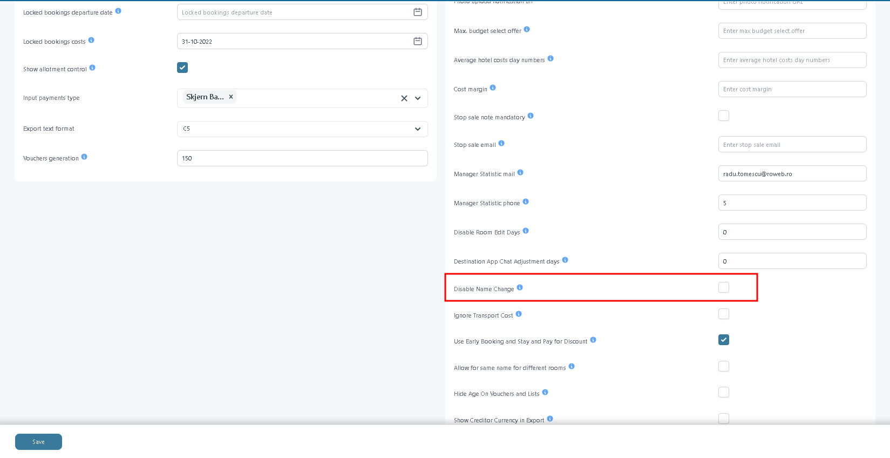

# Name change rule

Some airlines (for example, charter flights) allow passenger name changes until departure. Others do not allow name changes at all, or only until a defined cutoff before departure. The Name Change Rule is where you record which rule applies to a given transport.

#### Overview

The **Name Change Rule** controls whether passenger names can be changed on a transport.

You set the restriction separately for two groups:

* **Office** users — back-office staff.
* **WebBooking** users — customers editing their own booking.

Both groups share a single deadline, expressed in days before departure.

The company-wide **Disable Name Change** setting in **Setup → System Setup** takes priority over the Name Change Rule for customers. When it is enabled, customers cannot change passenger names in the Customer Center, whatever is configured on the transport. It does not affect Office users.

#### Purpose

Use the Name Change Rule to:

* Match Tourpaq's behaviour to your transport supplier's name-change policy.
* Reduce late changes that trigger supplier fees.
* Allow staff to correct names while preventing customers from doing so, or the reverse.

#### Preconditions

* The transport exists — see Transport creation.
* You know your transport supplier's name-change policy for this transport, including any deadline.
* You know whether **Disable Name Change** is enabled in **Setup → System Setup** — see System Setup – General Information Settings. If it is, the transport rule has no effect for customers.

#### How-to

1. **Check the company setting.**&#x20;

* Go to **Setup → System Setup** and find **Disable Name Change**. Leave it cleared if customer name changes are to be controlled per transport. Enable it only if customers must be blocked from changing names on every transport.

2. **Open the transport.**&#x20;

* Go to **Transport → Transport**, open the transport, and find the **Name Change Rule** section.

3. **Set the restrictions.**&#x20;

* Enable **Do Not Allow Name Change Office**, **Do Not Allow Name Change Web**, or both, according to your supplier policy.

4. **Set the deadline.**&#x20;

* Enter the number of days before departure after which no name change is allowed, then click **Save**.

For customers, the rule applies only while **Disable Name Change** in System Setup is cleared. For Office users, the rule applies regardless of that setting.

#### Field Reference

**Transport — Name Change Rule**

<figure><figcaption>
The Name Change Rule section in Transport creation.
</figcaption></figure>

| Field                                            | Description                                                                                                                                            | Notes                                                                                                                                             |
| ------------------------------------------------ | ------------------------------------------------------------------------------------------------------------------------------------------------------ | ------------------------------------------------------------------------------------------------------------------------------------------------- |
| **Do Not Allow Name Change Office**              | Blocks back-office staff from changing passenger names on this transport.                                                                              | Enforced after payment is registered. Not affected by **Disable Name Change** in System Setup.                                                    |
| **Do Not Allow Name Change Web**                 | Blocks customers from changing passenger names in WebBooking.                                                                                          | Cannot override **Disable Name Change** in System Setup: when that setting is enabled, customers cannot change names even if this box is cleared. |
| **Name change deadline (days before departure)** | The last point at which a name change is accepted. Enter `7` to allow changes until seven days before departure. After that, name changes are blocked. | Evaluated against the transport's departure date. For customers, applies only while **Disable Name Change** in System Setup is cleared.           |

**System Setup**

<figure><figcaption>
Disable Name Change in Setup → System Setup.
</figcaption></figure>

| Field                   | Description                                                                                | Notes                                                                                                                                                                                                             |
| ----------------------- | ------------------------------------------------------------------------------------------ | ----------------------------------------------------------------------------------------------------------------------------------------------------------------------------------------------------------------- |
| **Disable Name Change** | Blocks customers from changing passenger names in the Customer Center, on every transport. | Affects the Customer Center only; Office users are not affected. Takes priority over every transport: when enabled, customers cannot change names even if the transport's Name Change Rule is empty or allows it. |

**How the settings combine**

| System Setup: Disable Name Change | Transport: Name Change Rule              | Result                                                                       |
| --------------------------------- | ---------------------------------------- | ---------------------------------------------------------------------------- |
| Enabled                           | Anything, including nothing set          | Name change is **not allowed**.                                              |
| Cleared                           | Nothing set                              | Name change is **allowed**.                                                  |
| Cleared                           | **Do Not Allow Name Change Web** enabled | Name change is **not allowed**.                                              |
| Cleared                           | Deadline set                             | Name change is **allowed** before the deadline and **not allowed** after it. |


Enabling **Disable Name Change** in System Setup blocks customers from changing names on every transport, including transports whose Name Change Rule is empty. Confirm that is intended before saving.


### Related pages

* [Transport creation](./)
* [Transport Definition](../../../real-transports/transport-definition.md)
* [System Setup – General Information Settings](../../../setup/system-setup/system-setup-general-information-settings.md)
