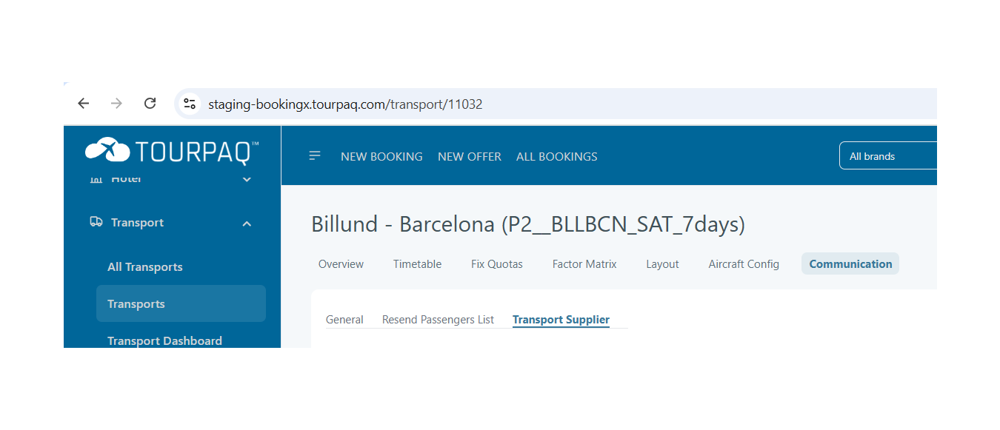
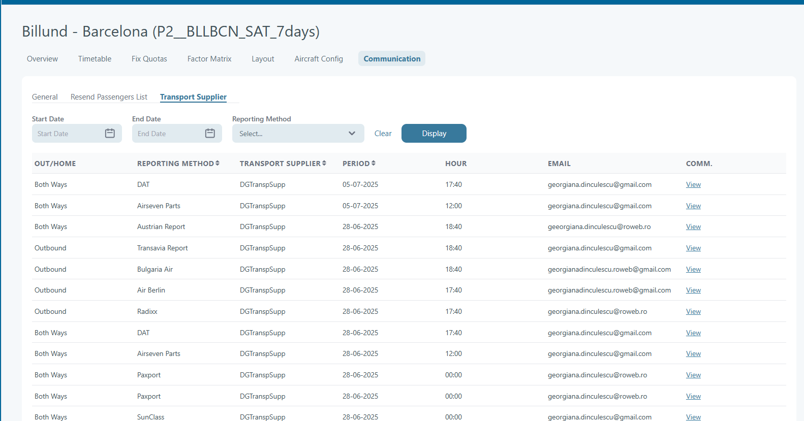
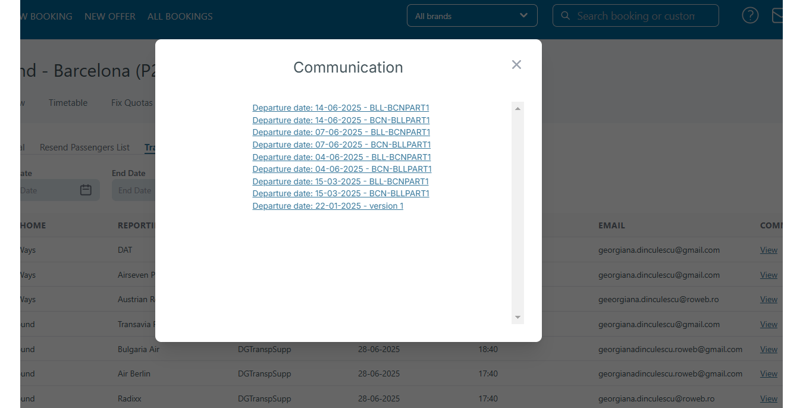

# Transport Reporting

Transport Reporting is a way to communicate the passenger name list **PNL** to the airline company. There are more methods to sent the PNL.

The reporting method type can be sent in **Transport** in **Transport/General tab** as a default. Tour operator code is required for some reporting types.

<figure><figcaption></figcaption></figure>

Another reporting method can be set from the **Timetable**. This will overwrite the method selected in the **Transport/General tab** for the duration of the flights.

<figure><figcaption></figcaption></figure>

The last reporting method can be set up from **Communication** tab.

By clicking "Add schedule" user can define rules based on which communication files are sent to defined e-mail.

**Defining separate rules for each departure date**

Rules captured in the image below, will sent communication files at the e-mail set for all bookings of selected transport with 20,10 and 1 day(s) before departure date.

<figure><figcaption></figcaption></figure>

**Defining one rule for an interval of days**

User can compact many rules to one, using Departure Date End. It can be defined an interval Departure Date- Departure Date End and also, using **Minutes** interval, communication files will be sent every set minutes. Rule captured in the picture below, will sent communication files at the e-mail address for selected transport, every 60 minutes for all bookings with 1,2,3...50 days before departure date.

<figure><figcaption></figcaption></figure>

When you are using Departure Date End, you can not copy this rule, to create a new one.

It is possible to define rules like below (using Hour set):

<figure><figcaption></figcaption></figure>

Rules number 1,2 and 3 are overwritten by the last rule, the only difference is the e-mail address to which the communication files are sent. This method can also overwrite the previous selected methods of defining communication files.

## **Communication Schedule – Handling Changed Passenger Seating After Departure**

### **Overview / Purpose**

This rule ensures that changes to passenger seating made **after departure** are still communicated to transport suppliers. It is specifically useful for **one-way homebound transports**, where new passengers may be added or existing ones removed after the outbound trip has already departed.

<figure><figcaption></figcaption></figure>

### **How It Works**

* Normally, communication schedules are set to capture bookings before departure.
* For one-way homebound trips, bookings created after the outbound departure might be missed in the initial communication.
* By creating a **communication scheduler with a -6 days offset**, the system can capture bookings made during the travel period and re-send updated lists to suppliers.
* This ensures suppliers (e.g., Paxport) receive the latest **Passenger Name List (PNL)** with accurate seat assignments before the homebound departure.

### **Key Features / Functions**

* **Catches late bookings or seating changes** for passengers on one-way homebound transports.
* **Re-sends communication** to suppliers so they always have the latest seating information.
* Works in conjunction with existing outbound and homebound schedulers.

### **Examples / Scenarios**

* **Example 1:**
  * Outbound: 01-07-2026
  * Homebound: 07-07-2026
  * A passenger books only a one-way home trip on 03-07-2025.
  * Since the outbound list was sent earlier, the passenger would normally not appear.
  * With a -6 days scheduler, the booking is captured and included in the updated PNL.
* **Example 2:**
  * A passenger cancels their homebound seat after departure.
  * The updated communication ensures the transport supplier sees the removal in time.

### **Notes / Best Practices**

* Always set up the **-6 days before departure scheduler** for one-way homebound transports.
* Coordinate with suppliers (e.g., Paxport) to confirm they accept and process re-sent lists.
* Avoid overlapping or redundant schedulers that might generate duplicate messages.
* Regularly test communication rules to ensure last-minute seating changes are reflected correctly.

The reporting is managed by a **Windows Service** that is searching for schedulers every 9 minute. The schedulers are set up in the **Transport/Communication tab**

**Fields**:

* Departure date: days before departure when the report will be sent
* Hour: the hour at which the report will be sent
* Minutes: the report will be sent every n minutes
* E-mail: the e-mail that will receive the report
* Stop sale: if checked, no more booking will be made on the flight
* Communication: allows the user to view sent lists
* Alternative reporting: list type to be sent

> 📝 **Note:** Minutes and Hour can not be set on the same rule

**Resend passenger list**

Allows the user to resend the passenger list from a set date to a desired e-mail adress without creating a schedule.

Alternative reporting types:

* Passenger list with adresses
* Passenger name list(Air)
* Inflight
* Buss Feed
* Gate Gourmet
* Infection Detection
* AirSeven Full

**Important**

In order to use reporting types, e-mail templates have to be created in the e-mail center.

**Sent emails are not saved anywhere.**

**Radix Data** and **Inflight Service** require credentials that can be filled in **System Setup**. Credential are obtained from the respective companies.

### Resend transport reporting 

This feature permits the user:

* To have a better overview of the transport reporting communication rules.
* To resend a full transport reporting.

It can be accessed from Transport -> Resend Transport Reporting

<figure><figcaption></figcaption></figure>

Available filters:

* Reporting type - This field indicates the source or category of the flight information. It might distinguish between scheduled flight plans, real-time tracking data, or historical records.
* Departure Date - This field specifies the calendar date on which the flight is scheduled to depart from its origin airport.
* Departure Airport - This field identifies the airport from which the flight originates. It is often represented by a standard airport code, such as an IATA
* Arrival Airport - This field identifies the airport where the flight is scheduled to land. It is also typically represented by a standard airport code.
* Airlines - This field indicates the airline operating the flight. It can be represented by the airline's name or its designated airline code.

<figure><figcaption></figcaption></figure>

**Resending section**

* Override Reporting - overwrite the reporting type set in the transport
* Email - destination email
* Do not send on FTP - option to just send the reporting on the email and not on the FTP

**Authentication**

A Secure Shell (SSH) public-private keypair is used to authenticate. The private key is generated by the tour operator and remains secret. The public key is shared with Transavia. When an SSH client connects, it sends a message with the public key and signature. Transavia will validate the message and check that the user and key are recognized.

**Generating SSH public-private keypair**

Online there are multiple guides that explain the process of generating a SSH public-private keypair. We recommend using ssh-keygen ([https://www.ssh.com/academy/ssh/keygen](https://www.ssh.com/academy/ssh/keygen)). To create a SSH public-private keypair on your local computer using the ssh-keygen command from PowerShell or a command prompt, type the following: ssh-keygen -m PEM -t rsa -b 4096 Enter a filename and enter a passphrase for the file.

**Supported SSH key formats**

We currently support SSH protocol 2 (SSH-2) RSA public-private key pairs with a minimum length of 2048 bits. Other key formats such as ED25519 and ECDSA are not supported.

**Confirmation e-mail**

Once the public key is configured by Transavia, a confirmation e-mail is sent to the e-mail address that shared the public key with Transavia. This confirmation e-mail is sent by [team\_allotment@transavia.com](mailto:team_allotment@transavia.com), The confirmation e-mail contains the necessary information to connect to SFTP like a username, a host and a port.

**Workflow**

1. Generate a SSH public-private keypair.
2. Share the public key via e-mail with technical partner support: [technical.partnersupport@transavia.com](mailto:technical.partnersupport@transavia.com).
3. Await the confirmation e-mail containing connection information.
4. Connect to SFTP using the username, key file and passphrase.
5. Upload PAX data files to the root directory.

After a PAX data file is uploaded, the file is automatically picked up to be processed by Transavia. That means that if the file is removed from your directory, the file is being processed.

### Transport Supplier 

The Transport Supplier allows sharing the same communication for one transport supplier across several transports.

One transport may have a single Transport Supplier for all rotations in the fix-quota(s), but another transport may have several transport suppliers for a single fix-quota.

Transport supplier can be found inside Edit Transport in Communication tab:

<figure><figcaption></figcaption></figure>

This tab shows the list of communication triggered by the rules from the Transport supplier.

<figure><figcaption></figcaption></figure>

This list can be ordered by Reporting Method, Transport Supplier and Period.

You can filter this list by using Start Date, End Date and Reporting method. Start date and End date will return a list that has the period inside the interval set by these two fields.

This table contains the following columns:

* Out/Home - transport PNL ways
* Reporting Method - Describes **how information is submitted or reported** (e.g., automatically via API, manually via upload, email, or through a platform).
* Transport Supplier - Refers to the **company or vendor providing the transport service**, such as airlines, bus companies, or shuttle services.
* Period - Could refer to the **reporting or scheduling time frame** (e.g., daily, weekly, monthly) or the specific **date range** covered by the report or operation.
* Hour - Most likely relates to the **time of day** for the transport, scheduling, or when a report is due or generated.
* Email - Field to input one or more **email addresses** where notifications, reports, or PNL documents are sent.
* Communications - link with the files for PNL Data(clicking this link will open a modal window that contains a list of links for files, when you click on one it will open in a new tab).

<figure><figcaption></figcaption></figure>
