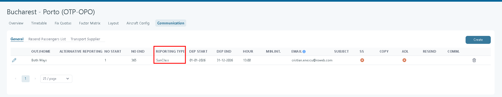

# Sunclass Transport Reporting

### Overview

Sunclass Transport Reporting is used to export passenger and transport information from Tourpaq to Sunclass in a fixed-width file format.

The export allows Sunclass and an agency to receive booking, passenger, meal preference, wheelchair assistance, and SSR information required for transport operations.

The reporting service automatically determines whether a booking should be reported as a new booking or a cancellation and keeps track of previously reported bookings to ensure correct communication with Sunclass.

***

### Purpose

The purpose of Sunclass Transport Reporting is to:

* Send transport bookings to Sunclass.
* Report passenger information and SSR services.
* Report meal preferences and wheelchair assistance.
* Track previously reported bookings.
* Handle booking changes and cancellations correctly.
* Ensure Sunclass always receives the latest valid transport information.

***

### How It Works

When the reporting service runs, Tourpaq identifies all bookings eligible for reporting.

<figure><figcaption></figcaption></figure>

#### First-Time Reporting

If a booking has never been reported before:

| Booking Status | Reported As  |
| -------------- | ------------ |
| New            | NEW          |
| Changed        | NEW          |
| Cancelled      | Not Reported |

Since Sunclass has no knowledge of the booking, both new and changed bookings are treated as NEW transactions.

Cancelled bookings are ignored because they have never been sent previously.

#### Previously Reported Bookings

If the booking has already been reported:

| Booking Status | Reported As |
| -------------- | ----------- |
| Changed        | NEW         |
| Cancelled      | CANCEL      |

This ensures Sunclass receives updates and cancellations only for bookings that already exist in their system.

#### Tracking Reported Bookings

Tourpaq maintains a list of bookings previously sent to Sunclass.

After a booking is successfully reported for the first time, it is added to this list and used during future reporting runs.


This tracking mechanism is designed to support future reporting integrations as well.


***

## Configuration

### SSR Mapping Configuration

Sunclass reporting relies on SSR mappings configured in:

**Super Administrator → SSR List**

<figure><figcaption></figcaption></figure>

Two mapping fields are available:

| Mapping             | Description                     |
| ------------------- | ------------------------------- |
| SUNCLASS MEAL       | Meal code reporting             |
| SUNCLASS WHEELCHAIR | Wheelchair assistance reporting |

#### SUNCLASS MEAL

<figure><figcaption></figcaption></figure>

Rules:

* Maximum length: 2 characters
* A single space is allowed as a valid mapping value
* Used when reporting meal preferences

Example:

| SSR Code | SUNCLASS MEAL  |
| -------- | -------------- |
| STML     | (single space) |
| VGML     | VG             |
| CHML     | CH             |

#### SUNCLASS WHEELCHAIR

Used to report wheelchair assistance.

<figure><figcaption></figcaption></figure>

Rules:

* Maximum length: 1 character

Example:

| SSR Code | SUNCLASS WHEELCHAIR |
| -------- | ------------------- |
| WCHR     | W                   |
| WCHS     | S                   |

***

### SSR Export Logic

#### Meal Codes

Tourpaq searches passenger SSR codes for mappings configured in:

```
SUNCLASS MEAL
```

Rules:

* Only the first matching meal SSR is reported.
* If no meal SSR is found, value `NM` is reported.
* Values shorter than 2 characters are padded with spaces.

#### Meal Direction

| Value | Meaning         |
| ----- | --------------- |
| U     | Outbound        |
| H     | Homebound       |
| B     | Both Directions |

#### Wheelchair Codes

Tourpaq searches passenger SSR codes for mappings configured in:

```
SUNCLASS WHEELCHAIR
```

Rules:

* Only the first matching wheelchair SSR is reported.
* If none is found, a blank space is reported.

#### SSR Codes

SSR codes mapped as:

* SUNCLASS MEAL
* SUNCLASS WHEELCHAIR

are excluded from standard SSR reporting.

Tourpaq reports the first three remaining SSR codes.

***

## File Structure

The Sunclass export is a fixed-width text file consisting of:

1. Header Record
2. Passenger Records
3. Footer Record (optional)

<figure><figcaption></figcaption></figure>

***

### Header Record

The header contains flight and export information.

#### Example

```
260301101530N999CLU260401DK709   Y260408DK710   YCPHACECPH
```

#### Main Fields

| Field                        | Description                        |
| ---------------------------- | ---------------------------------- |
| Export Date/Time             | Export timestamp                   |
| Transaction Type             | N=NEW, C=CANCEL                    |
| Header Identifier            | 999                                |
| Tour Operator                | CLU                                |
| Outbound Flight Information  | Flight details                     |
| Homebound Flight Information | Flight details                     |
| Airport Information          | Departure and destination airports |

***

### Passenger Record

Each passenger generates one passenger line.

#### Passenger Name

Reported as:

```
LASTNAME FIRSTNAME
```

Example:

| First Name | Last Name              |
| ---------- | ---------------------- |
| Jonas      | von der Velle Gunarson |

Result:

```
Gunarson Jonas von der
```

Names exceeding field length are truncated.

***

#### Gender Values

| Value | Meaning |
| ----- | ------- |
| M     | Male    |
| F     | Female  |
| C     | Child   |
| I     | Infant  |

***

#### Smoking

Always reported as:

```
N
```

***

#### Age Reporting

| Age   | Reported Value         |
| ----- | ---------------------- |
| 0-9   | Digit + trailing space |
| 10-99 | Actual age             |
| 100+  | 99                     |

Examples:

```
5
12
99
```

***

#### Passenger Record Example

```
GUNARSON JONAS VON DER M1234567890      NM B W  SPMLPETC
```

***

### Footer Record

Footer reporting is optional.

#### Example

```
260301101530 998000000125
```

#### Fields

| Field             | Description                      |
| ----------------- | -------------------------------- |
| Export Date/Time  | Export timestamp                 |
| Header Identifier | 998                              |
| Total Lines       | Total number of exported records |

***

## Manifestation in the System

The reporting process is fully automated.

When the scheduled reporting service executes:

1. Eligible bookings are identified.
2. Previously reported bookings are checked.
3. NEW or CANCEL transaction type is determined.
4. Passenger meal mappings are resolved.
5. Wheelchair mappings are resolved.
6. Remaining SSR codes are added.
7. Fixed-width export file is generated.
8. Booking reporting history is updated.

***

## Example SSR Configuration

The screenshot below illustrates how SSR codes are configured and mapped for Sunclass reporting.

#### Example Mappings

| SSR Code | SUNCLASS MEAL | SUNCLASS WHEELCHAIR |
| -------- | ------------- | ------------------- |
| STML     | (space)       | <p><br></p>         |
| VGML     | VG            | <p><br></p>         |
| CHML     | CH            | <p><br></p>         |
| WCHR     | <p><br></p>   | W                   |
| WCHS     | <p><br></p>   | S                   |


The SSR List configuration controls how meal and wheelchair information appears in the exported Sunclass file.

