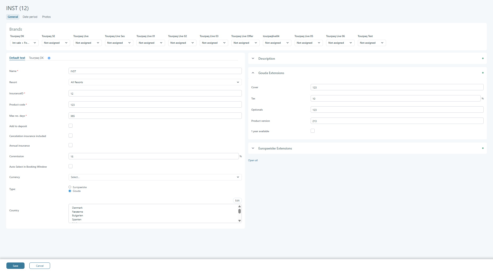
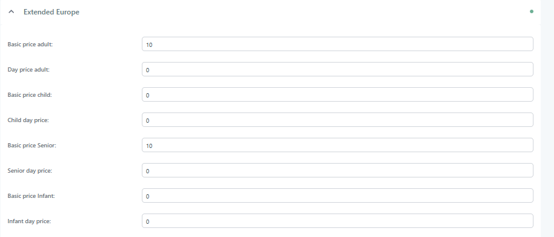
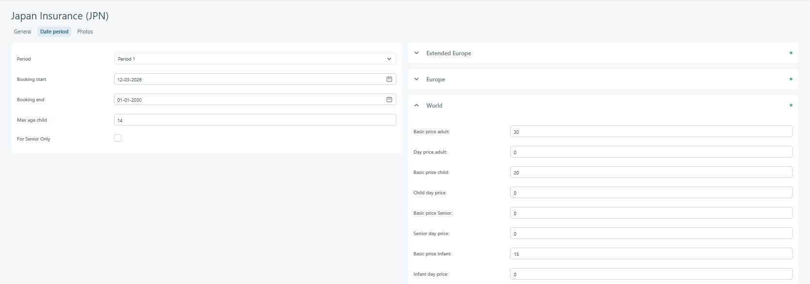
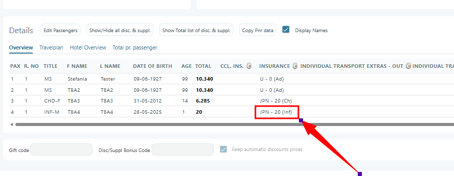
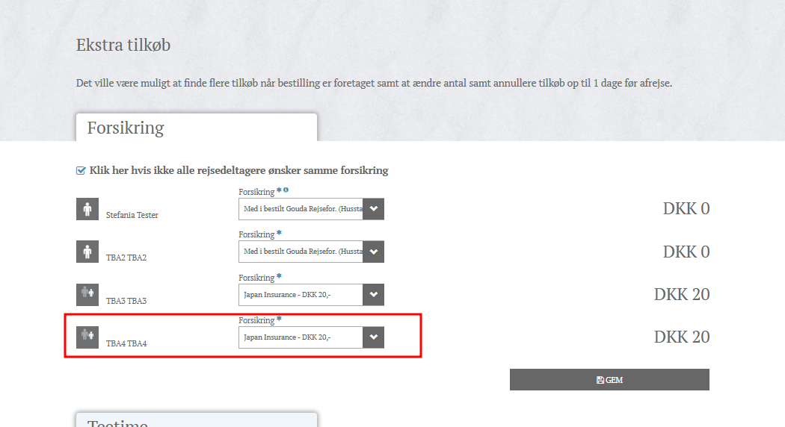
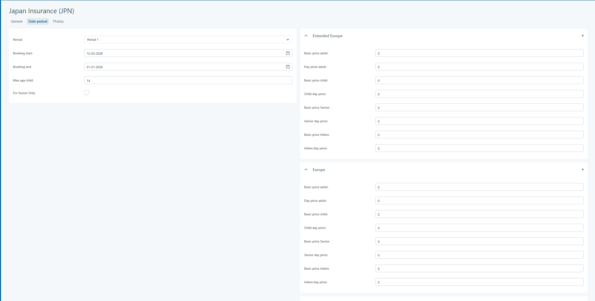

# Travel Insurance

## **General Tab**

### **Overview**

The system allows passengers to purchase travel insurance as part of their booking. Each insurance product is configured in Tourpaq Office and is linked to a specific insurance provider. Passengers may also choose to use their own external insurance, in which case only basic information (e.g., insurance company, policy number) is stored.

All travel insurance entries configured in the system are associated with a **travel insurance provider**. These entries are processed daily through the automated reporting service, which sends the corresponding data to the provider.\
(For detailed automation behavior, see _Travel Insurance Automated Reporting_).

### **Travel Insurance Asset Structure**

A travel insurance asset contains the full configuration required for system usage and for automated communication with the insurance provider. The following information must be available:

#### **General Information**

The **General** tab is the main configuration area for setting up an insurance product in the system. From here, you define the basic details, behaviour, availability, commission rules, pricing options, and insurance provider extensions.

The **General** tab contains all mandatory and optional settings that define how an insurance product behaves in the booking system. It covers:

* Basic identification
* Booking rules
* Provider type (Gouda / Europæiske)
* Country availability
* Commission and pricing options
* Provider-specific configuration (extensions)
* Brand assignment

This setup ensures that the insurance product appears correctly during the booking flow and that all calculations and integrations run as expected.

Travel Insurance can be configured for Adults, Children, and Infants. When infant support is enabled, the insurance can be selected and priced separately for infant passengers throughout the system.

Supported providers:

* Europæiske
* Gouda
* No external provider

The functionality and pricing rules described below apply regardless of the configured insurance provider.

#### **Purpose**

The purpose of the General tab is to:

* Define the core identity and behaviour of an insurance product
* Specify which customers can book it (age, country, resort conditions)
* Assign integration settings for external providers (Gouda, Europæiske)
* Control commission, deposit behaviour, and cancellation options
* Connect the insurance product to selected brands

This ensures the insurance behaves correctly across all booking channels.

### **Field Explanation**

<figure><figcaption></figcaption></figure>

#### **Brand Assignment (Top Section)**

| **Field**                                          | **Description**                                                                                        |
| -------------------------------------------------- | ------------------------------------------------------------------------------------------------------ |
| **Tourpaq DK / SE / Live / Other brand dropdowns** | Assigns this insurance to one or more brands. If “Not assigned,” the brand cannot sell this insurance. |

***

### **General Information**

| **Field**                           | **Description**                                                                                   |
| ----------------------------------- | ------------------------------------------------------------------------------------------------- |
| **Name**\*                          | Display name of the insurance (shown to users).                                                   |
| **Resort**                          | Limits the insurance to specific resorts, or “All Resorts”.                                       |
| **InsuranceID**\*                   | Internal identifier used for API calls and integrations.                                          |
| **Product code**\*                  | Provider product code used in external systems (Gouda/Europæiske).                                |
| **Max no. days**\*                  | Maximum number of travel days allowed for this insurance product.                                 |
| **Add to deposit**                  | If enabled, the insurance price is added to the deposit calculation instead of the final invoice. |
| **Cancellation insurance included** | If checked, cancellation coverage is included in this insurance.                                  |
| **Annual insurance**                | Indicates whether this is a yearly insurance product rather than per-trip.                        |
| **Commission**                      | Percentage commission paid to the agency for selling the insurance.                               |
| **Auto Select in Booking Window**   | Automatically selects this insurance by default in the booking flow.                              |
| **Currency**                        | The currency used for this insurance product.                                                     |
| **Types**                           | Selects the provider: **Europæiske** or **Gouda**. Determines which extensions become active.     |
| **Country**                         | Defines which customer nationalities are allowed to book this insurance.                          |

***

### **Description Section**

| **Field**                          | **Description**                                                                            |
| ---------------------------------- | ------------------------------------------------------------------------------------------ |
| **Description (Rich text editor)** | Text shown in customer-facing systems describing coverage, terms, and general information. |

***

### **Gouda Extensions**

| **Field**            | **Description**                                                                                                                                                                                                            |
| -------------------- | -------------------------------------------------------------------------------------------------------------------------------------------------------------------------------------------------------------------------- |
| **Cover**            | 
Indicates whether the insurance applies to:
<ul><li>A <strong>single person</strong>, or</li><li>A <strong>group</strong> (codes: <em>6, 10, 18</em>) — these group values are not sent directly to Gouda.</li></ul> |
| **Tax**              | 
The fee charged by Gouda for their services. Default: <strong>1.1%</strong> of the insurance price.
                                                                                                              |
| **Optionals**        | 
Extra configuration field for Gouda integrations.

Additional cover options:
<ol><li>Personal Property</li><li>Ski</li><li>Excess</li><li>Accident</li><li>Accident + Personal Property</li></ol>               |
| **Product version**  | Indicates which Gouda product version is used.                                                                                                                                                                             |
| **1 year available** | Enables 1-year coverage options if offered by Gouda.                                                                                                                                                                       |

***

### **Europæiske Extensions**

| **Field**               | **Description**                                                                         |
| ----------------------- | --------------------------------------------------------------------------------------- |
| **1–5 (option fields)** | Provider-specific values used by Europæiske for risk categories or benefit definitions. |
| **Trip type**           | Identifies the trip category used by Europæiske (e.g., Single Trip, Multi-Trip).        |

***

### **Pricing Structure**

Insurance prices are inserted according to:

* Insurance area (Extended Europe, Europe, World)
* Age (adult/child/senior)
* Type of price (basic price or daily price)

Each insurance must contain the following price inputs, per area:

#### **Extended Europe**

<figure><figcaption></figcaption></figure>

* Adult basic price
* Adult price per day
* Child basic price
* Child price per day
* Basic Price Senior
* Senior day price
* Basic price infant
* Infant day price

#### **Europe**

* Adult basic price
* Adult price per day
* Child basic price
* Child price per day
* Basic Price Senior
* Senior day price
* Basic price infant
* Infant day price

#### **World**

* Adult basic price
* Adult price per day
* Child basic price
* Child price per day
* Basic Price Senior
* Senior day price
* Basic price infant
* Infant day price

***

### **Price Calculation**

The total insurance price for a passenger is calculated as:

**Total Price = Basic Price + (Trip Length × Price per Day)**

This applies to both adults and children, based on the values defined for their age group and insurance area.

***

### **How It Works**

#### **1. Define the Insurance Identity**

You start by entering the core details (name, ID, product code). These fields tell the system and external providers what product this is.

#### **2. Select Provider Type**

Choosing **Gouda** or **Europæiske** determines which integration fields appear.\
Each provider requires specific codes and settings.

#### **3. Assign Brands**

The insurance product must be assigned to one or more brands before it can be sold under those brands.

#### **4. Configure Booking Behaviour**

Options such as:

* Auto-select in booking
* Deposit behaviour
* Cancellation included\
  control how the product behaves in the customer-facing booking flow.

#### **5. Set Age and Duration Rules**

Fields like:

* Max no. days

#### **6. Set Commission Rules**

Enter the commission percentage to define agency earnings.

#### **7. Provider Integration Setup**

Depending on provider:

* Fill Gouda fields to enable Gouda risk and product mapping
* Fill Europæiske fields for their product structure

These values must match the provider’s documentation.

#### **8. Country Availability**

Choose which nationalities are allowed to book the product.\
Example: Denmark, Bulgaria, Spain, Mallorca.


In order to be able to track the data sent via the API, there is a log for the data sent to Gouda and Europæiske (travel insurance and cancellation), These logs can be checked in the [Internal Logs](../setup/internal-logs/insurance-payload-log-gouda-and-europaeiske.md) page of Setup


***

## Infant Support

### Configuration

Navigate to: **Product Setup > Travel Insurance > Date period**

#### Date Period Configuration

Navigate to the **Date Period** tab.

For any type of insurance (Extended Europe, Europe, World), Basic price infant and infant day price are set.

<figure><figcaption></figcaption></figure>

***

### Booking Flow

When infant support is enabled:

* Travel Insurance can be selected for infant passengers in the booking flow.
* The configured infant price is used for the insurance cost calculation.

<figure><figcaption></figcaption></figure>

***

### Web Booking

When infant support is enabled:

* Travel Insurance can be selected for infant passengers during Web Booking.
* The configured infant price is used when calculating the insurance amount.

***

### Customer Center

When infant support is enabled:

* Travel Insurance can be added or modified for infant passengers in Customer Center.
* The configured infant price is used when calculating the insurance amount.

<figure><figcaption></figcaption></figure>

***

## Commission Calculation

### Commission Rules

The commission amount is calculated before tax is added to the Travel Insurance price.

#### Calculation Order

1. Determine the insurance base price.
2. Calculate commission from the base price.
3. Add tax.
4. Calculate the final insurance amount.

#### Example

| Item             | Amount |
| ---------------- | ------ |
| Insurance Price  | 100.00 |
| Commission (10%) | 10.00  |
| Tax              | 25.00  |
| Final Price      | 125.00 |

In this example:

* Commission is calculated from 100.00
* Tax is added afterwards
* Tax is not included in the commission calculation basis

This calculation method applies to Adult, Child, and Infant insurance pricing.

### **Notes**

* Required fields (\*) must be filled before saving.
* Changing provider type resets provider-specific fields.
* Country selection must match legal coverage rules.
* Brand assignment controls visibility across booking channels.

## **Date Period**

### **Overview**

The **Date Period** tab allows administrators to define booking periods and configure age rules and pricing models for insurance or additional services. A “Date Period” groups together validity dates, maximum age rules, and all pricing options that apply within the selected period.

This section ensures that correct price calculations are applied based on:

* Booking dates
* Traveller age groups (adult, child, senior, infant)
* Selected travel zones (Europe, Extended Europe, Worldwide)
* Duration ranges (e.g., 1–4 days, 5–9 days)

***

### **Purpose**

The purpose of the Date Period configuration is to:

* Control which prices apply during a specific booking timeframe
* Define age boundaries for children, infants, and seniors
* Set base and daily prices for different travel zones
* Apply duration-based pricing rules
* Manage insurance or service price variations depending on trip length

This ensures that the system always calculates the correct final price based on the traveller’s age, destination, and trip duration.

***

### **Field Explanation**

<figure><figcaption></figcaption></figure>

#### **General Fields (Left Panel)**

| **Field**           | **Description**                                                                                                                 |
| ------------------- | ------------------------------------------------------------------------------------------------------------------------------- |
| **Period**          | The name or label of the defined booking period (e.g., _Period 1_, _Winter Season_).                                            |
| **Booking start**   | The date from which the period becomes valid. Prices and rules under this period apply for bookings made on or after this date. |
| **Booking end**     | The last date on which the period is valid.                                                                                     |
| **Max age child**   | The maximum age considered a child. Travellers older than this age fall into the adult category.                                |
| **For Senior Only** | Restricts this pricing period to senior travellers only (e.g., senior insurance).                                               |

***

#### **Extended Europe (Right Panel – Section 1)**

Pricing fields for the **Extended Europe** region.

| **Field**              | **Description**                                 |
| ---------------------- | ----------------------------------------------- |
| **Basic price adult**  | Base premium for adults within Extended Europe. |
| **Day price adult**    | Additional price per day for adults.            |
| **Basic price child**  | Base premium for children.                      |
| **Child day price**    | Daily rate applied to child travellers.         |
| **Basic price Senior** | Base price for senior travellers.               |
| **Senior day price**   | Daily surcharge for seniors.                    |
| **Basic price Infant** | Base price for infant travellers.               |
| **Infant day price**   | Additional price per day for infants.           |

***

#### **Europe / World Sections**

This sections (Europe, World) contain the same structure as Extended Europe:

* Adult base and day prices
* Child base and day prices
* Senior base and day prices
* Infants base and day prices

***

#### **Europe – Fast Pris (Fixed Price) Section**

Fixed-price insurance scheme based on trip duration.

| **Duration Range** | **Field Meaning**                   |
| ------------------ | ----------------------------------- |
| **1–4 dagar**      | Price for trips lasting 1–4 days.   |
| **5–9 dagar**      | Price for trips lasting 5–9 days.   |
| **10–16 dagar**    | Price for trips lasting 10–16 days. |
| **17–23 dagar**    | Price for trips lasting 17–23 days. |
| **24–31 dagar**    | Price for trips lasting 24–31 days. |

#### **World – Fast Pris (Fixed Price)**

Same structure as Europe Fast Pris but applies to worldwide destinations.

***

### **How It Works**

1. **Select or Create a Date Period**\
   Each period contains its own pricing rules. When a booking falls inside the period’s start–end range, the system applies the rules from that period.
2. **Age Calculation**
   * Children are recognized based on **Max age child**.
   * Senior pricing is applied when the senior category is enabled and the traveller meets senior age criteria.
   * Infants are priced when insert the basic price infant
3. **Price Determination**\
   The system calculates price based on:
   * Travel zone (Europe, Extended Europe, World)
   * Age category (child, adult, senior, infant)
   * Trip duration (days)

## **Photos**

The system allows add images related to the travel insurance asset.

<figure><figcaption></figcaption></figure>
