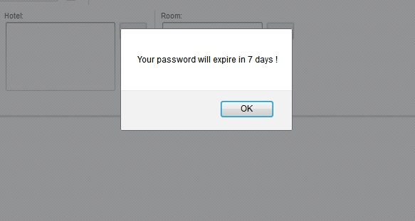
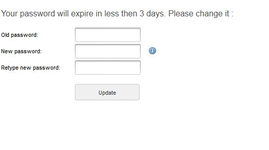

# Password expiration

This new feature allows you to set a number of days for a user password to be available, so the user is force to change his password.

### **How to set it?**

You can enable this features by going into the EditUser page for the user you want to make the change, and check the "Enable password valability days" checkbox.\ After that you have to insert the valability days. This will be calculated from the moment you enable the feature, and is reseted from the moment the user changes his password.

<figure><figcaption></figcaption></figure>

**Scenarious**

* If you have less then 10 days before your password expires. The system will send you an alert after you logged in.

<figure><figcaption></figcaption></figure>

* You have less then 3 days before your password expires. The system redirect you to the change password page.

<figure><figcaption></figcaption></figure>

* Your password has expired. You will recieve a message on login, and you have to contact an administrator to change your password if you want to continue to use the application.

<figure><figcaption></figcaption></figure>
