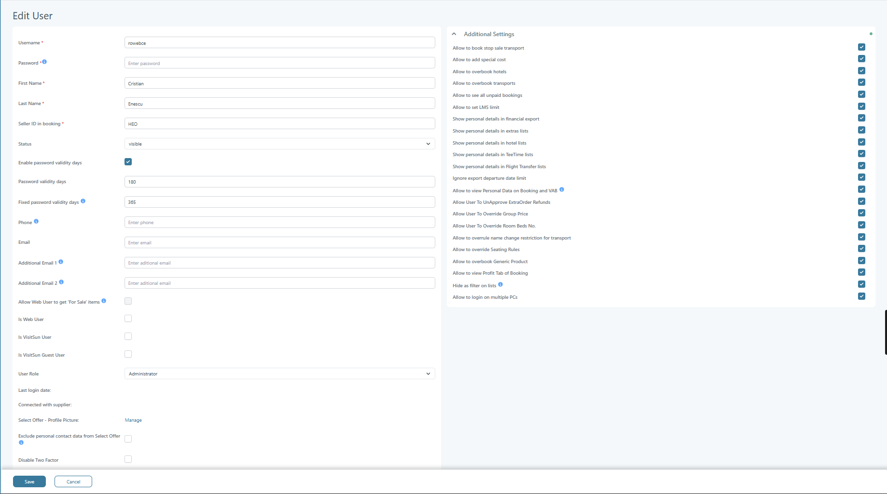

# Edit User

### Introduction

The **Edit User** page is used to manage user accounts in Tourpaq Office. It controls user identity, access rights, permissions, and system behavior. This page is central to user administration and directly impacts access to modules such as bookings, financial data, exports, and system configuration.

It is closely related to:

* Users → User List
* User Roles
* GDPR / Personal Data Handling
* Booking and Financial Permissions

***

### Overview

This page allows updating:

* User login credentials
* Personal information
* Role and permissions
* Access to sensitive data
* Operational capabilities across the system

***

### 📸 Screenshot – Full Page Overview

<figure><figcaption></figcaption></figure>

***

### Purpose

* Maintain user accounts
* Control access to system features
* Configure permissions for operations and data visibility
* Ensure GDPR compliance through access restrictions

***

### Requirements

* Access to **Users → User**
* Administrator or equivalent permissions
* Understanding of user roles and permissions structure

***

### Navigation

Users → User → Select User → **Edit**

***

### Interface Overview

The page is divided into two main sections:

1. **User Information (left side)**
2. **Additional Settings (right side)**

***

### 📸 User Information Section

<figure><figcaption></figcaption></figure>

***

### Field Description – User Information

<table><thead><tr><th width="197.75">Field Name</th><th>Description</th><th width="120.75">Mandatory</th><th>Notes / System Impact</th></tr></thead><tbody><tr><td>Username</td><td>Unique identifier used for login</td><td>Yes</td><td>Must be unique across the system</td></tr><tr><td>Password</td><td>User password</td><td>No (on edit)</td><td>Required only when creating user; follows password policy</td></tr><tr><td>First Name</td><td>User’s first name</td><td>Yes</td><td>Considered personal data (GDPR)</td></tr><tr><td>Last Name</td><td>User’s last name</td><td>Yes</td><td>Considered personal data (GDPR)</td></tr><tr><td>Seller ID in booking</td><td>Signature</td><td>Yes</td><td>Used for booking ownership and reporting</td></tr><tr><td>Status</td><td>Defines if user is visible or hidden across the system</td><td>No</td><td>
“visible” = active, “hidden” = cannot be visible across the system. 

<mark style="color:$warning;background-color:$primary;"><strong>To be able to see a hidden users across the system you need to select the checkbox "Show hidden"</strong></mark>
</td></tr><tr><td>Enable password validity days</td><td>Enables password expiration</td><td>No</td><td>Activates password expiry logic</td></tr><tr><td>Password validity days</td><td>Number of days before password expires</td><td>Conditional</td><td>Only active if password validity is enabled</td></tr><tr><td>Fixed password validity days</td><td>System-enforced password expiration</td><td>No</td><td>Overrides Password validity days</td></tr><tr><td>Phone</td><td>User phone number</td><td>No</td><td>Used for 2FA</td></tr><tr><td>Email</td><td>Primary email address</td><td>No</td><td>Used for notifications and communication</td></tr><tr><td>Additional Email 1</td><td>Secondary email address</td><td>No</td><td>Used only for 2FA</td></tr><tr><td>Additional Email 2</td><td>Secondary email address</td><td>No</td><td>Used only for 2FA</td></tr><tr><td>Allow Web User to get "For Sale" items</td><td>Grants access to sales items</td><td>No</td><td>Setting gives user access to transports, hotels and extras via API, that are "For sales" Requiere that the user already has "Is Web User" activated.</td></tr><tr><td>Is Web User</td><td>Marks user as web-based</td><td>No</td><td>Used for web booking access</td></tr><tr><td>Is VisitSun User</td><td>Enables VisitSun integration</td><td>No</td><td>Depends on VisitSun module</td></tr><tr><td>Is VisitSun Guest User</td><td>Guest-level VisitSun access</td><td>No</td><td>Limited access scenario</td></tr><tr><td>User Role</td><td>Defines system-wide permissions</td><td>Yes</td><td>
Core access control field. 
<ul><li><mark style="color:$danger;">Depending on the chosen user role, extra permissions are granted in Additional Settings.</mark> </li><li><mark style="color:$danger;">A user can have only one role.</mark></li></ul></td></tr><tr><td>Last login date</td><td>Last login timestamp</td><td>No</td><td>Read-only field</td></tr><tr><td>Connected with supplier</td><td>Links user to supplier</td><td>No</td><td>Used for supplier workflows</td></tr><tr><td>Select Offer - Profile Picture</td><td>Profile image management</td><td>No</td><td>Add profile picture</td></tr><tr><td>Exclude personal contact data from Select Offer</td><td>Hides personal data</td><td>No</td><td>GDPR-related restriction Agency contact data will be used instead.</td></tr><tr><td>Disable Two Factor</td><td>Disables 2FA login</td><td>No</td><td>Reduces security, use cautiously</td></tr></tbody></table>

***

### Additional Settings

Additional Settings represent the permissions granted to a user depending on the selected user role. A user can have only one role in the system. A user's role can be:

* administrator
* sales
* brand manager
* extras supplier
* financial
* guide team
* guide master
* hotel manager
* agency orders user&#x20;
* questionnaire
* supplier
* transport user

<figure><figcaption></figcaption></figure>

***

### Field Description – Additional Settings

These settings define **fine-grained permissions** across Tourpaq.

| Field Name                                              | Description                                                                                                        |
| ------------------------------------------------------- | ------------------------------------------------------------------------------------------------------------------ |
| Allow to book stop sale transport                       | Allows booking stop-sale transport                                                                                 |
| Allow to add special cost                               | Allows manual cost adjustments                                                                                     |
| Allow to overbook hotels                                | Allows exceeding hotel allotment                                                                                   |
| Allow to overbook transports                            | Allows exceeding transport capacity                                                                                |
| Allow to see all unpaid bookings                        | Grants access to unpaid bookings                                                                                   |
| Allow to set LMS limit                                  | Allows LMS configuration                                                                                           |
| Show personal details in financial export               | Includes personal data in exports                                                                                  |
| Show personal details in extras lists                   | Shows personal data in extras                                                                                      |
| Show personal details in hotel lists                    | Shows personal data in hotel exports                                                                               |
| Show personal details in fee time lists                 | Shows personal data in fee lists                                                                                   |
| Show personal details in Flight Transfer lists          | Shows personal data in transport exports                                                                           |
| Ignore export departure date limit                      | Overrides export filters                                                                                           |
| Allow to view Personal Data on Booking and VAB          | Access to personal booking data. This affects if the user can view the Customer and Phone columns in All Bookings. |
| Allow User To UnApprove ExtraOrder Refunds              | Allows reversing refunds                                                                                           |
| Allow User To Override Group Price                      | Allows manual group pricing                                                                                        |
| Allow User To Override Room Beds No.                    | Allows changing room capacity                                                                                      |
| Allow to overrule name change restriction for transport | Overrides name change rules                                                                                        |
| Allow to override Seating Rules                         | Overrides seating logic                                                                                            |
| Allow to overbook Generic Product                       | Allows exceeding generic product limits                                                                            |
| Allow to view Profit Tab of Booking                     | Access to profit data                                                                                              |
| Hide as filter on lists                                 | Hide the user in the lists throughtout the system                                                                  |
| Allow to login on multiple PCs                          | Enables concurrent sessions                                                                                        |

***

### Configuration Steps

1. Navigate to Users → User
2. Select an existing user
3. Update required fields:
   * Identity (name, email)
   * Role
   * Permissions
4. Configure Additional Settings based on access needs
5. Click **Save**

***

### System Behavior

* User Role defines baseline permissions
* Additional Settings override or extend permissions
* GDPR-sensitive fields control access to personal data
* Disabling a user prevents login but keeps history
* Password policies are enforced if enabled
* Permissions directly affect:
  * Booking flow
  * Financial exports
  * Data visibility
  * System restrictions

***

### Examples

#### Example 1 – Support User (GDPR restricted)

* User Role: Support
* Disable all "Show personal details" options

**Result:**\
The user can operate the system, but cannot access personal data

***

#### Example 3 – Administrator

* All permissions enabled

**Result:**\
Full system control

***

### Related Pages

* Users → User List
* User Roles
* Booking Permissions
* GDPR and Data Visibility
* Financial Exports
