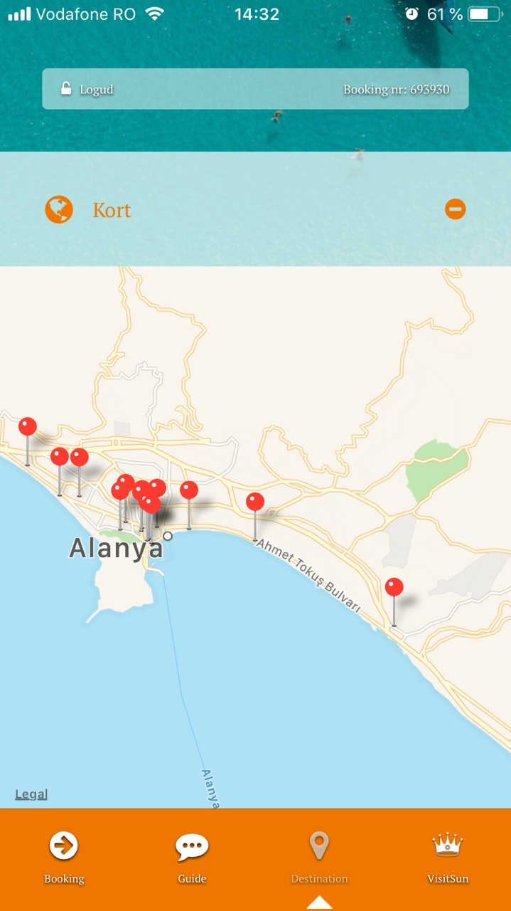
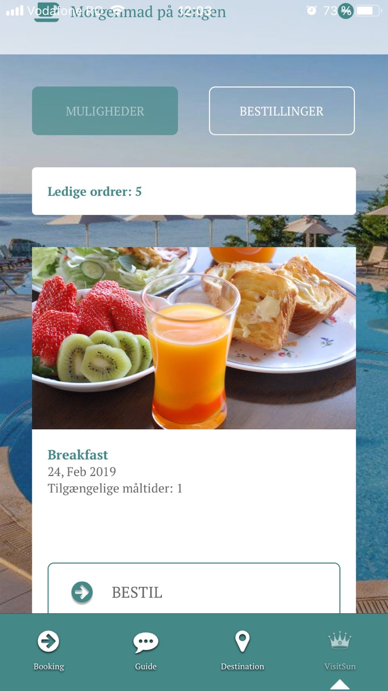

# Visit Sun App

VisitSun is an application designed for supporting the guests to have access to special features and information, to stay updated on any changes and to get inspired related to their bookings in order that the entire experience to be valuable. Application is available on both Android or IOS devices. Below, there is a picture with the application running on IOS:

<figure><figcaption></figcaption></figure>

Guests can login using the booking number and the password provided.

After login, guests are directed to a front page having a welcome quote.

<figure><figcaption></figcaption></figure>

From here, user can access available tabs in the application: Booking, Guide, Destination and VisitSun.

### Booking tab 

In this tab, user can access information about the booking.

**Welcome screen** provide information about number of days before departure, an introduction text and latest news regarding the destination. Introduction text displayed on "Welcome screen" can be configured from Tourpaq Office logged as admin by accessing **Guest App->Settings->Edit Agency->General settings**

<figure><figcaption></figcaption></figure>

In this section, there are also displayed notifications for insider tips. Notifications can be configured from **Guest App->Edit Agency->Manage VisitSun Settings->Notifications**.

Also, **push notifications** sent by the guides (from Tourpaq Office -> Guide-> View all bookings -> "Send push notifications") are received on the app, if logged in with a booking that a push notification was sent to. If the notification pup-up is clicked, the app is opened and the message is displayed and stored under **"Today's updates"**

**Booking info** provide information about names and number of passengers, resort, hotel name, room types, arrival and departure airports and timeline. In this section, user can access also Customer Center page in order to perform changes related to the booking .

**Ticket** section will display the booking ticket.

In **Hotel** section, user can check pictures, facilities, facts, description about the hotel where he is staying. Details shown here can be configured in Tourpaq Office, on **Edit Hotel-> Web tab**. If HTML Description is set, then will be displayed in the application, otherwise short description will be shown.

In **Weather** tab, details about weather during stay days are shown. Weather API URL which provide weather information can be set in Tourpaq **Service->Guest APP-> Settings** at Weather section.

Using **Upgrade your vacantion** tab, user can update the booking by adding products (like seating or baggage facilities) to his reservation from Customer Center. Products which can be booked here are defined in Tourpaq Office and description and photos for products available in the application can be configured in Tourpaq Office under **Extras Setup->Extras Categories** tab.

<figure><figcaption></figcaption></figure>

### Guide tab 

In **Your guides** section, user will be able to call or send e-mail to guides assigned to specific resort on which reservation is made. Guides names displayed are configured in **Office->Users-> Guides Profiles**.

<figure><figcaption></figcaption></figure>

Using **Chat** tab, user can start conversation with guides from the booking destination. If the booking is in the future, then the message sent by the user will be available to all guides and admin users. First guide that answer will automatically pick up the conversation. If the user is already at the destination, the conversation will be sent to all guides on that resort.

In **Weekly activities** section, user will be able to see weekly activities defined from **Guest App->Weekly Activities**.

<figure><figcaption></figcaption></figure>

<figure><figcaption></figcaption></figure>

Under **"Excursions"** (Udflugter) section, excursions which are defined in **Office->Extras** when logged-in as a guide will be available for booking. This can be done when accessing **Excursions(Udflugfter)** tab. For detailed information about how this type of an excursion/extras is created, please check [Destination - Mobile guide App](destination-mobile-guide-app.md)

Remark: Excursions are displayed also according to stop sales hours setup on the extra. Details here: [Extras](broken-reference)

**Vouchers** section displays the hotel voucher or excursions which are already confirmed for that specific booking. Hotel vouchers displayed in this section are hotels with Issue Voucher option checked.

<figure><figcaption></figcaption></figure>

<figure><figcaption></figcaption></figure>

### Destination tab 

* **Good to know** or "Things to see and do" section, contains tips configured when logged in as guide/admin in Tourpaq Office under **Guest App->Good to know** menu.

<figure><figcaption></figcaption></figure>

* **Vocabulary** section display a series of key words to be used by the guest during his vacation. Words are defined in Tourpaq Office from **Guest App-> Vocabulary** when logged in as guide or admin and are displayed in the application based on the country in which user travels.

<figure><figcaption></figcaption></figure>

<figure><figcaption></figcaption></figure>

* Under **Maps** section, user can check the map for current booking resort. Map displayed here can be configured in Tourpaq Office under **Guest App->Maps**. The guide/admin can define here also points of interest on the map by simply clicking on the map and entering "Location Details". It is possible also to upload pictures for defined point of interest.

<figure><figcaption></figcaption></figure>

In the mobile application it is displayed like below:

<figure><figcaption></figcaption></figure>

* **Kiss Cam** section allow to user to take photos using predefined overlays from **Guest App->Settings->KissCam Overlays**.

<figure><figcaption></figcaption></figure>

User can save photo or publish on social media.

<figure><figcaption></figcaption></figure>

### VisitSun 

This tab offers the possibility to the user to check VisitSun special features like: Dine-around, In-room breakfast, Fast check-in or Room selection.

<figure><figcaption></figcaption></figure>

**Dine Around** allow to guests to book lunch and/or dinner until the day before the latest one at a different hotel/restaurant than the one used on the booking from VisitSun group.

* Hotels from VisitSun group has to be configured by admin under Edit Hotel by checking "Is VisitSun" option.
* Admin can configure also in Edit Hotel, "Allowed dine arounds per week" from Edit Hotel.
* There is necessary that Extras Category- Dine around should be defined when logged-in as an admin from Office from **Extras Setup->Extras Category**.
* After logged-in as a supplier which is a Visit Sun User or as an admin
* (should be the supplier from the hotel), in Office can be defined new product for Dine Around from **Agent->Visit Sun Products**.

<figure><figcaption></figcaption></figure>

* Please make sure that product have a resourcer on that hotel and allotments are generated from "Generate Allotment". In the picture below, it is shown an basic example of "Dine Around" product configuration.

<figure><figcaption></figcaption></figure>

* It can be defined only one product for each hotel. Also, supplier can upload suggestive photos which are shown in the application from the Photos tab.
* In the application, accessing the **Dine Around** section, guests can select Dine Around to another hotel from that resort which is in the Visit Sun group.

Photo,hotel name, product, date and remaining allotments are displayed here.

Booked products "Dine Around" type are displayed on Booked tab and can be also removed from there.

**In Room Breakfast** allow guests to order breakfast in room two times per week during his stay.

* For configuring this (check "Dine Around" product configuration), the extras category "In Room Breakfast" has to be defined when logged-in as admin from Office **Extras Setup->Extras Category**.
* Hotels from VisitSun group has to be configured by admin under Edit Hotel by checking "Is VisitSun" option.
* Admin can configure also in Edit Hotel, "Allowed in-room breakfasts per week" from Edit Hotel.
* Next step is to define the product "In Room Breakfast" when logged-in as a supplier. The resource on the "In Room Breakfast" product should be the hotel from the booking and the allotments should be generated here. "In Room Breakfast" product is available for reservation in the app.:

<figure><figcaption></figcaption></figure>

When ordering "In Room Breakfast" from the application, guests can select the hour on which the product will be booked:

**Fast Check in** give guests the possibility to do fast check-in at hotel where they are staying from home. Information like first name and last name, passport number, nationality and date of birth should be filled in in order to enable the "Fast Check in".

Information added here will be updated on the booking and after that Hotel List will be sent to the hotel by the supplier from **Agent->Hotel List**. From **Insider Tips** section guest will be able to find out insider tips related to his trip. Insider tips shown here are configured when logged in as guide/ admin from the **Guest App->Insider Tips** menu.

<figure><figcaption></figcaption></figure>

Tips entered here are available for guest when accessing "Insider tips" section.

