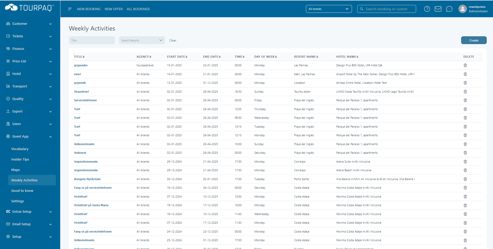
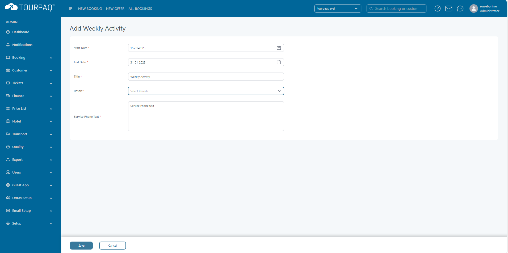
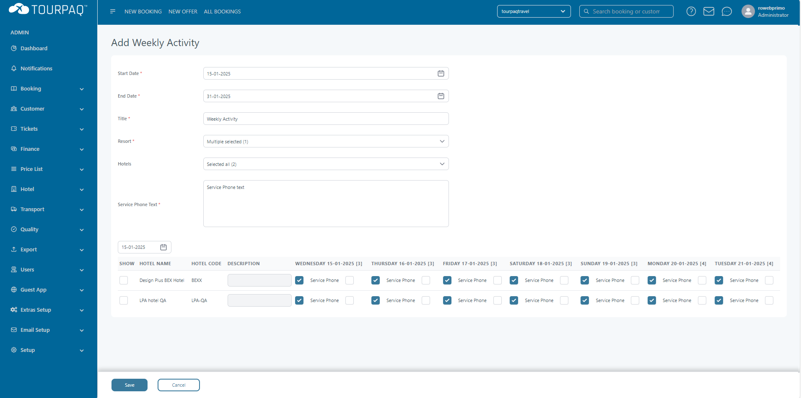
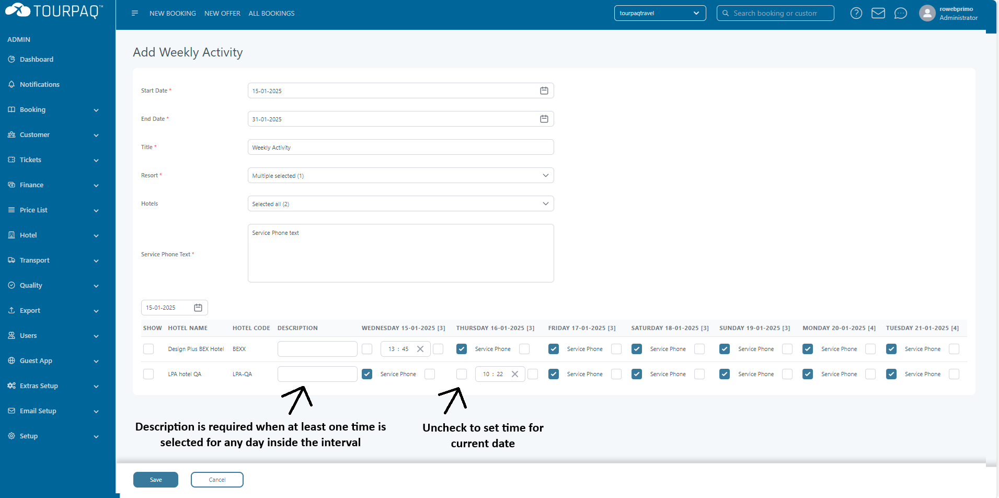

# Weekly Activities

In the Weekly activities section, user will be able to see weekly activities defined from Guest App->Weekly Activities, it can be used by Guide Users as well. A Guide User will be able to see a weekly activity only if he has access to all the Resorts that are assigned to that specific Weekly Activity.

<figure><figcaption></figcaption></figure>

By pressing either on the Weekly Activity Title or "Create" button, we can view or create a new Weekly Activity.

<figure><figcaption></figcaption></figure>

You can select multiple Resorts on the same Weekly Activity and then select what Hotels under the selected Resorts will have this Weekly Activity. You need to select at least one Resort and one Hotel as they are required.

<figure><figcaption></figcaption></figure>

After selecting the Hotels, a new table will appear for each hotel with 7 columns that represent the interval of 7 days from the selected start date. You can edit multiple weeks and then press "Save" to save all the changes.

Description is required for hotel when at least one day inside the interval of the hotel is selected, and it is the same description for all days.

<figure><figcaption></figcaption></figure>
